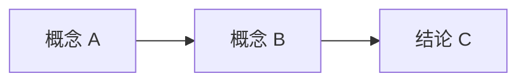

## 考点梳理

正文……（原创整理，紧扣考纲教材，勿直接照抄官方教材大段原文）

## 🧠 记忆工具箱

> 考点编写的核心：**让用户记得住**。每章至少给出一种记忆抓手，优先「图 + 口诀 + 场景」组合。

### 一图速记

用 Mermaid 画流程图/关系图/矩阵（站点已自托管渲染器，语法见示例章节）：

### 口诀速记

- 编一个短口诀或谐音串，把考点名词串起来；
- 给一个生活/工作场景锚点（像"盖房子""办运动会"），有画面才好记；
- 需要对比的概念用表格（两三行即可）。

## ⚠️ 易错提醒

- 高频混淆点：概念 A ≠ 概念 B 的本质区别；
- 考试陷阱提醒（选非题、绝对化表述、公式记反等）。

<!--more-->
