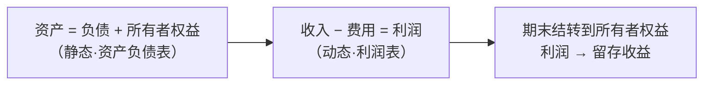

## 考点梳理

### 1.1 会计职能与基本假设

- **基本职能**：**核算**（反映）与**监督**（控制）；**拓展职能**：预测经济前景、参与经济决策、评价经营业绩；
- **四大基本假设**：**会计主体**（空间范围，与法律主体不同）、**持续经营**（前提）、**会计分期**（年度/中期）、**货币计量**（主要计量单位）。

### 1.2 会计基础：权责发生制 vs 收付实现制

- **权责发生制**：凡是**本期已实现的收入、已发生的费用**，不论款项是否收付均计入本期（企业会计的记账基础）；
- **收付实现制**：以**款项实际收付**为标准（主要用于预算/行政事业单位部分核算）。

> 例：本月收到客户上月货款 → 权责发生制下属于**上月**收入，本月不再确认收入。

### 1.3 会计信息质量要求（八项）

可靠性、相关性、可理解性、可比性、**实质重于形式**、重要性、**谨慎性**、及时性。

### 1.4 会计要素与会计等式

| 要素类别 | 内容 |
|---------|------|
| 反映**财务状况**（资产负债表） | 资产、负债、所有者权益 |
| 反映**经营成果**（利润表） | 收入、费用、利润 |

- **静态等式**：`资产 = 负债 + 所有者权益`（编资产负债表的依据）；
- **动态等式**：`收入 − 费用 = 利润`（编利润表的依据）；
- 等式扩展：`资产 = 负债 + 所有者权益 + (收入 − 费用)`。

### 1.5 借贷记账法（全书地基）

- 规则：**有借必有贷，借贷必相等**；
- 账户结构：资产/费用类**借方增加、贷方减少**；负债/所有者权益/收入类**贷方增加、借方减少**；
- 常见分录模板（示例）：
  - 收到投资者投资：借"银行存款" 贷"实收资本"；
  - 赊购原材料：借"原材料/库存商品"、"应交税费—应交增值税（进项税额）" 贷"应付账款"；
  - 支付本月办公费：借"管理费用" 贷"银行存款"。

### 1.6 凭证与账簿

原始凭证（业务发生依据）→ 记账凭证（登记账簿依据）→ 明细账与总账 → 对账与结账 → 编制报表。

## 🧠 记忆工具箱

### 口诀速记

- 基本假设：**主体、持续、分期、货币**——"**空（主体）持（持续）分（分期）币（货币）**"；
- 质量要求八项：`可靠、相关、可理解；可比、实质、重要、谨慎、及时`；
- 记账规则：**有借必有贷、借贷必相等**；"**资产费用借增贷减，负债权益收入贷增借减**"。

### 一图速记 · 会计等式关系

## ⚠️ 易错提醒

- **会计主体 ≠ 法律主体**：独资/合伙企业不是法律主体，但是会计主体；
- **权责发生制看"归属期"**，不是看"钱什么时候到"；
- 收到货款**不等于**本月收入（可能属前期或预收）；
- 借贷方向记反是初学者最大失分点：先判断科目性质（资产/负债/收入/费用），再定方向。
