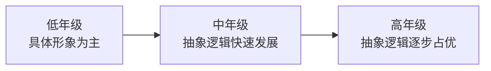

## 考点梳理

### 2.1 小学生认知发展特点

- **注意**：无意注意占优势 → 有意注意逐步发展；小学低年级注意不稳定、易分散——教师要用直观教具、趣味导入、明确任务来组织注意；
- **记忆**：由机械记忆为主向**意义记忆（理解记忆）**发展；低年级形象记忆强，中高年级抽象记忆增强；
- **思维**：由**具体形象思维**为主，逐步向**抽象逻辑思维**过渡——小学中年级是"飞跃"关键期；皮亚杰认为小学阶段多处于**具体运算阶段**（7–11 岁，能进行可逆、守恒思维，但需具体事物支撑）；
- 想象：有意想象与创造性想象逐步发展。

### 2.2 学习兴趣与习惯培养

- 培养学习兴趣：让学生获得**成功体验**、创设问题情境、学科价值引导；
- 学习习惯：从小抓起、循序渐进、正面强化、家校一致（教育一致性与连贯性）。

### 2.3 学习理论一句话（单选高频）

| 流派 | 代表 | 一句话 |
|------|------|--------|
| 行为主义 | 巴甫洛夫/斯金纳 | 学习=刺激与反应联结，靠**强化**塑形（操作条件反射） |
| 认知主义 | 布鲁纳/奥苏伯尔 | 学习=主动加工信息；布鲁纳重**发现**，奥苏伯尔重**有意义接受** |
| 人本主义 | 罗杰斯 | 学习以学生为中心，关注情感与自我实现 |
| 建构主义 | 皮亚杰/维果茨基 | 知识由学习者**主动建构**；维果茨基提**最近发展区** |

> 记忆锚点：**巴甫洛夫的狗（经典）、斯金纳的箱（操作）、布鲁纳发现、奥苏伯尔接受、罗杰斯学生中心、维果茨基跳一跳够得着（最近发展区）**。

## 🧠 记忆工具箱

### 一图速记 · 小学生思维怎么变

具体运算阶段（7–11 岁）：能守恒、可逆，但**仍需具体事物**支持——别脱离实物空讲概念。

### 口诀速记

- 注意：**"无意在先，有意渐长"**；记忆：**"机械转意义"**；思维：**"形象转抽象"**；
- 六大心理学家一句话（见上表锚点）。

### 简答模板

问"如何培养学生学习兴趣/注意力"：**①创设情境引兴趣 ②成功体验增信心 ③明确任务聚注意 ④直观手段助理解 ⑤及时强化固习惯**——教育学类措施题都可以"从兴趣、方法、评价、家校"四个维度展开。

## ⚠️ 易错提醒

- 皮亚杰"具体运算阶段"是 **7–11 岁**，能**守恒**但思维仍需具体事物——别与形式运算（11+，抽象推理）混淆；
- 斯金纳重**强化**（操作），巴甫洛夫是**经典条件反射**（被动刺激反应）——"谁先谁后/主动被动"常考；
- 奥苏伯尔是有意义**接受**学习（不是发现）——"发现学习"属于布鲁纳。
