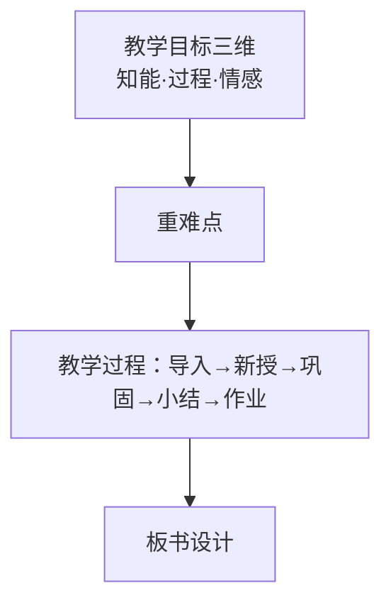

## 考点梳理

### 5.1 教学原则（必背口诀）

科学性与思想性统一、理论联系实际、直观性、启发性、循序渐进、巩固性、发展性（量力性/可接受性）、因材施教。

> 口诀：**"直启巩循可（量力），科思统一理实际，因材施教别忘记"**——材料分析给一句老师的话，先判断用了哪条原则。

- **直观性**：实物直观、模象直观、言语直观（"闻一闻、看一看、摸一摸"）；
- **启发性**：教师引导、学生思考（"不愤不启，不悱不发"——孔子）；
- 苏霍姆林斯基/陶行知等常与原则绑定出现（陶行知"教学做合一"）。

### 5.2 教学过程与规律

- 教学过程的本质：学生**认识**的特殊过程；
- 四条规律（单选高频）：间接经验与直接经验相结合（**以间接经验为主**）；掌握知识与发展智力相统一（**传授知识是发展智力的基础**）；教师主导与学生主体相统一；传授知识与思想教育相统一（**教学的教育性规律**——赫尔巴特）。

### 5.3 教学方法

讲授法、谈话法、讨论法、演示法、实验法、练习法、读书指导法、参观法等——按"以语言传递/直观感知/实际训练"归类记忆。

### 5.4 教学设计题（40 分大题）

- **教学目标三维**：知识与技能、过程与方法、情感态度与价值观；
- **教案要素**：课题/课型/课时 → 教学目标 → 教学重难点 → 教学准备（教具）→ 教学过程（导入 → 新授 → 巩固练习 → 小结 → 作业布置）→ 板书设计；
- 小学教案"导入"技巧：故事/谜语/游戏/生活情境导入；"新授"环节多用**启发式提问 + 直观教具 + 小组合作**。

## 🧠 记忆工具箱

### 一图速记 · 教案骨架

### 口诀速记

- 教学原则：**"直启循巩量，科思理实际，因材"**；
- 三维目标：**"知（识）过（程）情（感）"**；
- 四条规律：**"间直、知智、主客、教（育）性"**——间接与直接、知识与智力、教师主导与学生主体、传授知识与思想教育。

### 简答/材料模板

问"材料中老师的做法体现/违背了哪条教学原则" → ①判断原则名；②一句内涵；③"材料中，该老师……"；④总评。写教案题则**先列三维目标，再按五环节写清"教师活动+学生活动"**，板书画个结构图更稳。

## ⚠️ 易错提醒

- 教学过程以**间接经验（书本知识）为主**，但必须与直接经验结合——"一切从直接经验出发"是错误说法；
- 赫尔巴特提出**教学的教育性规律**（传授知识与思想教育统一）；"不愤不启"出自**孔子**（启发性原则）——人名与观点别配错；
- 教案的**导入不是新课讲解**，控制在几分钟内、目的是激发兴趣引出课题。
