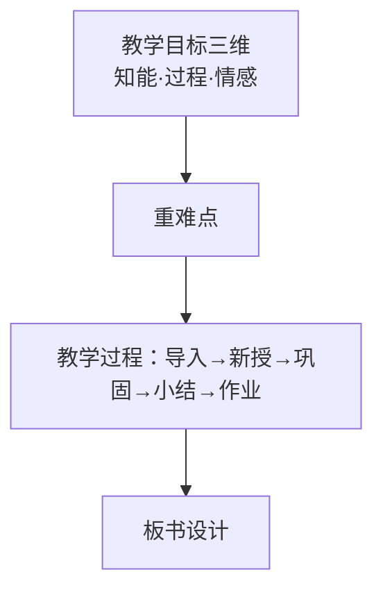

## 考点梳理

### 5.1 教学原则（必背口诀）

科学性与思想性统一、理论联系实际、直观性、启发性、循序渐进、巩固性、发展性（量力性/可接受性）、因材施教。

> 口诀：**"直启巩循可（量力），科思统一理实际，因材施教别忘记"**——材料分析给一句老师的话，先判断用了哪条原则。

- **直观性**：实物直观、模象直观、言语直观（"闻一闻、看一看、摸一摸"）；
- **启发性**：教师引导、学生思考（"不愤不启，不悱不发"——孔子）；
- 苏霍姆林斯基/陶行知等常与原则绑定出现（陶行知"教学做合一"）。

### 5.2 教学过程与规律

- 教学过程的本质：学生**认识**的特殊过程；
- 四条规律（单选高频）：间接经验与直接经验相结合（**以间接经验为主**）；掌握知识与发展智力相统一（**传授知识是发展智力的基础**）；教师主导与学生主体相统一；传授知识与思想教育相统一（**教学的教育性规律**——赫尔巴特）。

### 5.3 教学方法

讲授法、谈话法、讨论法、演示法、实验法、练习法、读书指导法、参观法等——按"以语言传递/直观感知/实际训练"归类记忆。

### 5.4 教学设计题（40 分大题）

- **教学目标三维**：知识与技能、过程与方法、情感态度与价值观；
- **教案要素**：课题/课型/课时 → 教学目标 → 教学重难点 → 教学准备（教具）→ 教学过程（导入 → 新授 → 巩固练习 → 小结 → 作业布置）→ 板书设计；
- 小学教案"导入"技巧：故事/谜语/游戏/生活情境导入；"新授"环节多用**启发式提问 + 直观教具 + 小组合作**。

## 🧠 记忆工具箱

### 一图速记 · 教案骨架

### 口诀速记

- 教学原则：**"直启循巩量，科思理实际，因材"**；
- 三维目标：**"知（识）过（程）情（感）"**；
- 四条规律：**"间直、知智、主客、教（育）性"**——间接与直接、知识与智力、教师主导与学生主体、传授知识与思想教育。

### 简答/材料模板

问"材料中老师的做法体现/违背了哪条教学原则" → ①判断原则名；②一句内涵；③"材料中，该老师……"；④总评。写教案题则**先列三维目标，再按五环节写清"教师活动+学生活动"**，板书画个结构图更稳。

## 📚 深度精讲（重点精细版）

### 一、三维目标的标准句式（照抄即得分结构）

| 维度 | 句式模板 | 示例 |
|------|---------|------|
| 知识与技能 | 能认读/说出/计算/掌握…… | 能正确认读并书写"日、月、水、火"四个生字 |
| 过程与方法 | 通过……（活动），学会/初步掌握……方法 | 通过看图说话与同桌互评，初步学会按顺序观察并表达的方法 |
| 情感态度与价值观 | 体会/感受……，养成……态度/习惯 | 感受汉字的形体美，养成认真书写的习惯 |

**常见错误**：把"过程与方法"写成"教师讲解生字"（写成教师行为）；三个维度互相串味（技能写进情感）。

### 二、教学重难点怎么定

- **重点**＝本节课最核心、必须掌握的知识与技能（如"掌握 9 加几的进位加法算理"）；
- **难点**＝学生理解或操作中最容易卡住的地方（抽象、易混、需迁移）；
- 判断口诀：**重点看教材地位，难点看学生实际**。

### 三、八条教学原则（逐条配教学实例）

| 原则 | 一句内涵 | 课堂实例（材料信号） |
|------|---------|--------------------|
| 科学性与思想性统一 | 知识要准，且育人 | 讲"圆周率"时融入祖冲之的科学精神 |
| 理论联系实际 | 学了能用 | 学"长方形面积"后测量教室地面 |
| 直观性 | 用实物/模象/语言直观 | 用小棒摆一摆理解"凑十法" |
| 启发性 | 引导思考不直接给答案 | "不愤不启，不悱不发"式追问 |
| 循序渐进 | 由易到难、由浅入深 | 先学整数加减再学小数加减 |
| 巩固性 | 及时复习、当堂练习 | 新授后安排变式练习与小结 |
| 量力性（可接受性） | 难度落在"跳一跳够得着" | 内容不超纲、分层任务 |
| 因材施教 | 承认差异、区别对待 | 同一内容设计基础题与拓展题 |

### 四、教学方法选择表

| 内容类型 | 推荐方法 |
|---------|---------|
| 概念、原理 | 讲授法＋提问法＋直观演示 |
| 操作技能、实验 | 演示法＋练习法＋实验法 |
| 情感态度 | 情境法＋讨论法＋榜样示范 |
| 复习巩固 | 练习法＋讨论法＋读书指导法 |

### 五、完整教案范例（小学语文《小小的船》示意）

**课题**：小小的船　**课型**：新授课　**课时**：1 课时
**教学目标**：①知识与技能：能正确、流利、有感情地朗读课文，会认"船、弯"等生字；②过程与方法：通过看图想象与同桌互读，初步学会边读边想象画面的方法；③情感态度与价值观：感受夜空的美丽，产生对大自然的热爱。
**教学重点**：朗读课文、认读生字；**教学难点**：体会比喻句"弯弯的月儿小小的船"的想象之妙。
**教学准备**：月亮与弯船的图片、生字卡片、朗读音频。
**教学过程**：
1. **导入（3 分钟）**：出示夜空图片提问"月亮像什么？"——激发兴趣、引出课题（设计意图：生活情境导入，调动经验）；
2. **初读感知（8 分钟）**：教师范读→学生自由读→同桌互读，圈出生字（设计意图：整体感知、扫清字词障碍）；
3. **精读品悟（15 分钟）**：抓住"弯弯的月儿小小的船"引导比较"月儿"与"船"的相似点，配动作朗读（设计意图：启发式提问 + 直观想象，突破难点）；
4. **巩固练习（8 分钟）**：生字开火车认读、填空朗读（设计意图：当堂巩固）；
5. **小结与作业（4 分钟）**：学生说收获；作业：给家人朗读并画一画自己心中的夜空（设计意图：延伸兴趣、联系生活）。
**板书设计**：小小的船——弯弯的月儿 → 小小的船 → 闪闪的星星 → 蓝蓝的天（箭头串联比喻关系）。

### 六、教学设计题（40 分）得分策略与背诵卡

- **时间分配**：审题 3 分钟 → 写目标与重难点 5 分钟 → 教学过程 20 分钟 → 板书与检查 5 分钟；
- **得分要素**：目标三维齐全且可测量（12 分左右）＋重难点准确（6 分左右）＋过程环节完整、师生活动分明（15 分左右）＋板书清晰（5 分左右）；
- **背诵卡**：**三维"知过情"，教案五环节"导入—新授—巩固—小结—作业"**；原则口诀"**直启循巩量，科思理实际，因材施教**"。

## ⚠️ 易错提醒

- 教学过程以**间接经验（书本知识）为主**，但必须与直接经验结合——"一切从直接经验出发"是错误说法；
- 赫尔巴特提出**教学的教育性规律**（传授知识与思想教育统一）；"不愤不启"出自**孔子**（启发性原则）——人名与观点别配错；
- 教案的**导入不是新课讲解**，控制在几分钟内、目的是激发兴趣引出课题。
