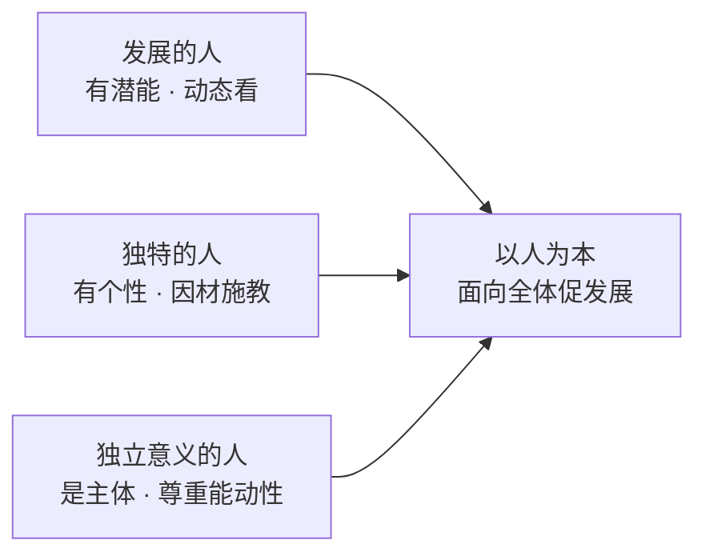

## 考点梳理

### 1.1 教育观：素质教育

- **素质教育的内涵**：以提高国民素质为根本宗旨；面向**全体**学生；促进**全面发展**；促进**个性**发展；以培养创新精神和实践能力为重点。
- **新课改的教学观**：从"教育者为中心"转向"**学习者为中心**"；从"教会学生知识"转向"**教会学生学习**"；从"重结论"转向"**重过程**"；从"关注学科"转向"**关注人**"。
- 常考对比：素质教育 ≠ 不要考试 ≠ 不要升学率；"减负"不是"无负担"。

### 1.2 学生观：核心必背

以人为本的学生观（三个"人"）：

1. **学生是发展的人**——有巨大发展潜能，处于发展过程中，用发展的眼光看学生；
2. **学生是独特的人**——各有差异、各有个性，因材施教；
3. **学生是具有独立意义的人**——学习的主体、责权主体，尊重其主观能动性。

> 一句话：**每个学生都是发展的、独特的、独立的人** —— 谐音记 **"两独一发"**（独立意义 + 独特 + 发展）。

### 1.3 教师观

- **角色转变**：从传授者转向学生学习的**促进者**；从教书匠转向**教育教学的研究者**；从课程执行者转向**课程的建设者和开发者**；从"蜡烛"转向**社区型的开放教师**；并做**终身学习的践行者**。
- **行为转变**：对待师生关系——尊重、赞赏；对待教学——帮助、引导；对待自我——反思；对待其他教育者——合作。

## 🧠 记忆工具箱

### 一图速记 · 学生观"两独一发"

### 口诀速记

- 学生观：**"两独一发"**——独特、独立意义、发展（考单选选对应的"从学生角度"说法）。
- 素质教育三个"面向"：面向全体、全面发展、发展个性 → 记"全体、全面、个性"。
- 新课改教学观四转向：**主体（学习者中心）、学法（教会学习）、过程（重过程）、人（关注人）**。

### 材料分析题万能模板（本模块必背）

材料分析题通用四步：**① 表态**（"材料中 X 老师的做法体现了/违背了……观"）→ **② 点理论**（分条写观点 + 一句内涵）→ **③ 引材料**（"材料中，该老师……"具体行为对应）→ **④ 总评**（"总之，值得学习/应引以为戒"）。理论点 + 材料行为**一一对应**才拿全分。

## ⚠️ 易错提醒

- "素质教育就是不要考试/成绩无所谓"是**错误**说法（它反对的是"唯分数"，不是反对考试）；
- 材料题先判断**考哪个观**：谈"面向全体/评价学生"多在学生观，谈"教师怎么教"多在教师观/教学观——别张冠李戴；
- "尊重学生主体"≠"放任学生"：独立意义的人仍需要教师引导。
