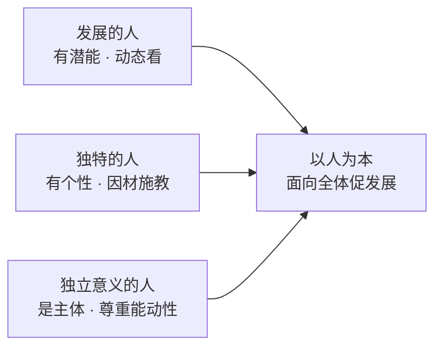

## 考点梳理

### 1.1 教育观：素质教育

- **素质教育的内涵**：以提高国民素质为根本宗旨；面向**全体**学生；促进**全面发展**；促进**个性**发展；以培养创新精神和实践能力为重点。
- **新课改的教学观**：从"教育者为中心"转向"**学习者为中心**"；从"教会学生知识"转向"**教会学生学习**"；从"重结论"转向"**重过程**"；从"关注学科"转向"**关注人**"。
- 常考对比：素质教育 ≠ 不要考试 ≠ 不要升学率；"减负"不是"无负担"。

### 1.2 学生观：核心必背

以人为本的学生观（三个"人"）：

1. **学生是发展的人**——有巨大发展潜能，处于发展过程中，用发展的眼光看学生；
2. **学生是独特的人**——各有差异、各有个性，因材施教；
3. **学生是具有独立意义的人**——学习的主体、责权主体，尊重其主观能动性。

> 一句话：**每个学生都是发展的、独特的、独立的人** —— 谐音记 **"两独一发"**（独立意义 + 独特 + 发展）。

### 1.3 教师观

- **角色转变**：从传授者转向学生学习的**促进者**；从教书匠转向**教育教学的研究者**；从课程执行者转向**课程的建设者和开发者**；从"蜡烛"转向**社区型的开放教师**；并做**终身学习的践行者**。
- **行为转变**：对待师生关系——尊重、赞赏；对待教学——帮助、引导；对待自我——反思；对待其他教育者——合作。

## 🧠 记忆工具箱

### 一图速记 · 学生观"两独一发"

### 口诀速记

- 学生观：**"两独一发"**——独特、独立意义、发展（考单选选对应的"从学生角度"说法）。
- 素质教育三个"面向"：面向全体、全面发展、发展个性 → 记"全体、全面、个性"。
- 新课改教学观四转向：**主体（学习者中心）、学法（教会学习）、过程（重过程）、人（关注人）**。

### 材料分析题万能模板（本模块必背）

材料分析题通用四步：**① 表态**（"材料中 X 老师的做法体现了/违背了……观"）→ **② 点理论**（分条写观点 + 一句内涵）→ **③ 引材料**（"材料中，该老师……"具体行为对应）→ **④ 总评**（"总之，值得学习/应引以为戒"）。理论点 + 材料行为**一一对应**才拿全分。

## 📚 深度精讲（重点精细版）

### 一、素质教育五条内涵（逐条：含义 → 教育启示 → 命题信号）

| 内涵 | 含义 | 教育启示 | 材料/选项信号 |
|------|------|---------|--------------|
| 以提高国民素质为宗旨 | 面向国家与民族的素质提升 | 教育不能只服务少数人/只盯升学 | "只抓尖子生"违背 |
| 面向全体学生 | 人人有受教育的权利与机会 | 不放弃任何一个学生 | 忽视后进生、分层放弃 |
| 促进全面发展 | 德智体美劳整体发展 | 开齐课程、五育并举 | 挤占音体美课 |
| 促进个性发展 | 在全面基础上发展特长 | 尊重差异、提供选择 | 一刀切、统一标准 |
| 以创新精神和实践能力为重点 | 培养会思考、能动手的人 | 探究式、项目式学习 | 死记硬背、只讲不练 |

### 二、新课改教学观四转向（含课堂实例）

1. **教育者为中心 → 学习者为中心**：课堂上让学生先试后讲，教师做组织者；
2. **教会知识 → 教会学习**：教方法与策略（如何预习、如何归纳），而不只给结论；
3. **重结论 → 重过程**：让学生经历"猜想—验证—表达"的探究过程；
4. **关注学科 → 关注人**：先关心学生的情绪与状态，再谈分数。

### 三、学生观"两独一发"逐条展开

| 学生观 | 含义 | 教师应做的 | 常见反例 |
|--------|------|-----------|---------|
| 发展的人 | 处于发展过程中，有巨大潜能 | 用发展眼光评价、允许犯错、鼓励进步 | "你就是笨""没救了"式定性 |
| 独特的人 | 每个学生有差异与个性 | 因材施教、弹性作业、多元评价 | 用同一把尺子衡量所有学生 |
| 具有独立意义的人 | 是学习与责权主体 | 尊重意愿、引导自主、倾听意见 | 包办代替、强制灌输 |

### 四、教师观：角色与行为转变

- **角色**：促进者（不再是唯一知识源）、研究者（反思教学）、课程建设者与开发者（会用教材也会开发资源）、社区型开放教师、终身学习者；
- **行为**：师生关系上尊重赞赏、教学上帮助引导、自我上反思、同事间合作。

### 五、材料分析题完整范例（职业理念）

**题干（示例）**：四年级的小林数学成绩长期靠后，上课不敢举手。王老师没有批评他，而是把他的作业逐题圈出"做对的地方"，课堂上特意设计了基础题请他回答，答对后带头鼓掌；还让他担任"数学小组记录员"。一学期后，小林不仅能主动发言，成绩也进入中游。

**标准作答**：
① 王老师的做法**践行了"以人为本"的学生观**。（点理论）
② **学生是发展的人**——学生有巨大发展潜能，不能用一时成绩定性。材料中，王老师没有因小林成绩落后而放弃，而是通过基础题与鼓励帮助他逐步进步，体现了用发展的眼光看待学生。
③ **学生是独特的人**——每个学生存在差异，应因材施教。材料中，王老师针对小林"不敢举手、基础薄弱"的特点设计基础题与记录员角色，做到了因材施教。
④ **学生是具有独立意义的人**——学生是学习的主体。材料中，王老师让小林担任记录员、在课堂上主动发言，调动了其学习主动性。
⑤ 总之，王老师的做法符合素质教育面向全体学生、促进学生发展的要求，值得学习。（总评）

**评分点拆解**：理论点（每条 2 分左右，需写准"学生观"名称）+ 结合材料的具体行为（每条 2–3 分）+ 表态与总评（2 分）。**只有理论不引材料、或只复述材料不提理论，都拿不到高分。**

### 六、命题角度与背诵卡

- 命题角度：判断做法体现/违背哪一"观"；材料分析；"下列不属于素质教育内涵的是"选非题；
- 背诵卡：**素质五条：宗旨、全体、全面、个性、创新实践**；**教学观四转向：主体、学法、过程、关注人**；**学生观"两独一发"**；**教师观：促进者、研究者、建设者、开放教师、终身学习**。

## ⚠️ 易错提醒

- "素质教育就是不要考试/成绩无所谓"是**错误**说法（它反对的是"唯分数"，不是反对考试）；
- 材料题先判断**考哪个观**：谈"面向全体/评价学生"多在学生观，谈"教师怎么教"多在教师观/教学观——别张冠李戴；
- "尊重学生主体"≠"放任学生"：独立意义的人仍需要教师引导。
