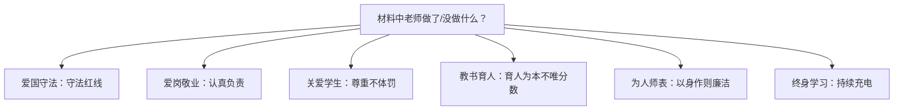

## 考点梳理

《中小学教师职业道德规范（2008）》共六条，逐条对应关键词：

| 条目 | 关键词（答题落点） |
|------|-------------------|
| 爱国守法 | 依法执教、遵纪守法、不违方针政策 |
| 爱岗敬业 | 忠诚教育事业、勤恳负责、甘为人梯、认真备课上课批改 |
| 关爱学生 | 关心爱护**全体**学生、尊重人格、不体罚、不挖苦、保护安全健康 |
| 教书育人 | 遵循规律、**素质教育**、循循善诱、**不以分数作为评价学生的唯一标准** |
| 为人师表 | 以身作则、衣着得体、语言规范、团结协作、尊重家长、廉洁从教（不有偿家教） |
| 终身学习 | 更新知识结构、拓宽知识视野、钻研业务、勇于创新 |

> 记忆锚点：**"三爱两人一终身"**——三爱（爱国守法、爱岗敬业、关爱学生）、两人（教书育人、为人师表）、一终身（终身学习）。

## 材料分析答题模板（本模块必背）

**第一步**：表态——"材料中 X 老师的行为**践行了/违背了**《中小学教师职业道德规范》中……的要求"；
**第二步**：分条——"① 体现了**关爱学生**。关爱学生要求关心爱护全体学生、尊重学生人格。材料中，该老师……"（理论 + 材料一一对应）；
**第三步**：总评——"总之，该老师（值得学习 / 需反思改进）"。

高分关键：**写 3 条左右即可，每一条都是"规范名 + 内涵一句 + 材料一句"**，宁精勿滥。

## 🧠 记忆工具箱

### 一图速记 · 六条对号入座

### 口诀速记

- **三爱两人一终身**（见上）；
- 材料题判条小技巧：**"体罚/挖苦/不尊重→关爱学生"、"敷衍/不备课→爱岗敬业"、"有偿家教/收礼→为人师表"、"只盯分数→教书育人"、"不学习新方法→终身学习"**。

## ⚠️ 易错提醒

- "关爱学生"强调的是**面向全体**，偏爱尖子生、忽视后进生同样违背本条；
- "教书育人"的材料信号常是**"成绩好就表扬、成绩差就批评/以分数排座次"**；
- 教师**可以**课后义务辅导，但**有偿家教/利用职务收受财物**违背为人师表——"禁止有偿补课"常与"为人师表、廉洁从教"挂钩。
