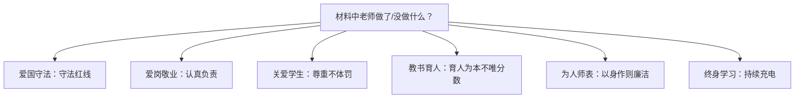

## 考点梳理

《中小学教师职业道德规范（2008）》共六条，逐条对应关键词：

| 条目 | 关键词（答题落点） |
|------|-------------------|
| 爱国守法 | 依法执教、遵纪守法、不违方针政策 |
| 爱岗敬业 | 忠诚教育事业、勤恳负责、甘为人梯、认真备课上课批改 |
| 关爱学生 | 关心爱护**全体**学生、尊重人格、不体罚、不挖苦、保护安全健康 |
| 教书育人 | 遵循规律、**素质教育**、循循善诱、**不以分数作为评价学生的唯一标准** |
| 为人师表 | 以身作则、衣着得体、语言规范、团结协作、尊重家长、廉洁从教（不有偿家教） |
| 终身学习 | 更新知识结构、拓宽知识视野、钻研业务、勇于创新 |

> 记忆锚点：**"三爱两人一终身"**——三爱（爱国守法、爱岗敬业、关爱学生）、两人（教书育人、为人师表）、一终身（终身学习）。

## 材料分析答题模板（本模块必背）

**第一步**：表态——"材料中 X 老师的行为**践行了/违背了**《中小学教师职业道德规范》中……的要求"；
**第二步**：分条——"① 体现了**关爱学生**。关爱学生要求关心爱护全体学生、尊重学生人格。材料中，该老师……"（理论 + 材料一一对应）；
**第三步**：总评——"总之，该老师（值得学习 / 需反思改进）"。

高分关键：**写 3 条左右即可，每一条都是"规范名 + 内涵一句 + 材料一句"**，宁精勿滥。

## 🧠 记忆工具箱

### 一图速记 · 六条对号入座

### 口诀速记

- **三爱两人一终身**（见上）；
- 材料题判条小技巧：**"体罚/挖苦/不尊重→关爱学生"、"敷衍/不备课→爱岗敬业"、"有偿家教/收礼→为人师表"、"只盯分数→教书育人"、"不学习新方法→终身学习"**。

## 📚 深度精讲（重点精细版）

### 一、六条规范逐条拆解（内涵 + 材料信号 + 反例）

| 规范 | 内涵 | 材料信号 | 反例 |
|------|------|---------|------|
| 爱国守法 | 依法执教、贯彻方针 | 遵守法规与学校制度 | 传播错误言论、违规办学 |
| 爱岗敬业 | 忠诚事业、认真负责 | 备课批改、加班辅导 | 敷衍上课、无故缺课 |
| 关爱学生 | 爱护**全体**、尊重人格、保护安全 | 耐心辅导后进生、不体罚 | 讽刺挖苦、罚站体罚、偏袒 |
| 教书育人 | 遵循规律、**不唯分数** | 因材施教、多元评价 | 按成绩排座次、只盯分数 |
| 为人师表 | 以身作则、**廉洁从教** | 衣着得体、拒收礼品、团结协作 | 有偿补课、收受财物、言行失范 |
| 终身学习 | 更新知识、钻研业务 | 参加培训、研究教学 | 一本教案用十年 |

### 二、《新时代中小学教师职业行为十项准则》要点（示例口径）

坚定政治方向、自觉爱国守法、传播优秀文化、潜心教书育人、关心爱护学生、加强安全防范、坚持言行雅正、秉持公平诚信、坚守廉洁自律、规范从教行为。

> 与"材料题"的关联：**收礼/有偿补课 → 廉洁自律；体罚/侮辱 → 关心爱护学生；不当言论 → 言行雅正/政治方向**。

### 三、材料分析题完整范例（职业道德）

**题干（示例）**：张老师班上有个学生小强，父母离异后情绪低落、成绩下滑。张老师多次家访了解情况，课后为他补课，还特意在班会课上表扬他帮同学修桌椅的行为。有家长私下送购物卡请张老师"多照顾"自己孩子，张老师婉言谢绝并说明会公平对待每个学生。

**标准作答**：
① 张老师的行为**践行了《中小学教师职业道德规范》的要求**。
② **关爱学生**——关心爱护全体学生、尊重学生人格。材料中，张老师在小强情绪低落时多次家访、课后补课，体现了对学生的关心与爱护。
③ **教书育人**——遵循教育规律、因材施教。材料中，张老师针对小强的具体情况给予帮助，并通过表扬其助人行为引导其重建自信。
④ **为人师表（廉洁从教）**——以身作则、自觉抵制不良风气。材料中，张老师婉拒家长的购物卡并说明会公平对待每位学生，体现了廉洁从教与公平诚信。
⑤ 总之，张老师的做法值得学习。

**评分点**：每条 2 分左右的理论名称 + 2–3 分材料结合 + 表态与总评 2 分；**理论必须与材料行为一一对应**。

### 四、典型例题（带解析）

**例题 1**：教师接受家长赠送的贵重礼品，并在评优中对其子女予以照顾。该行为主要违背了？
A. 爱岗敬业　B. 为人师表　C. 终身学习　D. 爱国守法
**答案 B**。解析：收受财物、区别对待违背为人师表（廉洁从教、公平诚信）。

**例题 2**：教师利用假期自费参加专业培训、研究新的教学方法。这主要体现了？
A. 关爱学生　B. 教书育人　C. 终身学习　D. 爱国守法
**答案 C**。解析：主动更新知识结构、钻研业务是终身学习的典型表现。

### 五、命题角度与背诵卡

- 命题角度：给行为判断对应哪条规范、材料分析（通常考关爱学生/教书育人/为人师表）、十项准则归属；
- 背诵卡：**三爱两人一终身**；**收礼有偿补课找"为人师表"、体罚讽刺找"关爱学生"、只盯分数找"教书育人"、培训钻研找"终身学习"**。

## ⚠️ 易错提醒

- "关爱学生"强调的是**面向全体**，偏爱尖子生、忽视后进生同样违背本条；
- "教书育人"的材料信号常是**"成绩好就表扬、成绩差就批评/以分数排座次"**；
- 教师**可以**课后义务辅导，但**有偿家教/利用职务收受财物**违背为人师表——"禁止有偿补课"常与"为人师表、廉洁从教"挂钩。
