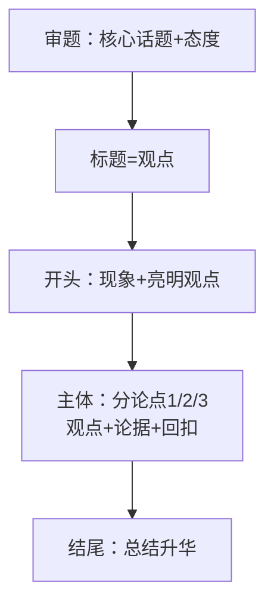

## 考点梳理

### 5.1 逻辑思维（单选 2–4 题）

- **概念关系**：全同、包含、交叉、全异——考"下列与××关系相同的是"；
- **充分/必要条件**：充分条件"有它就行"（p→q），必要条件"没它不行"（q→p）；"只有…才…"→必要条件；
- 简单命题推理：矛盾律/排中律；三段论常见错误"中项不周延"可不深究，先会画圈与举反例。

### 5.2 信息处理（Word/Excel/PPT 常识）

- **Word**：段落对齐、样式、页眉页脚、批注/修订；
- **Excel**：函数记忆——`SUM` 求和、`AVERAGE` 平均、`MAX/MIN` 最大最小、`COUNT` 计数、`RANK` 排名；单元格引用 $A$1 绝对引用；
- **PPT**：母版统一版式、放映方式。
- 考法：给"需要求平均分"让你选函数、给引用地址判断绝对引用等。

### 5.3 阅读理解（材料题 14 分）

材料作文题前的那道阅读题：**先定位段落找观点句（首尾句）→ 分点概括 → 用原文词句作答**；紧扣"文中"不要自由发挥。

### 5.4 写作（50 分，重中之重）

- **审题立意**：材料作文抓**核心话题 + 价值导向**（教育类写作常见母题：师德/学生观/教育公平/读书/成长）；
- **结构模板**：标题（观点句）→ 开头 100 字亮观点 → 主体 2–3 段（分论点 + 论据 + 分析）→ 结尾回扣；
- **论据积累**：教育人物（陶行知"教学做合一"、孔子"有教无类"）、名言 + 1–2 个当代事例即可；
- 字数达标（小学 800 字左右/示例）> 字句华丽；**字迹工整是隐形分**。

## 🧠 记忆工具箱

### 一图速记 · 写作骨架

### 口诀速记

- **逻辑关系**：充分"有它就行"，必要"没它不行"；"只要…就"=充分，"只有…才"=必要；
- **Excel 函数**：`求和平均最大小，计数排名别忘了`——SUM/AVERAGE/MAX MIN/COUNT/RANK；
- **作文评分顺口溜**：**"立意定档、结构保底、论据加分、卷面印象"**。

## ⚠️ 易错提醒

- "只要 A 就 B"是**充分**不是"唯一"条件；"只有 A 才 B"是**必要**条件——箭头方向别画反；
- Excel 平均分用 `AVERAGE` 不是 `SUM`；`$A$1` 是**绝对引用**（行列都不变）；
- 写作最忌**跑题与空洞**：每段都回扣中心论点；切忌大段抄材料。
