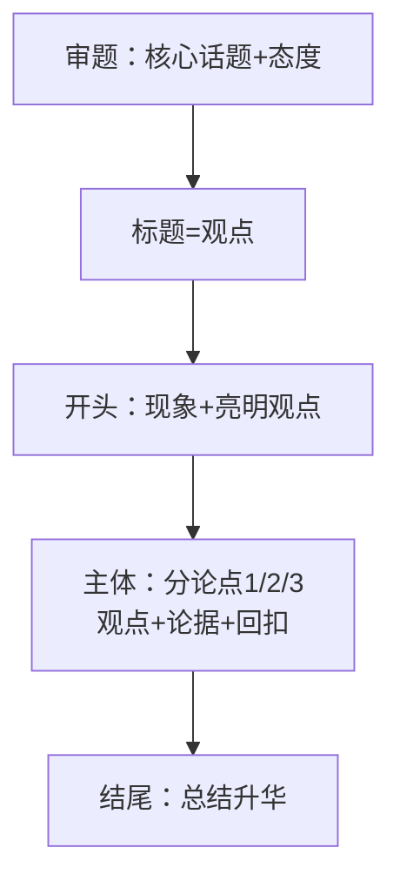

## 考点梳理

### 5.1 逻辑思维（单选 2–4 题）

- **概念关系**：全同、包含、交叉、全异——考"下列与××关系相同的是"；
- **充分/必要条件**：充分条件"有它就行"（p→q），必要条件"没它不行"（q→p）；"只有…才…"→必要条件；
- 简单命题推理：矛盾律/排中律；三段论常见错误"中项不周延"可不深究，先会画圈与举反例。

### 5.2 信息处理（Word/Excel/PPT 常识）

- **Word**：段落对齐、样式、页眉页脚、批注/修订；
- **Excel**：函数记忆——`SUM` 求和、`AVERAGE` 平均、`MAX/MIN` 最大最小、`COUNT` 计数、`RANK` 排名；单元格引用 $A$1 绝对引用；
- **PPT**：母版统一版式、放映方式。
- 考法：给"需要求平均分"让你选函数、给引用地址判断绝对引用等。

### 5.3 阅读理解（材料题 14 分）

材料作文题前的那道阅读题：**先定位段落找观点句（首尾句）→ 分点概括 → 用原文词句作答**；紧扣"文中"不要自由发挥。

### 5.4 写作（50 分，重中之重）

- **审题立意**：材料作文抓**核心话题 + 价值导向**（教育类写作常见母题：师德/学生观/教育公平/读书/成长）；
- **结构模板**：标题（观点句）→ 开头 100 字亮观点 → 主体 2–3 段（分论点 + 论据 + 分析）→ 结尾回扣；
- **论据积累**：教育人物（陶行知"教学做合一"、孔子"有教无类"）、名言 + 1–2 个当代事例即可；
- 字数达标（小学 800 字左右/示例）> 字句华丽；**字迹工整是隐形分**。

## 🧠 记忆工具箱

### 一图速记 · 写作骨架

### 口诀速记

- **逻辑关系**：充分"有它就行"，必要"没它不行"；"只要…就"=充分，"只有…才"=必要；
- **Excel 函数**：`求和平均最大小，计数排名别忘了`——SUM/AVERAGE/MAX MIN/COUNT/RANK；
- **作文评分顺口溜**：**"立意定档、结构保底、论据加分、卷面印象"**。

## 📚 深度精讲（重点精细版）

### 一、逻辑：概念关系与条件推理

| 概念关系 | 含义 | 例子 |
|---------|------|------|
| 全同 | 外延完全重合 | 北京 / 中华人民共和国首都 |
| 包含（属种） | 一方完全包含另一方 | 学生 / 小学生 |
| 交叉 | 部分重合 | 学生 / 党员 |
| 全异 | 完全没有重合 | 学生 / 石头 |

- **充分条件**：有它就行（p→q，如"下雨→地湿"）；**必要条件**：没它不行（只有 p 才 q）；**充要条件**：互为前提；
- **重要推论**：充分条件**不能反推**（"地湿"未必因为下雨，也可能洒水）；必要条件不能正推（年满 18 岁不一定能当选）；
- 三段论与朴素逻辑：多用**列表法、排除法、假设法**（先假设后验证，找矛盾即排除）。

### 二、信息处理：Word / Excel / PPT 考点

- Word：样式与格式刷、页眉页脚、批注与修订、分节符（不同页不同页码）；
- Excel：**相对引用 A1 / 绝对引用 $A$1 / 混合引用 A$1**；常用函数 SUM、AVERAGE、MAX、MIN、COUNT、RANK、IF；排序筛选与条件格式；
- PPT：母版统一版式、自定义动画与切换、放映方式（演讲者视图）。

### 三、阅读理解（材料题）答题步骤

①定位段落（找观点句，多在第一句或最后一句）→ ②概括要点（分层归纳）→ ③结合原文词句作答（不自由发挥）→ ④控制字数（要点齐全优先）。

### 四、写作：结构、素材与卷面（50 分）

- **评分维度**：立意（是否切题、正确深刻）、结构（清晰完整）、内容（论据充实）、语言（通顺有文采）、卷面（工整整洁）；
- **标题拟法**：引用式（"腹有诗书气自华"）、对偶式（"以爱育人，以德立身"）、设问式（"教育为何需要耐心？"）；
- **开头四法**：排比铺垫、引用名言、设问引人、故事导入；**结尾三法**：总结升华、号召展望、呼应开头；
- **主体结构三选一**：**并列式**（分论点平行展开，最适合新手）、**递进式**（是什么→为什么→怎么办）、**对照式**（正反对照）；
- **论据分类储备**：教育类（陶行知、苏霍姆林斯基、张桂梅）、励志类、文化类、家国类，每类备 2 个事例 + 2 句名言即可反复使用。

### 五、典型例题（带解析）

**例题 1**：已知"如果下雨，那么地面会湿"。现在地面是湿的，能否推出"下过雨"？
A. 一定能推出　B. 不能，下雨是地湿的充分条件而非必要条件　C. 能推出，因为属于逆命题成立　D. 与逻辑无关
**答案 B**。解析：充分条件只能"由前推后"，不能"由后推前"；地面湿也可能是洒水导致。

**例题 2**：材料作文初学者最稳妥的主体结构是？
A. 并列式（分论点平行展开，首尾呼应）　B. 想到哪写到哪　C. 只写一个事例到底　D. 大段抒情不展开论证
**答案 A**。解析：并列式结构清晰、易上手，配合"总—分—总"能保证结构分；其余写法易被判结构混乱或论据单薄。

### 六、命题角度与背诵卡

- 命题角度：概念关系判断、充分/必要条件方向、Excel 引用与函数、阅读概括、写作结构与卷面；
- 背诵卡：**充分"有它就行"、必要"没它不行"**；**$A$1 绝对引用**；**写作：立意定档、结构保底、论据加分、卷面印象**；**并列式最稳，总—分—总最保险**。

## ⚠️ 易错提醒

- "只要 A 就 B"是**充分**不是"唯一"条件；"只有 A 才 B"是**必要**条件——箭头方向别画反；
- Excel 平均分用 `AVERAGE` 不是 `SUM`；`$A$1` 是**绝对引用**（行列都不变）；
- 写作最忌**跑题与空洞**：每段都回扣中心论点；切忌大段抄材料。
