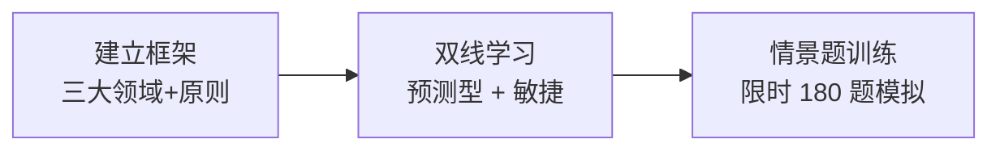

## 考点梳理（先建立全景）

### 1.1 考什么：三大领域

| 领域 | 占比（示例口径） | 考查重点 |
|------|---------------|---------|
| **人员 People** | 约 42% | 团队领导与激励、冲突处理、干系人参与、赋能与培训 |
| **过程 Process** | 约 50% | 范围/进度/成本/质量/风险/采购过程、变更控制、价值交付 |
| **业务环境 Business Environment** | 约 8% | 合规与治理、收益实现、组织变革、外部环境 |

### 1.2 怎么考：形式与节奏

- **180 题 / 230 分钟**（含约 5 题不计分预试题，示例口径）；
- 题型以**情景单选**为主：给一个项目情境，问"项目经理**首先/最好**应该做什么"；
- **预测型与敏捷/混合各约一半**——只背传统过程组必失分；
- 中国大陆为中英文对照机考，考位需提前预约。

### 1.3 报名与维持（示例口径）

- 条件：**35 小时项目管理培训**证明 + 项目经验（本科及以上 36 个月 / 大专及高中 60 个月）；
- 流程：PMI 官网英文申请 → 缴费 → 可能被抽审 → 预约机考 → 参加考试；
- 维持：**每 3 年 60 PDU** 续证。

## 🧠 记忆工具箱

### 一图速记 · 备考三段式

### 口诀速记

- 三领域：**人（People）→ 过程（Process）→ 环境（Business Environment）**，占比"**人四、过程五、环境一**"（示例口径）；
- 备考顺序：**先框架、再双线、后刷题**；
- 敏捷必背五件套：**迭代规划、每日站会、评审、回顾、看板/燃尽图**。

## ⚠️ 易错提醒

- 把 PMP 当成"软考英文版"直接裸考：新考纲**约一半是敏捷/混合情境题**，必须单独准备；
- 忽略"预试题"：180 题中有少量不计分题，遇到陌生怪题不要慌；
- 报名经验描述写成"参与"：需体现**领导与指导**职责。
