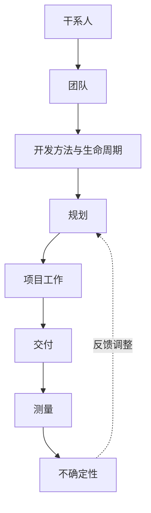

## 考点梳理

### 2.1 十二条原则（从"怎么做"到"怎么想"）

PMBOK 第七版以**原则**代替部分过程细节，核心包括（示例口径）：

1. 成为勤勉、尊重和关心他人的**管家**；
2. 营造**协作**的项目团队环境；
3. 有效**与干系人协作**；
4. **聚焦于价值**；
5. 识别、评估并**响应系统交互**；
6. 展现**领导力**行为；
7. 根据环境进行**裁剪**；
8. 将**质量**融入过程和成果；
9. 驾驭**复杂性**；
10. 优化**风险应对**；
11. 拥抱**适应性和韧性**；
12. 为实现**预期未来状态**而变革。

### 2.2 八大绩效域（相互依赖）

干系人、团队、开发方法与生命周期、规划、项目工作、交付、测量、不确定性——八个绩效域**同时存在、相互影响**，项目经理要在其间保持平衡（例如"交付"提速会加大"不确定性"与"团队"压力）。

### 2.3 价值交付视角

- 项目的目的不是"完成交付物"，而是**实现收益与价值**；
- 因此需要关注：商业论证、收益管理计划、组织变革管理与运营衔接。

## 🧠 记忆工具箱

### 一图速记 · 八大绩效域

### 口诀速记

- 八个绩效域首字：**干、团、开、规、工、交、测、不**——"**干团开规工交测不**"（读两遍即可记住顺序）；
- 三句原则内核：**聚焦价值、拥抱变化、按情境裁剪**。

## ⚠️ 易错提醒

- 绩效域**不是阶段**：八个绩效域在整个项目期间同时存在，不要按顺序"一个个做完"；
- "聚焦价值"不等于"多交付功能"——交付**未被需要的功能**反而浪费（对应范围管理中的镀金）；
- 原则与过程**不冲突**：原则指导判断，过程提供工具，考场上两者结合答题。
