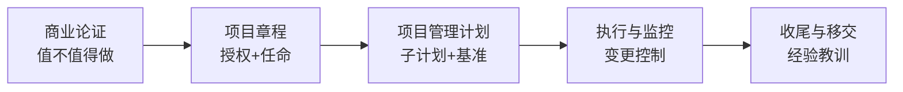

## 考点梳理

### 3.1 启动链：商业论证 → 章程 → 项目

| 产出物 | 作用 | 谁负责 |
|--------|------|--------|
| 商业论证 | 论证"值不值得做"（成本收益、可行性） | 发起人/组织 |
| 收益管理计划 | 说明如何实现与度量收益 | 发起人 + 项目经理 |
| **项目章程** | **正式授权项目、任命项目经理**、给出高层级目标与约束 | 发起人/高层签发 |
| 干系人登记册 | 记录干系人信息、影响力与态度 | 项目经理牵头 |

### 3.2 整合管理：项目经理的"总调度"

- 制定**项目管理计划**（各子计划的集成，含基准）；
- **指导与管理项目工作**、管理项目知识（经验教训）；
- **监控项目工作**与实施**整体变更控制**；
- 收尾：验收、归档、释放资源、知识移交。

### 3.3 治理与阶段关口

- **治理**：由发起人/指导委员会（或 PMO）设定决策规则与权限边界；
- **阶段关口（Phase Gate）**：阶段结束时评审"是否继续投入"，可做出继续/调整/终止的决策；
- **变更控制**：预测型项目由 CCB 审批重大变更；敏捷项目由**产品负责人**对待办列表排序来吸收变化。

## 🧠 记忆工具箱

### 一图速记 · 从"想法"到"授权"

### 口诀速记

- 整合七件事：**定计划、干工作、管知识、控工作、控变更、收尾、管阶段**；
- 章程三问：**谁授权（发起人）、授什么权（动用资源）、给什么目标（高层级范围与里程碑）**。

### 敏捷对照（同章必看）

| 主题 | 预测型做法 | 敏捷做法 |
|------|-----------|---------|
| 需求确认 | 需求基线 + 变更控制 | **产品待办列表**动态排序 |
| 计划 | 详细计划与基准 | 滚动式规划 + **迭代计划会** |
| 治理 | 阶段关口 + CCB | **迭代评审**与发布计划调整 |
| 知识管理 | 经验教训登记册 | **迭代回顾会**持续改进 |

## ⚠️ 易错提醒

- 章程**不是**项目经理自己写的（可参与起草，但由发起人/高层签发）；
- 敏捷项目并非"没有计划/没有治理"——只是把计划与治理放到迭代节奏中；
- 收尾不是"交付完就结束"：验收、移交、**经验教训归档**、资源释放都算。
