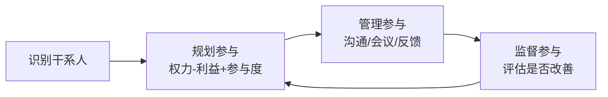

## 考点梳理

### 5.1 质量：过程与结果两条线

| 过程 | 面向 | 关键活动 |
|------|------|---------|
| 规划质量管理 | 标准 | 质量目标、质量标准、**质量成本**（一致性/非一致性） |
| 管理质量（QA） | **过程** | 过程审计、过程改进、培训（预防为主） |
| 控制质量（QC） | **结果** | 检验、抽样、缺陷纠正、验收 |

七种基本质量工具：因果图（找根因）、流程图、核查表、帕累托图（80/20）、直方图、控制图（±3σ）、散点图。

**敏捷质量实践**：**测试驱动开发（TDD）**、持续集成、结对编程、迭代演示即验收、定义完成（DoD）。

### 5.2 资源：团队与领导力

- 规划资源（**RACI**）→ 获取资源 → 建设团队（塔克曼阶段：形成/震荡/规范/成熟/解散）→ 管理团队（冲突处理五法：撤退/缓和/妥协/强迫/**合作**）；
- 激励理论：马斯洛需要层次、赫茨伯格双因素、X/Y 理论；
- **敏捷团队**：**自组织、跨职能**，项目经理/Scrum Master 采用**仆人式领导**（Servant Leadership）——服务团队、清除障碍，而非命令控制。

### 5.3 沟通：模型、渠道与敏捷实践

- 沟通模型：发送方编码 → 渠道 → 接收方解码 → **反馈确认**，全程有噪声；
- 渠道数＝N(N−1)/2（12 人＝66 条）；
- 敏捷：**每日站会**（15 分钟、三个问题）、信息辐射体（看板、燃尽图）、迭代评审与回顾。

### 5.4 干系人：从识别到参与

识别 → 规划参与 → 管理参与 → 监督参与；**权力-利益方格**：双高重点管理、高权低利令其满意、低权高利随时告知、双低监督；参与度五级：不知晓→抵制→中立→支持→**领导**。

**敏捷干系人实践**：**产品负责人**代表客户与业务，负责待办列表与价值排序；迭代评审会持续收集反馈。

## 🧠 记忆工具箱

### 一图速记 · 沟通与干系人闭环

### 口诀速记

- 质量：**QA 管过程（审计）、QC 管结果（检验）**；
- 团队阶段：`形 → 震 → 规 → 熟 → 散`；冲突：`撤让折压谈`（最佳合作）；
- 沟通：**渠道 N(N−1)/2；重要信息书面化 + 要反馈**；
- 敏捷领导力：**仆人式领导 = 服务团队 + 清除障碍 + 赋能**。

## ⚠️ 易错提醒

- "质量保证就是质检"是错的：QC 才做检验，QA 面向过程；
- 敏捷团队不是"没有管理"：**自组织 ≠ 无序**，靠规则（DoD、站会、回顾）运转；
- 干系人管理不能"只汇报不参与"：关键干系人需被纳入决策与评审；
- 冲突"合作/面对"最理想，但**紧急情况**可用强迫决策。
