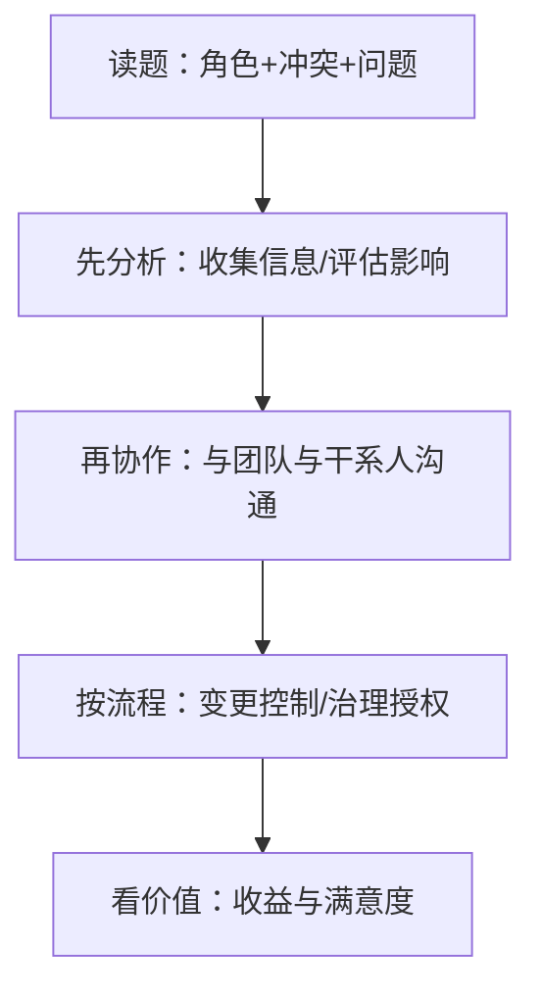

## 考点梳理

### 6.1 风险管理（七过程）

规划风险管理 → **识别风险**（头脑风暴、**德尔菲**、访谈、SWOT、核对表）→ **定性分析**（概率×影响矩阵排序）→ **定量分析**（EMV、决策树、蒙特卡洛）→ **规划应对** → 实施应对 → 监督风险。

**应对策略**：威胁＝**规避/转移/减轻/接受**；机会＝**开拓/提高/分享/接受**；风险登记册需含**责任人（owner）与触发器**。

**敏捷风险实践**：迭代回顾识别过程风险；用 **Spike（探针/技术调研迭代）** 降低技术不确定性；在待办列表中显式加入风险应对事项；缩短迭代以快速获得反馈。

### 6.2 采购与合同

- 自制-外购分析三问：能力、成本、时间；
- 合同类型与风险分担：**固定总价（买方风险最小）／成本类（买方风险大）／工料（范围不清时用）**；避免成本加成本百分比；
- 采购收尾：采购审计、索赔与争议在收尾前结清；
- **敏捷合同**：按迭代/增量计费、渐进式明细、鼓励协作与变更。

### 6.3 PMP 情景题应试法（得分关键）

**读题三步**：① 认清你的角色（项目经理/Scrum Master/PMO）；② 抓情境冲突（范围蔓延？资源冲突？干系人不支持？）；③ 看问题问什么（"首先/最好/应该"）。

**决策优先级（考场通用）**：
1. **先分析、后行动**（先收集信息、评估影响，而非立刻执行）；
2. **优先沟通与协作**（与团队/干系人商议，而非单方面命令）；
3. **遵循流程与治理**（走变更控制、报发起人要有充分理由）；
4. **聚焦价值与干系人满意**（不是"完成更多功能"）；
5. **避免极端与越权**（不擅自加班、不直接拒绝客户、不绕过流程、不指责他人）。

**常见错误选项特征**：绝对化（"总是/绝不"）、跳过分析直接动手、责任外推（"让发起人决定日常事务"）、损害团队或干系人信任的做法。

**时间管理**：180 题 / 230 分钟 ≈ **每题 1.3 分钟**；先做有把握的题并标记长难题，分段休息（考场允许的短暂休息），最后统一复查。

## 🧠 记忆工具箱

### 一图速记 · 情景题决策链

### 口诀速记

- 风险七过程：`规识定量应行监`；威胁 `躲甩降认`、机会 `开提分接`；
- 合同风险：**总价甩卖方、成本买方扛、工料中间站**；
- 情景题五优先：**先分析、再沟通、守流程、盯价值、不越权**。

## ⚠️ 易错提醒

- 情景题里"项目经理**亲自**加班完成"几乎总是错误选项（应通过资源管理与计划调整解决）；
- "直接上报发起人"通常是**最后一招**，除非涉及越权/重大风险且已尝试团队内解决；
- 敏捷项目中的风险**不写在风险登记册就完事**——要落到待办列表与迭代活动中；
- 采购题注意"合同类型 + 风险归属"的对应关系，别只背名称。
