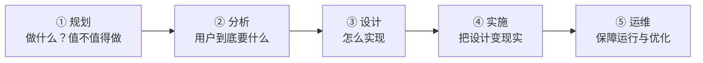

## 考点梳理

### 1.1 信息与信息化

**信息**是经过加工、对决策有价值的数据；**信息化**的核心是开发利用信息资源。我国国家信息化体系通常概括为六要素：信息资源、信息网络、信息技术应用、信息技术与产业、信息化人才、信息化政策法规与标准规范（示例口径，以官方教材为准）。

### 1.2 信息系统生命周期

信息系统一般经历：**规划 → 分析 → 设计 → 实施 → 运维**。规划阶段回答"系统做什么、值不值得做"；分析阶段弄清"用户要什么"；设计阶段解决"怎么做"；运维阶段持续保障系统可用并响应变更。

### 1.3 系统集成

系统集成是把**硬件、软件、网络、数据与人**组合成一个协同信息系统的过程，常见层面有：

- **网络集成**：将异构网络设备互连成统一网络；
- **数据集成**：统一各系统的数据格式与交换；
- **应用集成**：让多个应用系统协同工作，典型思路是**面向服务的架构（SOA）**——把业务能力封装成服务，通过标准化接口组合，追求**松耦合、可复用**。

### 1.4 信息安全基础

信息安全的三个基本属性（CIA）：

- **保密性（Confidentiality）**：信息不被未授权者获取；
- **完整性（Integrity）**：信息不被非法篡改；
- **可用性（Availability）**：授权者随时可用。

常见威胁包括病毒木马、网络攻击、内部泄露、管理漏洞；防护手段从技术（加密、访问控制、防火墙、备份）与管理（制度、审计）两方面入手。

## 🧠 记忆工具箱

### 一图速记 · 信息系统生命周期

生活锚点：**像盖房子** —— 规划=想清楚要什么房；分析=问清家里住几口人；设计=画图纸；实施=施工；运维=入住后的物业。

### 口诀速记

- **六要素一句话**：「**人才上网做产业，应用资源要守法**」→ 逐词对应：人才（信息化人才）、上网（信息网络）、做产业（信息技术与产业）、应用（信息技术应用）、资源（信息资源）、守法（政策法规与标准）。有画面、能串起来，比硬背六个名词好记。
- **生命周期五步**：`规 → 分 → 设 → 实 → 运`（谐音"规分设实运"）。
- **信息安全三性 CIA**：『**锁 · 戳 · 门**』——保密=上锁（防偷看）；完整=盖戳（防篡改）；可用=24 小时开门（随时能用）。

## 📚 深度精讲（重点精细版）

### 一、DIKW 层次：数据怎样变成智慧

| 层次 | 含义 | 记忆锚 |
|------|------|--------|
| 数据 Data | 原始记录（数字、符号） | 一堆散装数字 |
| 信息 Information | 加工后有意义的结果 | 数字变成"本月销量" |
| 知识 Knowledge | 信息经归纳形成的规律/经验 | 从中看出"旺季规律" |
| 智慧 Wisdom | 运用知识做决策与创新 | 据此决定明年备货策略 |

> 考试常以"给场景判断属于哪一层"出现：**能直接看到的是数据，赋予了意义是信息，形成可复用规律是知识，能指导决策是智慧。**

### 二、电子政务与电子商务（高频分类题）

**电子政务四种模式**：G2G（政府对政府）、G2B（政府对企业）、G2C（政府对公众）、G2E（政府对公务员）。
**电子商务常见模式**：B2B（企业对企业）、B2C（企业对消费者）、C2C（消费者对消费者）、O2O（线上到线下）。
> 记法：**字母组合=主体之间**："谁对谁"读出来即可，不必背术语。

### 三、信息系统开发方法：该选哪一种

| 方法 | 特点 | 适用场景 |
|------|------|---------|
| 结构化方法（生命周期法） | 阶段清晰、文档驱动、自顶向下 | 需求明确稳定、规模较大 |
| 原型法 | 快速做出可运行原型反复修改 | **需求不明确**、用户参与度高 |
| 面向对象方法 | 以对象/类封装，复用性高 | 复杂系统、易演化 |
| 敏捷/迭代 | 短周期交付、拥抱变化 | 需求多变、快速上线 |

> 命题套路："用户说不清需求"→原型法；"需求稳定的大系统"→结构化方法。

### 四、系统集成的层次与中间件

- 集成层次：**网络集成 → 数据集成 → 应用集成 → 业务/流程集成**（由低到高、由技术到业务）；
- 实现手段：**中间件**（消息中间件负责异步可靠传输、应用服务器承载业务组件、数据库中间件做读写分离/分库分表）＋ **SOA/微服务**（服务化、松耦合）。

### 五、典型例题（带解析）

**例题 1**：某市开通"企业开办一网通办"平台，企业在线提交材料、政府在线审批。该应用属于电子政务的哪种模式？
A. G2G　B. G2B　C. G2C　D. G2E
**答案 B**。解析：主体是"政府—企业"，企业的英文是 Business，故为 G2B；G2C 面向公众（Citizen），G2E 面向公务员（Employee）。

**例题 2**：某项目开发中，用户无法清晰描述需求，开发方先做出可运行界面供用户试用并及时修改。这属于哪种开发方法？
A. 结构化方法　B. 原型法　C. 面向对象方法　D. 净室方法
**答案 B**。解析：题干两个关键信息"需求不明确 + 可运行原型反复修改"是原型法的定义特征；结构化方法要求需求相对明确。

### 六、命题角度与背诵卡

- 命题角度：DIKW 层次判断、电子政务/电子商务模式、开发方法适用场景、系统集成层次排序、SOA 特征；
- 背诵卡：**数据—信息—知识—智慧（越往下越"懂"）**；**字母模式读"谁对谁"**；**需求不清用原型、需求稳定用结构化**；**集成层次：网络→数据→应用→业务**。

## ⚠️ 易错提醒

- 「数据」与「信息」：**数据是原始记录，信息是加工后有价值的结果**，两者不能混用。
- SOA 追求的是**松耦合**，不是"把所有系统合并成一个大系统"。
- 完整性被破坏 ≠ 保密性被破坏：**篡改是"完整"，泄露才是"保密"**（做题时先判断动了哪一性）。
