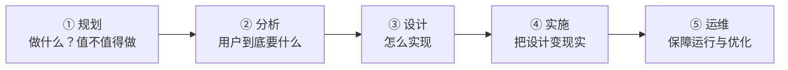

## 考点梳理

### 1.1 信息与信息化

**信息**是经过加工、对决策有价值的数据；**信息化**的核心是开发利用信息资源。我国国家信息化体系通常概括为六要素：信息资源、信息网络、信息技术应用、信息技术与产业、信息化人才、信息化政策法规与标准规范（示例口径，以官方教材为准）。

### 1.2 信息系统生命周期

信息系统一般经历：**规划 → 分析 → 设计 → 实施 → 运维**。规划阶段回答"系统做什么、值不值得做"；分析阶段弄清"用户要什么"；设计阶段解决"怎么做"；运维阶段持续保障系统可用并响应变更。

### 1.3 系统集成

系统集成是把**硬件、软件、网络、数据与人**组合成一个协同信息系统的过程，常见层面有：

- **网络集成**：将异构网络设备互连成统一网络；
- **数据集成**：统一各系统的数据格式与交换；
- **应用集成**：让多个应用系统协同工作，典型思路是**面向服务的架构（SOA）**——把业务能力封装成服务，通过标准化接口组合，追求**松耦合、可复用**。

### 1.4 信息安全基础

信息安全的三个基本属性（CIA）：

- **保密性（Confidentiality）**：信息不被未授权者获取；
- **完整性（Integrity）**：信息不被非法篡改；
- **可用性（Availability）**：授权者随时可用。

常见威胁包括病毒木马、网络攻击、内部泄露、管理漏洞；防护手段从技术（加密、访问控制、防火墙、备份）与管理（制度、审计）两方面入手。

## 🧠 记忆工具箱

### 一图速记 · 信息系统生命周期

生活锚点：**像盖房子** —— 规划=想清楚要什么房；分析=问清家里住几口人；设计=画图纸；实施=施工；运维=入住后的物业。

### 口诀速记

- **六要素一句话**：「**人才上网做产业，应用资源要守法**」→ 逐词对应：人才（信息化人才）、上网（信息网络）、做产业（信息技术与产业）、应用（信息技术应用）、资源（信息资源）、守法（政策法规与标准）。有画面、能串起来，比硬背六个名词好记。
- **生命周期五步**：`规 → 分 → 设 → 实 → 运`（谐音"规分设实运"）。
- **信息安全三性 CIA**：『**锁 · 戳 · 门**』——保密=上锁（防偷看）；完整=盖戳（防篡改）；可用=24 小时开门（随时能用）。

## ⚠️ 易错提醒

- 「数据」与「信息」：**数据是原始记录，信息是加工后有价值的结果**，两者不能混用。
- SOA 追求的是**松耦合**，不是"把所有系统合并成一个大系统"。
- 完整性被破坏 ≠ 保密性被破坏：**篡改是"完整"，泄露才是"保密"**（做题时先判断动了哪一性）。
