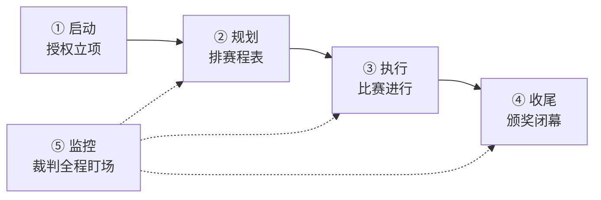

## 考点梳理

### 2.1 什么是项目

**项目**是为创造独特的产品、服务或成果而进行的**临时性**工作。三大特征：

- **临时性**：有明确的开始与结束；
- **独特性**：没有两个完全一样的项目；
- **渐进明细**：随进展不断细化（如计划先粗后细）。

与**运营（日常重复性工作）**相对：项目结束即解散，运营长期持续。

### 2.2 项目管理过程组与知识领域

项目管理把活动归入 **5 大过程组**：

> 启动 → 规划 → 执行 → 监控 → 收尾

再按管理对象划分为 **10 大知识领域**（示例口径）：整合管理、范围管理、进度管理、成本管理、质量管理、资源管理、沟通管理、风险管理、采购管理、干系人管理。

两者是"过程按阶段推进、知识按对象管理"的矩阵关系：每个过程组里都可能用到多个知识领域的活动。

### 2.3 项目章程与项目经理

**项目章程**由发起人或高层签发，正式授权项目启动，并任命项目经理、明确项目目标与高层级约束——它回答"项目被批准了、谁来负责"。

项目经理对项目**目标的实现**负责，需要平衡范围、进度、成本、质量与干系人期望。

## 🧠 记忆工具箱

### 一图速记 · 五大过程组

生活锚点：**像办一场运动会** —— 启动=开幕式定赛程、授权开赛；规划=排出赛程表；执行=比赛进行；监控=裁判全程盯场；收尾=颁奖闭幕。

### 口诀速记

- **过程组五字诀**：`启 · 规 · 执 · 监 · 收`（启动→规划→执行→监控→收尾）。
- **十大领域串记**：「**整范进成质 · 资采沟干风**」（整合/范围/进度/成本/质量 · 资源/采购/沟通/干系人/风险）。再按"管什么"归类理解：
  - **目标线**：范围、进度、成本、质量（把事做对、做快、做省、做好）；
  - **资源线**：资源、采购（人和物从哪来）；
  - **人际线**：沟通、干系人（跟谁说话、把谁伺候好）；
  - **后台**：风险（防意外）+ 整合（总调度）。
- **项目三特征场景**：借用场地办比赛——临时（结束即拆）、独特（每场都不一样）、渐进明细（赛程越排越细）。
- **章程一句话**：「发起人盖章授权、任命项目经理」——是"出生证"，不是 PM 自封的。

## 📚 深度精讲（重点精细版）

### 一、项目与运营：一张表分清

| 维度 | 项目 | 运营 |
|------|------|------|
| 目的 | 创造独特成果 | 维持业务持续运转 |
| 时限 | **临时性**（有始有终） | 长期、持续 |
| 重复性 | 一次性、独特 | 重复、标准化 |
| 结束方式 | 目标达成即结束、团队解散 | 持续改进、不"结束" |
| 管理重点 | 目标/范围/风险 | 效率/质量/稳定 |

### 二、三种"生命周期/过程组"别混

- **项目生命周期**：项目从启动到结束的**阶段划分**（如需求→设计→开发→测试→上线）；
- **产品生命周期**：产品从概念到退市的**更长周期**（可能包含多个项目）；
- **项目管理过程组**：启动、规划、执行、监控、收尾——**贯穿每个阶段循环使用**，不是"阶段"本身。

> 记忆锚：**阶段是"分段"，过程组是"每段里怎么干活"**。

### 三、组织结构决定项目经理的权力（必考）

| 组织结构 | 项目经理权限 | 特点 |
|---------|------------|------|
| 职能型 | **很小/几乎没有** | 按部门管理，无专职 PM |
| 弱矩阵 | 小 | 有协调员，权力有限 |
| 平衡矩阵 | 中 | PM 与职能经理分权 |
| 强矩阵 | 较大 | PM 掌握较多资源 |
| 项目型 | **最大（近乎全权）** | 团队专职、PM 全权负责 |

> 口诀：**职能→弱→平衡→强→项目型，PM 权力"节节高"**。

### 四、项目章程包含什么（选择题常考）

项目目的与目标、**高层级范围与可交付成果**、总体里程碑与进度、总体预算与资金、关键干系人清单、**项目经理及其职责权限**、发起人/批准人、假设与制约因素。（**不含**：详细 WBS、详细进度计划、具体采购合同——那是后续过程的产物。）

### 五、项目经理的能力要求（示例口径）

- **技术项目管理**：懂流程、工具与技术；
- **领导力**：团队建设、激励、冲突处理、沟通；
- **战略与商业管理**：理解组织战略、行业与合规，让项目对齐业务价值。

### 六、典型例题（带解析）

**例题 1**：某组织把项目成员集中办公、由项目经理全权负责资源与考核。该组织最可能是？
A. 职能型　B. 弱矩阵　C. 平衡矩阵　D. 项目型
**答案 D**。解析："集中办公 + PM 全权负责资源"是项目型的典型特征；职能型 PM 几乎没有权限，矩阵型 PM 与职能经理分权。

**例题 2**：下列内容通常**不**出现在项目章程中的是？
A. 项目总体里程碑　B. 高层级范围描述　C. 详细的工作分解结构（WBS）　D. 项目经理任命
**答案 C**。解析：章程是"授权与高层级目标"，详细 WBS 属规划阶段范围管理的产物。

### 七、命题角度与背诵卡

- 命题角度：项目/运营辨析、三特征、过程组顺序、十大领域选非、组织结构与 PM 权限、章程内容选非、项目经理能力；
- 背诵卡：**项目=临时+独特+渐进明细**；**过程组"启规执监收"**；**权力阶梯：职能＜弱＜平衡＜强＜项目型**；**章程给授权、不给细节**。

## ⚠️ 易错提醒

- "项目有临时性"≠"项目成果是临时的"：成果长期存在，**临时的是项目本身**。
- 十大知识领域里**没有**"文档管理、审计管理"这类选项，选非题常在这里设陷阱。
- 先启动后规划：没有授权书，一切规划都是空谈（顺序题高频考点）。
