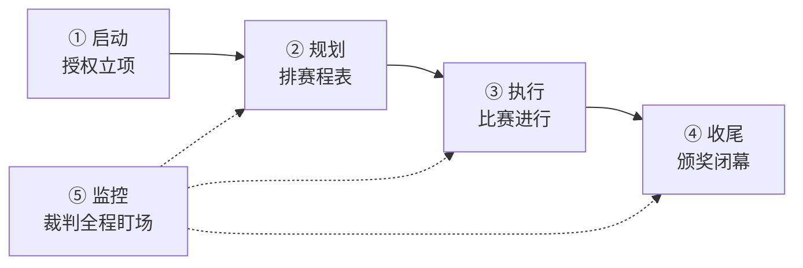

## 考点梳理

### 2.1 什么是项目

**项目**是为创造独特的产品、服务或成果而进行的**临时性**工作。三大特征：

- **临时性**：有明确的开始与结束；
- **独特性**：没有两个完全一样的项目；
- **渐进明细**：随进展不断细化（如计划先粗后细）。

与**运营（日常重复性工作）**相对：项目结束即解散，运营长期持续。

### 2.2 项目管理过程组与知识领域

项目管理把活动归入 **5 大过程组**：

> 启动 → 规划 → 执行 → 监控 → 收尾

再按管理对象划分为 **10 大知识领域**（示例口径）：整合管理、范围管理、进度管理、成本管理、质量管理、资源管理、沟通管理、风险管理、采购管理、干系人管理。

两者是"过程按阶段推进、知识按对象管理"的矩阵关系：每个过程组里都可能用到多个知识领域的活动。

### 2.3 项目章程与项目经理

**项目章程**由发起人或高层签发，正式授权项目启动，并任命项目经理、明确项目目标与高层级约束——它回答"项目被批准了、谁来负责"。

项目经理对项目**目标的实现**负责，需要平衡范围、进度、成本、质量与干系人期望。

## 🧠 记忆工具箱

### 一图速记 · 五大过程组

生活锚点：**像办一场运动会** —— 启动=开幕式定赛程、授权开赛；规划=排出赛程表；执行=比赛进行；监控=裁判全程盯场；收尾=颁奖闭幕。

### 口诀速记

- **过程组五字诀**：`启 · 规 · 执 · 监 · 收`（启动→规划→执行→监控→收尾）。
- **十大领域串记**：「**整范进成质 · 资采沟干风**」（整合/范围/进度/成本/质量 · 资源/采购/沟通/干系人/风险）。再按"管什么"归类理解：
  - **目标线**：范围、进度、成本、质量（把事做对、做快、做省、做好）；
  - **资源线**：资源、采购（人和物从哪来）；
  - **人际线**：沟通、干系人（跟谁说话、把谁伺候好）；
  - **后台**：风险（防意外）+ 整合（总调度）。
- **项目三特征场景**：借用场地办比赛——临时（结束即拆）、独特（每场都不一样）、渐进明细（赛程越排越细）。
- **章程一句话**：「发起人盖章授权、任命项目经理」——是"出生证"，不是 PM 自封的。

## ⚠️ 易错提醒

- "项目有临时性"≠"项目成果是临时的"：成果长期存在，**临时的是项目本身**。
- 十大知识领域里**没有**"文档管理、审计管理"这类选项，选非题常在这里设陷阱。
- 先启动后规划：没有授权书，一切规划都是空谈（顺序题高频考点）。
