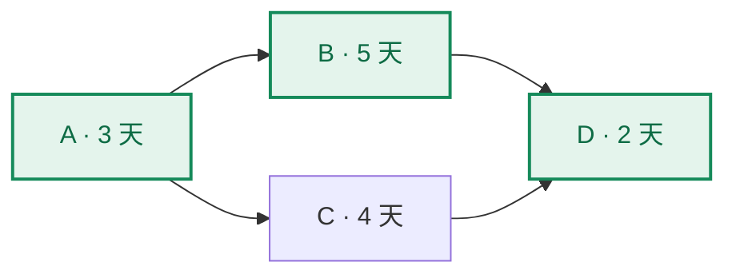

## 考点梳理

### 3.1 范围管理

- **产品范围**：交付物应具备的功能特性；**项目范围**：为交付该产品所需做的工作。
- 范围确认（验收）与范围控制的核心工具是 **WBS（工作分解结构）**：把项目可交付成果逐层分解为更小的、可管理的工作包。
  - 分解遵循 **100% 规则**：WBS 底层之和＝100% 的项目范围，不多不少；
  - 最底层叫**工作包**，可再细化为活动（进度层面）。
- **范围蔓延（scope creep）**：未经控制的范围扩大；**镀金（gold plating）**：主动添加范围外功能讨好客户——两者都要控制。

### 3.2 进度管理：网络图与关键路径

- 活动排序常用**前导图法（PDM）**画网络图，节点表示活动、箭头表示依赖。
- 网络图上可做**正推**（得最早开始 ES、最早完成 EF）与**逆推**（得最晚完成 LF、最晚开始 LS）。
- **总浮动时间（TF）＝ LS − ES（或 LF − EF）**，表示活动在不延误项目前提下可推迟的时间。
- **关键路径**＝总浮动时间**最小**（通常为 0）的路径，是网络图中**最长**的路径，决定项目最短工期。

### 3.3 进度压缩

当工期紧张时可在关键路径上压缩：

- **赶工（crashing）**：增加资源/加班压缩活动历时——**成本上升**，只对**关键路径**上的活动有效；
- **快速跟进（fast tracking）**：把本应串行的活动改为并行——增加**返工风险**，不一定增加成本。

## 🧠 记忆工具箱

### 一图速记 · 关键路径怎么看

把题库里的经典计算题画出来（A=3 天、B=5 天、C=4 天并行，D=2 天等 B、C 都完成）：

两条路各算一遍：**A→B→D = 3+5+2 = 10 天**（绿色加粗，最长）；A→C→D = 3+4+2 = 9 天，**C 有 1 天浮动**。做题套路就三步：①列出每条路径 ②算总时长 ③最长的那条=关键路径。

### 口诀速记

- **关键路径三连**：最长路径 · 总浮动最小 · 决定最短工期。锚点：**马拉松最长路线决定关门时间**。
- **WBS**：底层之和必须 = 100% 项目范围——**不多不少**（多=镀金/蔓延，少=漏交付）。
- **范围两大"偷跑"**：蔓延=被动的"活越加越多"（客户不断加需求）；镀金=主动的"做好人"（偷偷多做）。

### 易混辨析 · 赶工 vs 快速跟进

| 对比 | 赶工（crashing） | 快速跟进（fast tracking） |
|------|------------------|---------------------------|
| 做法 | 加资源 / 加班 | 串行活动改成并行 |
| 直接代价 | **成本上升** | **返工风险上升** |
| 适用 | 只对**关键路径**活动有效 | 有并行余地的活动 |
| 一句话 | 花钱买时间 | 并行赌返工 |

## ⚠️ 易错提醒

- "总浮动为 0 的路径才是关键路径"表述**过于绝对**：多条路径共享浮时时，关键路径的总浮动也可能不为 0——严谨说法是"总浮动**最小**的路径"。
- 压缩进度**只能在关键路径**上做，否则白费资源。
- 关键路径可能不止一条：多条路径总浮动并列最小时，都是关键路径。
