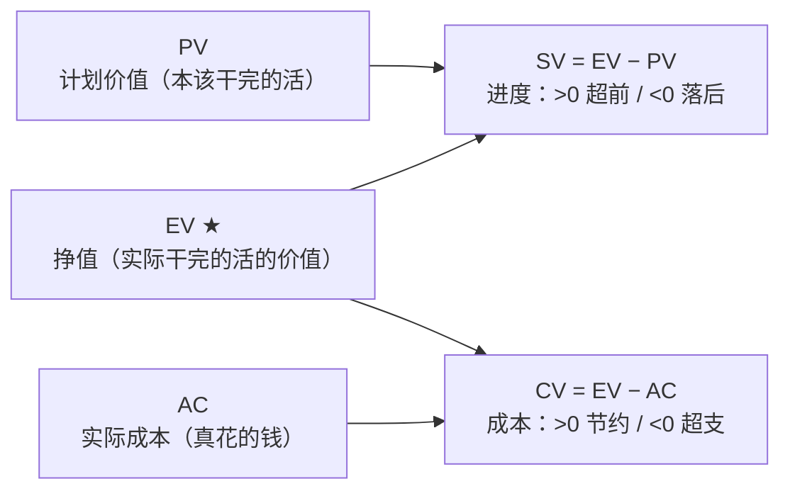

## 考点梳理

### 4.1 成本管理基本概念

- **成本估算**：估算完成活动所需资源成本，形成各活动估算；
- **成本预算**：把估算汇总并分配到 WBS 工作包，形成**成本基准**（含应急储备）。
- 成本基准 + **管理储备**（应对未知-未知风险）＝项目总预算。

### 4.2 挣值管理（EVM）

挣值管理把范围、进度、成本统一到三个基本量上（均指**到检查点为止**的累计值）：

| 记号 | 含义 | 说明 |
|------|------|------|
| PV | 计划价值 | 到检查点本应完成工作的计划价值 |
| EV | 挣值 | 到检查点**实际完成**工作的计划价值 |
| AC | 实际成本 | 到检查点实际花费 |

派生指标：

- **SV = EV − PV**：进度偏差，>0 进度超前，<0 进度落后；
- **CV = EV − AC**：成本偏差，>0 成本节约，<0 成本超支；
- **SPI = EV / PV**：进度绩效指数，>1 进度超前；
- **CPI = EV / AC**：成本绩效指数，>1 成本节约。

典型偏差下的完工估算：**EAC = BAC ÷ CPI**（按当前"每花 1 元产出不足 1 元价值"的效率做完）。

### 4.3 质量管理：QA 与 QC

- **质量**＝"符合要求 + 适合使用"；质量是**做出来的**，不是检验出来的。
- **质量保证（QA）**：面向**过程**，通过**过程审计**等方法确保按规范执行，重在**预防**；
- **质量控制（QC）**：面向**结果**，通过检验、测量发现并纠正缺陷，重在**检查**。

### 4.4 七种基本质量工具

因果图、流程图、核查表、帕累托图、直方图、控制图、散点图。常考区分：

- **控制图**：监控过程是否处于受控状态（是否有特殊原因变异）；
- **帕累托图**：按频次排序，"80/20"找少数关键问题；
- **因果图（鱼骨图）**：找问题根因。

## 🧠 记忆工具箱

### 一图速记 · EVM 四个公式从哪来

**万能锚**：把 EV 想成"**挣到的钱**"——挣的比"本该干的（PV）"多→进度超前；挣的比"花的（AC）"少→成本超支。**E（EV）永远是主角**：减 PV 管进度、减 AC 管成本。

### 口诀速记

- **EVM 口诀**：『**E 减看偏差，E 除看指数；偏差看正负，指数看大于 1**。』
- **EAC 典型偏差**：`EAC = BAC ÷ CPI`——记"**老本 ÷ 当前效率**"（按现在的亏法干完全程要花多少）。
- **QA/QC 一句话**：QA 像**纪委**（审计过程：有没有按规矩干），QC 像**质检员**（检验结果：货合不合格）。
- **质量工具按用途选**：找根因→**鱼骨图**；排优先级→**帕累托**（80/20）；看过程稳不稳→**控制图**。

### 易混辨析 · QA vs QC

| 对比 | QA 质量保证 | QC 质量控制 |
|------|-------------|-------------|
| 对象 | **过程** | **结果** |
| 手段 | 过程审计、培训、预防 | 检验、测量、纠正 |
| 时机 | 执行中持续 | 交付/检查点 |
| 关键词 | 预防、审计、规矩 | 检查、返工、验收 |

## 📚 深度精讲（重点精细版）

### 一、成本估算四法与储备

| 方法 | 做法 | 特点 |
|------|------|------|
| 类比估算 | 参考类似历史项目 | 快、粗，早期用 |
| 参数估算 | 历史数据 × 参数（如"每平方米造价×面积"） | 需可靠参数，可重复 |
| 自下而上估算 | 各工作包估算后汇总 | 最准、最费时 |
| 三点估算（PERT） | （乐观 O ＋ 4×最可能 M ＋ 悲观 P）÷ 6 | 应对不确定性；标准差≈(P−O)/6 |

**储备**：**应急储备**应对"已知-未知"（含在成本基准内）；**管理储备**应对"未知-未知"（在成本基准之外，动用需高层批准）。总预算＝成本基准 ＋ 管理储备。

### 二、挣值管理（EVM）全部指标

基本量（到检查点累计）：PV（计划价值）、EV（挣值）、AC（实际成本）、BAC（完工预算）。

| 指标 | 公式 | 判读 |
|------|------|------|
| SV 进度偏差 | EV − PV | ＜0 落后，＞0 超前 |
| CV 成本偏差 | EV − AC | ＜0 超支，＞0 节约 |
| SPI 进度绩效 | EV ÷ PV | ＜1 落后，＞1 超前 |
| CPI 成本绩效 | EV ÷ AC | ＜1 超支，＞1 节约 |
| EAC 完工估算 | 典型：BAC÷CPI；非典型：AC＋(BAC−EV)；混合：AC＋(BAC−EV)÷(CPI×SPI) | 预测总花费 |
| ETC 完工尚需 | EAC − AC | 还需花多少 |
| VAC 完工偏差 | BAC − EAC | ＞0 省，＜0 超 |
| TCPI 完工绩效 | (BAC−EV)÷(BAC−AC) | 剩余工作需达到的效率，＞1 表示压力更大 |

> **一句话记**：E 是主角——减 PV 管进度、减 AC 管成本、除 PV/AC 得指数；指数与偏差都**看是否"好"方向**（偏差为正、指数＞1 皆好）。

### 三、挣值典型例题（完整演算）

某项目 BAC＝200 万元，工期 10 个月。第 6 月末：计划完成 60%、实际完成 45%，已花 110 万元。

1. PV＝200×60%＝120 万；EV＝200×45%＝90 万；AC＝110 万；
2. SV＝90−120＝**−30 万**（进度落后）；CV＝90−110＝**−20 万**（成本超支）；
3. SPI＝90/120＝**0.75**；CPI＝90/110≈**0.82**；
4. 典型偏差 EAC＝200÷0.82≈**244 万**（比原预算多约 44 万）；ETC＝244−110＝**134 万**；
5. 结论与措施：进度、成本双落后 → 优先压缩关键路径（赶工需评估成本）、控制非关键开支、必要时走变更调整基准。

### 四、质量三过程与质量成本

| 过程 | 面向 | 典型活动 |
|------|------|---------|
| 规划质量管理 | 定标准 | 质量目标、质量标准、成本效益分析 |
| 管理质量（原"质量保证"） | **过程** | 过程审计、过程改进、培训（预防为主） |
| 控制质量（QC） | **结果** | 检验、测量、抽样、缺陷纠正、验收 |

**质量成本**：**一致性成本**（预防成本＋评估成本：培训、设备、检验）与**非一致性成本**（内部失败：返工；外部失败：保修、索赔、声誉损失）——**多花预防钱，少花失败钱**。

### 五、七种基本质量工具（用途对照）

| 工具 | 用来干什么 |
|------|-----------|
| 因果图（鱼骨图） | 找**根本原因** |
| 流程图 | 看过程步骤与可能出错的环节 |
| 核查表 | 系统化收集缺陷数据 |
| 帕累托图 | 按频次排序，抓 80/20 的少数关键问题 |
| 直方图 | 看数据分布形态 |
| 控制图 | 判断过程是否受控（±3σ 控制限、连续七点趋势等异常判读） |
| 散点图 | 看两个变量之间是否存在相关关系 |

### 六、高频命题角度与背诵卡

- 命题角度：EV/PV/AC 数据读取、四个偏差指数计算、EAC 三种公式选型、QA 与 QC 归属、七工具用途匹配、应急储备 vs 管理储备；
- 背诵卡：**E 减看偏差、E 除看指数；偏差正数好、指数大于 1 好**；**QA 像纪委（过程审计）、QC 像质检（结果检验）**；**预防花小钱，失败赔大钱**。

## ⚠️ 易错提醒

- SPI/CPI **越大越好**，SV/CV **越正越好**——别把 PV 和 AC 的位置记反：**EV 永远是被减数/分子**。
- "质量保证就是质检"是常见误区：质检属于 QC，QA 是过程层面的保证。
- EAC 选"典型"还是"非典型"要看题干：按当前效率继续=典型（BAC÷CPI）；一次性的偏差、后续恢复=非典型（AC+BAC−EV）。
