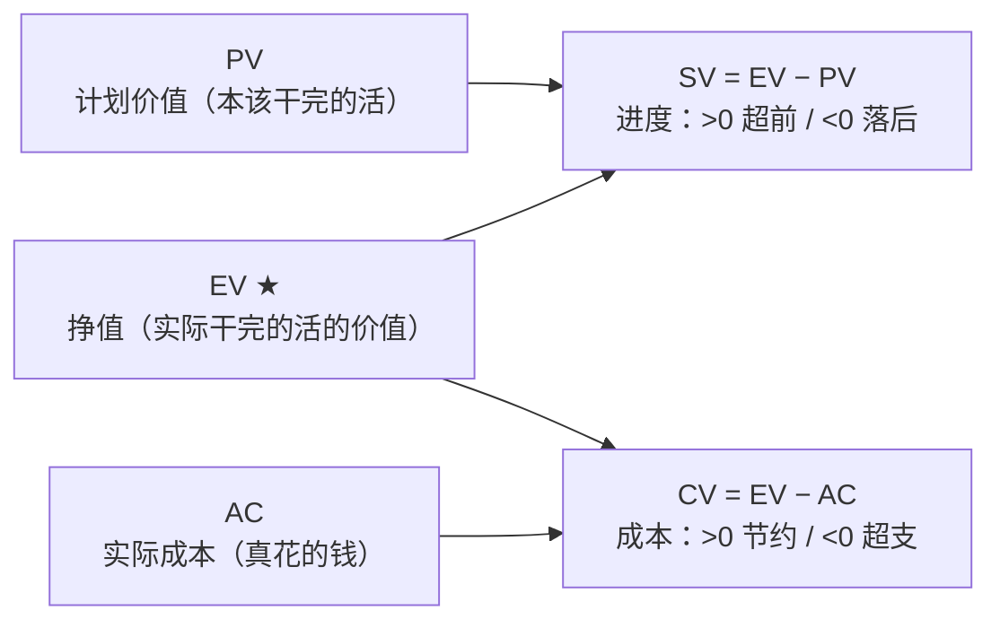

## 考点梳理

### 4.1 成本管理基本概念

- **成本估算**：估算完成活动所需资源成本，形成各活动估算；
- **成本预算**：把估算汇总并分配到 WBS 工作包，形成**成本基准**（含应急储备）。
- 成本基准 + **管理储备**（应对未知-未知风险）＝项目总预算。

### 4.2 挣值管理（EVM）

挣值管理把范围、进度、成本统一到三个基本量上（均指**到检查点为止**的累计值）：

| 记号 | 含义 | 说明 |
|------|------|------|
| PV | 计划价值 | 到检查点本应完成工作的计划价值 |
| EV | 挣值 | 到检查点**实际完成**工作的计划价值 |
| AC | 实际成本 | 到检查点实际花费 |

派生指标：

- **SV = EV − PV**：进度偏差，>0 进度超前，<0 进度落后；
- **CV = EV − AC**：成本偏差，>0 成本节约，<0 成本超支；
- **SPI = EV / PV**：进度绩效指数，>1 进度超前；
- **CPI = EV / AC**：成本绩效指数，>1 成本节约。

典型偏差下的完工估算：**EAC = BAC ÷ CPI**（按当前"每花 1 元产出不足 1 元价值"的效率做完）。

### 4.3 质量管理：QA 与 QC

- **质量**＝"符合要求 + 适合使用"；质量是**做出来的**，不是检验出来的。
- **质量保证（QA）**：面向**过程**，通过**过程审计**等方法确保按规范执行，重在**预防**；
- **质量控制（QC）**：面向**结果**，通过检验、测量发现并纠正缺陷，重在**检查**。

### 4.4 七种基本质量工具

因果图、流程图、核查表、帕累托图、直方图、控制图、散点图。常考区分：

- **控制图**：监控过程是否处于受控状态（是否有特殊原因变异）；
- **帕累托图**：按频次排序，"80/20"找少数关键问题；
- **因果图（鱼骨图）**：找问题根因。

## 🧠 记忆工具箱

### 一图速记 · EVM 四个公式从哪来

**万能锚**：把 EV 想成"**挣到的钱**"——挣的比"本该干的（PV）"多→进度超前；挣的比"花的（AC）"少→成本超支。**E（EV）永远是主角**：减 PV 管进度、减 AC 管成本。

### 口诀速记

- **EVM 口诀**：『**E 减看偏差，E 除看指数；偏差看正负，指数看大于 1**。』
- **EAC 典型偏差**：`EAC = BAC ÷ CPI`——记"**老本 ÷ 当前效率**"（按现在的亏法干完全程要花多少）。
- **QA/QC 一句话**：QA 像**纪委**（审计过程：有没有按规矩干），QC 像**质检员**（检验结果：货合不合格）。
- **质量工具按用途选**：找根因→**鱼骨图**；排优先级→**帕累托**（80/20）；看过程稳不稳→**控制图**。

### 易混辨析 · QA vs QC

| 对比 | QA 质量保证 | QC 质量控制 |
|------|-------------|-------------|
| 对象 | **过程** | **结果** |
| 手段 | 过程审计、培训、预防 | 检验、测量、纠正 |
| 时机 | 执行中持续 | 交付/检查点 |
| 关键词 | 预防、审计、规矩 | 检查、返工、验收 |

## ⚠️ 易错提醒

- SPI/CPI **越大越好**，SV/CV **越正越好**——别把 PV 和 AC 的位置记反：**EV 永远是被减数/分子**。
- "质量保证就是质检"是常见误区：质检属于 QC，QA 是过程层面的保证。
- EAC 选"典型"还是"非典型"要看题干：按当前效率继续=典型（BAC÷CPI）；一次性的偏差、后续恢复=非典型（AC+BAC−EV）。
