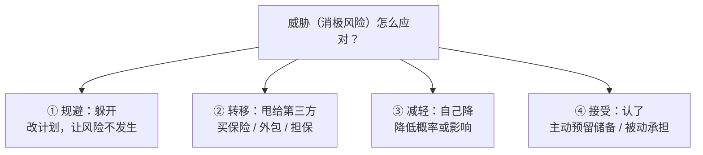

## 考点梳理

### 5.1 项目风险

**风险**是"不确定的事件或条件，一旦发生会对项目目标产生正面或负面影响"。关键词：**不确定性 + 影响**。

- 已识别风险的记录载体是**风险登记册**（描述、概率、影响、应对、责任人）；
- 风险管理有"未知-未知"与"已知-未知"之分：已知-未知可准备**应急储备**，未知-未知准备**管理储备**。

### 5.2 风险分析：定性 vs 定量

- **定性风险分析**：用**概率 × 影响矩阵**对风险评级、排序——快、主观、常用；
- **定量风险分析**：用数据模型量化（期望货币值 EMV、决策树、蒙特卡洛模拟），算出风险对目标的总体影响。

### 5.3 风险应对策略

针对**威胁**：**规避**（消除威胁或改变计划）、**转移**（把风险后果转给第三方，如买保险、外包）、**减轻**（降低概率或影响，如用成熟技术）、**接受**（被动：接受不处理；主动：预留储备）。

针对**机会**：**开拓**（让机会一定发生）、**提高**（提高发生概率/影响）、**分享**（分给能放大机会的第三方）、**接受**。

### 5.4 干系人管理

- **干系人**：受项目影响或能影响项目的个人/组织。第一步是**识别**并记录其需求与期望；
- **参与度评估**五级：不知晓 → 抵制 → 中立 → 支持 → 领导，管理目标是让干系人向"支持/领导"靠近；
- **权力-利益方格**：高权力高利益→**重点管理**；高权力低利益→**令其满意**；低权力高利益→**随时告知**；低权力低利益→**监督**。

## 🧠 记忆工具箱

### 一图速记 · 威胁怎么应对（从硬到软）

### 口诀速记

- **威胁四字诀**：『**躲（规避）→ 甩（转移）→ 降（减轻）→ 认（接受）**』——一个比一个"软"：能躲就躲，躲不掉就甩给别人，甩不掉自己降，降到没法降就认（备储备）。
- **机会四字诀**：『**开（开拓）→ 提（提高）→ 分（分享）→ 接（接受）**』——威胁是"躲甩降认"，机会是"开提分接"，**别用混**。
- **定性 vs 定量一句话**：定性=**拍脑袋评级排序**（概率×影响矩阵，快）；定量=**用数字算总账**（EMV、决策树、蒙特卡洛，慢而准）。考试先定性后定量。
- **风险 vs 问题**：风险是**还没发生**的隐患（提前管）；问题是**已经发生**的麻烦（立即处理）。

### 易混辨析 · 干系人权力-利益方格

| 权力 ＼ 利益 | 低利益 | 高利益 |
|-------------|--------|--------|
| **高权力** | **令其满意**（哄好就行） | **重点管理**（伺候好） |
| **低权力** | **监督**（看着办） | **随时告知**（常汇报） |

口诀：**都高重点管；权高利低哄满意；权低利高常汇报；都低看着办**。

## ⚠️ 易错提醒

- **转移≠减轻**：转移是把后果转给第三方（保险/外包），减轻是自己降低概率或影响。
- **规避≠减轻**：规避是让风险事件不发生（改变计划），不是"小心一点"。
- 干系人管理是**贯穿全程**的持续过程，不是只在启动阶段做一次。
- EMV 期望值 = **概率 × 影响**，别乘错（如 30% × 50 万 = 15 万，不是 50 万也不是 1.5 万）。
