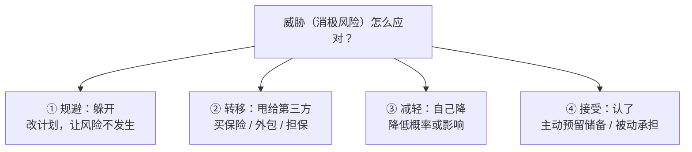

## 考点梳理

### 5.1 项目风险

**风险**是"不确定的事件或条件，一旦发生会对项目目标产生正面或负面影响"。关键词：**不确定性 + 影响**。

- 已识别风险的记录载体是**风险登记册**（描述、概率、影响、应对、责任人）；
- 风险管理有"未知-未知"与"已知-未知"之分：已知-未知可准备**应急储备**，未知-未知准备**管理储备**。

### 5.2 风险分析：定性 vs 定量

- **定性风险分析**：用**概率 × 影响矩阵**对风险评级、排序——快、主观、常用；
- **定量风险分析**：用数据模型量化（期望货币值 EMV、决策树、蒙特卡洛模拟），算出风险对目标的总体影响。

### 5.3 风险应对策略

针对**威胁**：**规避**（消除威胁或改变计划）、**转移**（把风险后果转给第三方，如买保险、外包）、**减轻**（降低概率或影响，如用成熟技术）、**接受**（被动：接受不处理；主动：预留储备）。

针对**机会**：**开拓**（让机会一定发生）、**提高**（提高发生概率/影响）、**分享**（分给能放大机会的第三方）、**接受**。

### 5.4 干系人管理

- **干系人**：受项目影响或能影响项目的个人/组织。第一步是**识别**并记录其需求与期望；
- **参与度评估**五级：不知晓 → 抵制 → 中立 → 支持 → 领导，管理目标是让干系人向"支持/领导"靠近；
- **权力-利益方格**：高权力高利益→**重点管理**；高权力低利益→**令其满意**；低权力高利益→**随时告知**；低权力低利益→**监督**。

## 🧠 记忆工具箱

### 一图速记 · 威胁怎么应对（从硬到软）

### 口诀速记

- **威胁四字诀**：『**躲（规避）→ 甩（转移）→ 降（减轻）→ 认（接受）**』——一个比一个"软"：能躲就躲，躲不掉就甩给别人，甩不掉自己降，降到没法降就认（备储备）。
- **机会四字诀**：『**开（开拓）→ 提（提高）→ 分（分享）→ 接（接受）**』——威胁是"躲甩降认"，机会是"开提分接"，**别用混**。
- **定性 vs 定量一句话**：定性=**拍脑袋评级排序**（概率×影响矩阵，快）；定量=**用数字算总账**（EMV、决策树、蒙特卡洛，慢而准）。考试先定性后定量。
- **风险 vs 问题**：风险是**还没发生**的隐患（提前管）；问题是**已经发生**的麻烦（立即处理）。

### 易混辨析 · 干系人权力-利益方格

| 权力 ＼ 利益 | 低利益 | 高利益 |
|-------------|--------|--------|
| **高权力** | **令其满意**（哄好就行） | **重点管理**（伺候好） |
| **低权力** | **监督**（看着办） | **随时告知**（常汇报） |

口诀：**都高重点管；权高利低哄满意；权低利高常汇报；都低看着办**。

## 📚 深度精讲（重点精细版）

> 说明：本章前文"记忆工具箱"已讲威胁/机会应对与权力-利益方格；此处补充**风险管理全流程、识别与分析工具、干系人参与管理工具**等精细化内容。

### 一、风险管理七过程（流程题必背）

1. 规划风险管理（定方法、角色、预算、时间安排与风险类别）；
2. **识别风险**（把不确定性"找出来"，产出风险登记册雏形）；
3. **定性风险分析**（概率×影响矩阵排序，定优先级）；
4. **定量风险分析**（对高优先级风险做数值建模：EMV、决策树、蒙特卡洛）；
5. **规划风险应对**（威胁：规避/转移/减轻/接受；机会：开拓/提高/分享/接受）；
6. 实施风险应对；
7. 监督风险（跟踪已识别风险、识别新风险、评估过程有效性）。

> 口诀：**"规—识—定—量—应—行—监"**（规划、识别、定性、定量、应对、实施、监督）。

### 二、风险识别工具（考特征匹配）

| 工具 | 关键特征 |
|------|---------|
| 头脑风暴 | 集思广益、快速产生大量风险 |
| **德尔菲技术** | **专家匿名、多轮反馈、逐步收敛**（避免权威压制） |
| 访谈 | 与经验者深聊，挖掘隐性风险 |
| SWOT 分析 | 从优势/劣势/机会/威胁四个角度找风险与机会 |
| 核对表（检查表） | 依据历史项目清单逐项核对 |
| 假设分析 | 检验假设不成立时会怎样 |
| 图解技术 | 因果图、流程图、影响图 |

### 三、风险登记册要写什么（owner 与触发器是重点）

风险描述、类别、**概率与影响**、优先级、**应对策略与行动**、**风险责任人（owner）**、**触发器/预警信号**、应急储备、状态（开放/关闭）。

> 考点：**每个风险必须有明确的责任人**；高级风险还应有**应急计划（plan B）**与**权变措施（workaround，事到临头才用）**的区分。

### 四、干系人管理四过程与工具

- 四过程：**识别干系人 → 规划干系人参与 → 管理干系人参与 → 监督干系人参与**；
- **权力-利益方格**（前文已讲）；
- **凸显模型（Salience Model）**：按**权力（Power）、合法性（Legitimacy）、紧迫性（Urgency）**三项把干系人分为多类——三项都有＝最优先（决定性干系人）；
- **参与度评估矩阵**：不知晓 → 抵制 → 中立 → 支持 → **领导**；管理目标是让关键干系人从当前状态向"支持/领导"移动。

### 五、典型例题（带解析）

**例题 1**：为避免个别专家意见主导结论，项目组采用"专家匿名填写 + 多轮汇总反馈直至意见收敛"的方式收集风险意见。该方法属于？
A. 头脑风暴　B. 德尔菲技术　C. 访谈　D. 假设分析
**答案 B**。解析："匿名 + 多轮反馈 + 逐步收敛"是德尔菲技术的标志；头脑风暴是面对面/集中讨论，访谈是一对一深聊。

**例题 2**：某供应商权力大、对项目高度关注（利益高）。按凸显模型，它还缺哪一项才会成为"权力-合法性-紧迫性"三要素齐备的决定性干系人？
A. 权力　B. 合法性　C. 紧迫性　D. 预算
**答案 C**。解析：题干已给"权力大（Power）+ 高度关注（利益/紧迫性倾向）"，凸显模型第三要素为**紧迫性**；"预算"不是凸显模型要素。

### 六、命题角度与背诵卡

- 命题角度：风险管理流程排序、识别工具特征匹配、威胁/机会应对策略匹配、EMV 计算、干系人四种策略、参与度层级、凸显模型三要素；
- 背诵卡：**"规识定量应行监"**；**德尔菲=匿名多轮收敛**；**应对：威胁躲甩降认、机会开提分接**；**凸显三要素=权力+合法性+紧迫性**；**参与度五级：不知晓→抵制→中立→支持→领导**。

## ⚠️ 易错提醒

- **转移≠减轻**：转移是把后果转给第三方（保险/外包），减轻是自己降低概率或影响。
- **规避≠减轻**：规避是让风险事件不发生（改变计划），不是"小心一点"。
- 干系人管理是**贯穿全程**的持续过程，不是只在启动阶段做一次。
- EMV 期望值 = **概率 × 影响**，别乘错（如 30% × 50 万 = 15 万，不是 50 万也不是 1.5 万）。
