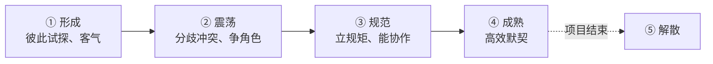

## 考点梳理

### 6.1 资源/人力资源管理

管理"人"的四个过程（示例口径）：

1. **规划资源（人力资源计划）**：识别角色职责，产出**责任分配矩阵 RAM**（常用 RACI：负责/批准/咨询/知会）与组织分解结构 OBS；
2. **组建项目团队**：预分派、谈判、招募（含虚拟团队）；
3. **建设项目团队**：提升协作能力。常用**激励理论**：
   - 马斯洛需要层次：生理→安全→社交→尊重→自我实现（逐级满足）；
   - 赫茨伯格双因素：保健因素（薪金、环境，没有会不满）与激励因素（成就、认可、成长，有了才满意）；
   - 麦克利兰成就动机：成就、权力、归属；
   - X/Y 理论：X 认为人懒需监督，Y 认为人自驱需授权。
4. **管理项目团队**：观察与交谈、绩效评估、冲突处理、问题日志。

**冲突处理五策略**（按"合作程度"从低到高）：撤退/回避、缓和/包容（求同）、妥协/调解（各让一步）、强迫/命令（赢-输）、合作/面对（双赢）。项目冲突常见来源：进度、优先级、资源、技术观点、人事。

### 6.2 沟通管理

- **沟通模型**：发送方编码 → 选择媒介传递 → 接收方解码 → 确认理解 → 反馈；全程存在**噪声**。
- **沟通渠道数**：`N × (N−1) / 2`（N 为干系人/成员数）——人越多，沟通复杂度**按平方级**增长。
- 沟通方式：书面 vs 口头、正式 vs 非正式；按场景选择（重要决策留书面记录）。
- **会议**：项目启动会、例行周会、评审会、站会；会前发议程、会后发纪要（行动项 + 责任人 + 期限）。

## 🧠 记忆工具箱

### 一图速记 · 团队发展五阶段

锚点：**一支球队从组队到夺冠**——互相客气的"新人期"吵过架（震荡）立好规矩（规范）配合默契（成熟）赛季结束散伙（解散）。

### 口诀速记

- **团队五阶段**：`形 → 震 → 规 → 熟 → 散`（谐音"行真规数算"可不强求，按"开始—吵架—磨合—高效—解散"的故事记即可）。
- **沟通渠道公式**：`N(N−1)/2`——**两两握一次手**，人数越多握手次数平方级上涨（3 人=3 条、5 人=10 条、10 人=45 条）。
- **冲突五策略从软到硬**：`撤（撤退）→ 让（缓和）→ 折（妥协）→ 压（强迫）→ 谈（合作）`；**最佳是合作双赢**，紧急时可用强迫。
- **RACI**：四字母=四角色——**R** 干活、**A** 拍板、**C** 咨询、**I** 知会（A 只有一个人）。

### 易混辨析 · 双因素理论

| 因素类型 | 包含 | 没有会怎样 | 有了会怎样 |
|---------|------|-----------|-----------|
| 保健因素 | 薪金、福利、工作环境 | **不满** | 不会不满（但也不会更满意） |
| 激励因素 | 成就、认可、成长 | 未必不满 | **更满意/更积极** |

## 📚 深度精讲（重点精细版）

### 一、人力资源管理四过程与产物

| 过程 | 做什么 | 关键产物 |
|------|--------|---------|
| 规划资源管理 | 定角色、职责、汇报关系 | **RACI 责任分配矩阵**、组织图（OBS） |
| 组建项目团队 | 获取所需人员 | 团队派工单、资源日历 |
| 建设项目团队 | 提升协作与能力 | 团队绩效评价、培训记录 |
| 管理项目团队 | 跟踪表现、解决冲突 | 变更请求、问题日志、经验教训 |

### 二、项目经理的五种权力（考场景匹配）

| 权力类型 | 来源 | 适用/风险 |
|---------|------|----------|
| 合法（职位）权力 | 组织正式任命 | 基础权力，单靠它难以服众 |
| 奖励权力 | 能给予奖励/认可 | 见效快，但需真实可兑现 |
| 强制（惩罚）权力 | 能处罚 | 短期有效，长期伤士气 |
| **专家权力** | 技术/专业能力强 | 最持久、最受认可的权力来源之一 |
| **参照（感召）权力** | 人格魅力、被认同 | 团队自愿追随 |

> 记忆锚：**职位给的权力是"外壳"，专家与参照权力才是"内核"**。

### 三、冲突处理五法的适用场景

| 策略 | 适用场景 |
|------|---------|
| 撤退/回避 | 问题次要、需要冷静、信息不足时**临时**处理 |
| 缓和/包容 | 强调共同点、维护关系，问题暂缓 |
| 妥协/调解 | 双方势均力敌、需快速达成可接受方案 |
| 强迫/命令 | **紧急情况**、涉及重大安全/合规，必须立即决断 |
| **合作/面对** | 时间允许、需要真正解决问题（**最理想、双赢**） |

### 四、团队发展阶段的领导风格（示例口径）

形成期（指导型：明确任务与规则）→ 震荡期（教练型：疏导冲突、明确角色）→ 规范期（支持型：鼓励协作）→ 成熟期（**授权型**：放手让团队自主运转）。

### 五、沟通：模型、渠道与障碍

- 模型要素：**发送方 → 编码 → 媒介（渠道） → 解码 → 接收方 → 反馈**，全程存在**噪声**；
- **沟通渠道公式 N(N−1)/2**：3 人＝3 条、5 人＝10 条、**12 人＝66 条**、20 人＝190 条；
- 常见障碍：过滤（报喜不报忧）、选择性知觉、情绪影响、语言/术语差异、信息过载；
- 改善手段：重要信息**书面化 + 确认理解（反馈）**、统一术语、控制信息颗粒度。

### 六、典型例题（带解析）

**例题 1**：项目上线前夜发现严重安全缺陷，必须立即决定是否回滚。项目经理直接拍板执行回滚。其冲突处理方式属于？
A. 撤退　B. 缓和　C. 强迫　D. 合作
**答案 C**。解析：题干强调"紧急、必须立即决断"，属于强迫/命令的典型适用场景；合作虽最理想但需时间协商。

**例题 2**：某 12 人项目组（含项目经理）内部两两沟通，理论上共有多少条沟通渠道？
A. 24　B. 66　C. 132　D. 144
**答案 B**。解析：N(N−1)/2＝12×11/2＝66。24 是 12×2 的误算，132 是"12×11"未÷2，144 是 12×12。

### 七、命题角度与背诵卡

- 命题角度：RACI 字母含义（A 唯一）、权力类型匹配、冲突策略场景、团队阶段顺序、沟通渠道计算、沟通障碍识别；
- 背诵卡：**团队五阶段"形震规熟散"**；**冲突五策"撤让折压谈"**——**紧急用强迫、长期靠合作**；**渠道 N(N−1)/2**；**RACI：R 干活、A 拍板（唯一）、C 咨询、I 知会**。

## ⚠️ 易错提醒

- **激励 ≠ 加薪万能**：加薪是保健因素，只能消"不满"，不能长期激励——题目考双因素时常在这里设坑。
- 冲突"不能消灭，只能管理"：完全没有冲突并不一定是好事，过度冲突才有害。
- 沟通渠道数**不算自己**：N 个人之间两两组合，先算组合数再除以 2。
- 重要沟通（变更、验收、风险）**必须书面留痕**，"口头说了就行"是管理大忌。
