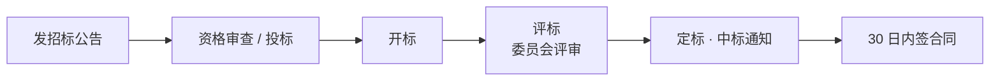

## 考点梳理

### 7.1 采购管理过程（四过程）

1. **规划采购**：做**自制-外购分析**（自己做还是买）、编写采购工作说明书 SOW 与采购文件（RFP 建议征询书 / RFQ 报价征询书）；
2. **实施采购**：发布招标信息 → 投标 → 评标/建议书评价 → 谈判 → 授予合同；
3. **控制采购**：管理合同关系、监督履约、处理**合同变更与索赔**；
4. **结束采购**：采购审计、整理归档、经验教训。

### 7.2 合同类型与风险分担（高频考点）

| 大类 | 类型 | 特点 | 买方风险 |
|------|------|------|---------|
| 总价类 | 固定总价（FFP） | 一口价、超支卖方扛 | **最小** |
| 总价类 | 总价+激励（FPIF） | 定目标成本与分成比例 | 小 |
| 成本类 | 成本+固定酬金（CPFF） | 实报实销+固定利润 | 大 |
| 成本类 | 成本+激励酬金（CPIF） | 实报实销+按绩效浮动利润 | 大 |
| 成本类 | 成本+成本百分比（CPPC） | 花得越多赚得越多 | **最大（应避免）** |
| 工料类 | 工料合同（T&M） | 单价固定、数量按实结算 | 中等（范围不明时用） |

规律一句话：**固定总价 = 风险基本全压给卖方；成本类 = 风险基本由买方背**；范围不清楚时用工料合同。

### 7.3 招投标要点（示例口径，以最新法规为准）

- 招标方式：**公开招标**（发公告、不特定投标人）与**邀请招标**（向 ≥3 家特定单位发邀请）；
- 评标委员会：≥5 人单数，技术经济专家**不少于 2/3**；
- 中标人确定后发出中标通知书，**30 日内**签订书面合同；
- 禁止围标、串标、虚假投标。

### 7.4 合同管理与索赔

- 合同管理：**合同变更要走变更流程并形成书面变更协议**；履约监控；违约处理；
- **索赔**：按合同约定程序提出（时效、证据、书面），承包商向业主索赔或反向索赔；
- 收尾注意：**索赔与争议要在合同收尾前了结**，签署最终结算。

## 🧠 记忆工具箱

### 一图速记 · 公开招标流程

### 口诀速记

- **合同类型按"风险往哪边甩"记**：`总价甩卖方 · 成本买方扛 · 工料中间站`。
- **CPPC 是雷区**：成本加成本百分比＝"花越多赚越多"，激励卖方烧钱，**买方风险最大、应避免**。
- **采购四过程**：`规（规划）→ 招（实施）→ 控（控制）→ 结（结束）`——和进度"规划-执行-监控-收尾"同构，好记。
- **自制 vs 外购**：问三句——自己会吗（能力）？便宜吗（成本）？来得及吗（进度）？任一不满足就外购。

## ⚠️ 易错提醒

- 风险方向别记反：**总价合同（尤其 FFP）对买方最有利、卖方风险最大**；成本百分比合同反之。
- 工料合同不是"成本类"：它按**固定单价×实际用量**结算，多用于范围模糊或紧急情况。
- 邀请招标对象**不得少于 3 家**；评标委员会专家比例 **≥ 2/3**（常考数字）。
- 合同变更**必须先走变更控制、后执行**，"先干后补"会导致索赔争议。
