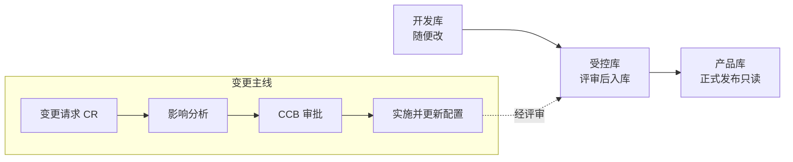

## 考点梳理

### 8.1 文档管理

按内容用途分三类（示例口径）：

- **开发文档**：需求规格、设计说明书、测试用例等（开发过程产物）；
- **产品文档**：用户手册、操作指南、培训材料（面向使用方）；
- **管理文档**：项目计划、报告、会议纪要、变更记录（面向管理）。

文档要**评审**（同行评审/正式评审）并纳入配置管理；重要文档（计划、合同、验收报告）须留正式版本。

### 8.2 配置管理

- **配置项（CI）**：纳入配置管理的单元——项目计划、需求、设计、源代码、文档、数据、甚至工具链，均有唯一标识；
- **配置库（三库）**：
  - **开发库（动态库）**：开发人员随时读写；
  - **受控库（主库）**：经过评审的基线内容，需权限控制；
  - **产品库（发布库）**：正式发布/交付版本，只读。
- **基线（Baseline）**：一组配置项在某个时点被正式冻结的版本（如需求基线、设计基线），后续改动必须走变更控制；
- **配置管理活动**：配置标识 → 配置控制（变更审批）→ 配置状态报告 → **配置审计**（功能配置审计：功能是否符合需求；物理配置审计：交付物是否完整一致）。

### 8.3 变更管理流程（必考顺序题）

1. 提出**变更请求（CR）**并登记；
2. **影响分析**（范围/进度/成本/风险）；
3. **CCB（变更控制委员会）审批**——重要变更才上会，一般变更项目经理可批；
4. 批准后更新计划/基准并**实施**；
5. **验证**实施结果、更新配置项与文档、关闭变更。

## 🧠 记忆工具箱

### 一图速记 · 配置库流转与变更主线

### 口诀速记

- **三库三级权限**：开发库=**草稿随便改**；受控库=**评审后进、改要批**；产品库=**发布版只读**。锚点：写稿（草稿）→ 编辑审稿（受控）→ 印刷发行（产品）。
- **变更五步走**：`提（CR）→ 析（影响）→ 批（CCB）→ 干（实施）→ 验（验证归档）`——**先批后干，绝不先斩后奏**。
- **两类配置审计**：功能审计=**做没做到**（对需求）；物理审计=**东西齐不齐**（对清单）。

### 易混辨析 · 文档三分类

| 类型 | 给谁用 | 例子 |
|------|--------|------|
| 开发文档 | 开发者 | 需求规格、设计说明书、测试用例 |
| 产品文档 | 用户 | 用户手册、操作指南 |
| 管理文档 | 管理者 | 计划、报告、会议纪要 |

## 📚 深度精讲（重点精细版）

### 一、文档质量四要求与三分类速查

- 要求：**针对性**（给谁看写什么）、**及时性**（随进度同步更新）、**完整性**（要素齐全）、**可追溯性**（版本、变更记录可查）；
- 三分类：开发文档（需求/设计/测试）、产品文档（用户手册/操作指南）、管理文档（计划/报告/纪要）。

### 二、配置管理四活动（不只"三库"）

| 活动 | 内容 | 产物/要点 |
|------|------|----------|
| 配置识别 | 确定哪些是配置项、编号与属性 | 配置项清单、基线 |
| 配置控制 | 变更评估与审批、入库出库权限 | 变更记录、**受控库**管理 |
| 配置状态报告 | 记录并发布配置项状态变化 | 状态报告（谁改了什么、何时） |
| **配置审计** | 验证一致性与完整性 | 功能配置审计 + 物理配置审计报告 |

### 三、基线类型（示例口径）

| 基线 | 冻结内容 | 时点 |
|------|---------|------|
| 功能基线 | 需求规格（做什么） | 需求评审通过后 |
| 分配基线 | 设计规格（怎么分到模块） | 设计评审通过后 |
| 产品基线 | 产品全部配置项（含交付物） | 验收/发布前 |

> 一句话：**功能基线管"要什么"、分配基线管"怎么分"、产品基线管"交什么"**。

### 四、配置审计两类对比

| 类型 | 检查什么 | 例句 |
|------|---------|------|
| 功能配置审计 | 功能实现是否符合**需求** | "系统是否实现了合同要求的全部功能" |
| 物理配置审计 | 交付物与**配置清单**是否一致 | "文档、源码、安装包是否齐全且版本匹配" |

> 与**质量审计**的区别：质量审计查"过程是否按规矩执行"，配置审计查"版本与构成是否一致"。

### 五、变更控制：分级审批与评估要素

- 变更分级：重大变更（涉及基准、合同、投资）→ **CCB 审批**；一般变更 → 项目经理审批；紧急变更 → 可先处置后补流程（须留痕）；
- **变更影响评估五要素**：范围、进度、成本、质量、风险（缺一项就答不完整）；
- 变更台账：编号、提出人、日期、内容、评估结论、审批结果、实施与验证状态；
- 版本号规则（示例）：`V 主版本.次版本.修订号`——**重大变更升主版本、功能增强升次版本、纠错升修订号**。

### 六、典型例题（带解析）

**例题 1**：配置管理员核对"交付的文档、源代码、安装包是否齐全且版本一致"，这属于？
A. 功能配置审计　B. 物理配置审计　C. 质量审计　D. 财务审计
**答案 B**。解析：物理配置审计检查交付物与配置清单的一致性；功能配置审计核对"功能是否符合需求"。

**例题 2**：某变更涉及合同金额与项目基准调整，应由谁审批？
A. 项目经理自行批准　B. 配置管理员　C. 变更控制委员会（CCB）　D. 开发组长
**答案 C**。解析：涉及基准/合同/投资的重大变更须 CCB 审批；一般变更才由项目经理审批。

### 七、命题角度与背诵卡

- 命题角度：三库权限、基线类型、配置审计两类、变更流程顺序、CCB 审批范围、版本号规则；
- 背诵卡：**开发库随便改 · 受控库改要批 · 产品库只读**；**变更五步：提析批干验**；**功能审计对需求、物理审计对清单**；**涉基准/合同 → CCB**。

## ⚠️ 易错提醒

- **基线 ≠ 配置项**：配置项是"对象"，基线是"某一时点被冻结的版本集合"。
- 变更控制委员会（CCB）**不是所有变更都开会**——重大变更才上会，细枝末节走项目经理审批，否则项目被流程拖死。
- **配置审计 ≠ 质量审计**：配置审计查"版本/构成是否一致完整"；质量审计查"过程是否按规矩执行"。
- 变更实施后**必须同步更新文档与配置**，否则"代码改了、文档没改"，后期维护就失控。
