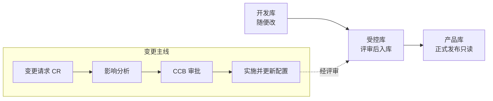

## 考点梳理

### 8.1 文档管理

按内容用途分三类（示例口径）：

- **开发文档**：需求规格、设计说明书、测试用例等（开发过程产物）；
- **产品文档**：用户手册、操作指南、培训材料（面向使用方）；
- **管理文档**：项目计划、报告、会议纪要、变更记录（面向管理）。

文档要**评审**（同行评审/正式评审）并纳入配置管理；重要文档（计划、合同、验收报告）须留正式版本。

### 8.2 配置管理

- **配置项（CI）**：纳入配置管理的单元——项目计划、需求、设计、源代码、文档、数据、甚至工具链，均有唯一标识；
- **配置库（三库）**：
  - **开发库（动态库）**：开发人员随时读写；
  - **受控库（主库）**：经过评审的基线内容，需权限控制；
  - **产品库（发布库）**：正式发布/交付版本，只读。
- **基线（Baseline）**：一组配置项在某个时点被正式冻结的版本（如需求基线、设计基线），后续改动必须走变更控制；
- **配置管理活动**：配置标识 → 配置控制（变更审批）→ 配置状态报告 → **配置审计**（功能配置审计：功能是否符合需求；物理配置审计：交付物是否完整一致）。

### 8.3 变更管理流程（必考顺序题）

1. 提出**变更请求（CR）**并登记；
2. **影响分析**（范围/进度/成本/风险）；
3. **CCB（变更控制委员会）审批**——重要变更才上会，一般变更项目经理可批；
4. 批准后更新计划/基准并**实施**；
5. **验证**实施结果、更新配置项与文档、关闭变更。

## 🧠 记忆工具箱

### 一图速记 · 配置库流转与变更主线

### 口诀速记

- **三库三级权限**：开发库=**草稿随便改**；受控库=**评审后进、改要批**；产品库=**发布版只读**。锚点：写稿（草稿）→ 编辑审稿（受控）→ 印刷发行（产品）。
- **变更五步走**：`提（CR）→ 析（影响）→ 批（CCB）→ 干（实施）→ 验（验证归档）`——**先批后干，绝不先斩后奏**。
- **两类配置审计**：功能审计=**做没做到**（对需求）；物理审计=**东西齐不齐**（对清单）。

### 易混辨析 · 文档三分类

| 类型 | 给谁用 | 例子 |
|------|--------|------|
| 开发文档 | 开发者 | 需求规格、设计说明书、测试用例 |
| 产品文档 | 用户 | 用户手册、操作指南 |
| 管理文档 | 管理者 | 计划、报告、会议纪要 |

## ⚠️ 易错提醒

- **基线 ≠ 配置项**：配置项是"对象"，基线是"某一时点被冻结的版本集合"。
- 变更控制委员会（CCB）**不是所有变更都开会**——重大变更才上会，细枝末节走项目经理审批，否则项目被流程拖死。
- **配置审计 ≠ 质量审计**：配置审计查"版本/构成是否一致完整"；质量审计查"过程是否按规矩执行"。
- 变更实施后**必须同步更新文档与配置**，否则"代码改了、文档没改"，后期维护就失控。
