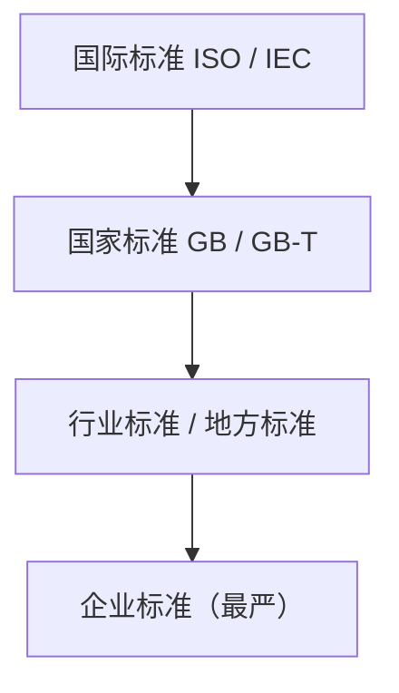

> 本章为知识框架整理，具体条款请以**现行有效法律条文**为准（示例口径）。

## 考点梳理

### 9.1 知识产权：著作权、专利、商标

- **软件著作权**：自作品创作完成即自动产生（登记非强制，仅为证明便利）。作者**署名权、修改权保护期不受限制**；**发表权与财产权**：自然人作品为作者终生 + 死后 **50 年**，法人作品自首次发表起 **50 年**。
- **职务作品**：主要利用单位物质技术条件创作、由单位承担责任的（软件、工程设计图等特殊职务作品），作者保留署名权、**其他著作权归单位**；一般职务作品著作权归作者，单位在 2 年内优先使用（示例口径）。
- **专利权**：**发明 20 年**、**实用新型 10 年**、**外观设计 15 年**（自申请日起算）。
- **商标权**：注册保护期 **10 年**，可无限续展。
- 委托/合作开发成果归属：**有约定按约定，无约定**按法律规定（委托开发成果归受托人，委托人有使用等权利——示例口径，考案例题常出）。

### 9.2 招标投标与政府采购（示例要点）

- 招标方式：公开招标、邀请招标（**≥3 家**）；
- 评标委员会：**≥5 人**单数，其中技术、经济专家**不少于 2/3**；
- 发出中标通知书后 **30 日内**订立书面合同；
- 政府采购以**公开招标为主要方式**，另有邀请招标、竞争性谈判、询价、单一来源等（单一来源：只能从唯一供应商处采购等法定情形）。

### 9.3 合同法要点（民法典合同编）

- **要约邀请 ≠ 要约 ≠ 承诺**：招标公告属于要约邀请，投标文件属于要约，中标通知书属于承诺；
- 合同一般以**书面形式**订立，可约定违约金、定金；不可抗力可部分或全部免责（示例口径）；
- 履行中变更须**双方协商一致**并采用书面形式。

### 9.4 标准化常识

- 标准层级（自上而下细化）：**国际标准**（ISO/IEC）→ **国家标准**（GB 强制 / GB/T 推荐）→ 行业标准 → 地方标准 → 企业标准；
- 企业标准应严于或等同于上级标准（示例口径）。

## 🧠 记忆工具箱

### 一图速记 · 标准金字塔（越往下越具体）

### 口诀速记

- **保护期一口诀**：`署名修改永流传，发表财产五十年；发明二十实用十，外观十五商标十`（后两句自申请/注册日起）。
- **招标三步怕记混**：公告是**邀请**（要约邀请）、标书是**要约**、中标是**承诺**——锚点：逛街问价（邀请）→ 下单（要约）→ 店家接单（承诺）。
- **标准谁更细**：金字塔从上往下越来越严、越来越细，**企业标准往往最严**。

### 高频数字速查表

| 场景 | 数字 |
|------|------|
| 邀请招标对象 | ≥ 3 家 |
| 评标委员会人数 | ≥ 5 人（单数） |
| 评标专家占比 | ≥ 2/3 |
| 中标后签合同 | 30 日内 |
| 专利：发明/实用新型/外观 | 20 / 10 / 15 年 |
| 商标续展周期 | 10 年 |

## ⚠️ 易错提醒

- **署名权没有期限**，但**发表权有期限**（50 年）——两者别混。
- "著作权登记"**不是获得著作权的前提**，只起证明作用。
- 招标公告/招标文件是**要约邀请**，不是要约（考概念归属的经典陷阱）。
- 委托开发无约定时成果通常归**受托人（开发方）**，甲方只获得使用权（案例题高频）。
