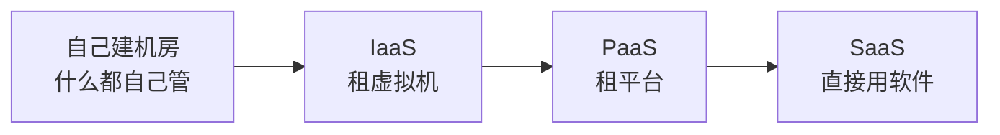

> 新一代信息技术是近年综合知识的高频新增考点，以"概念 + 特征 + 分类"考查为主。

## 考点梳理

### 10.1 云计算

- **基本特征**：按需自助服务、广泛网络接入、**资源池化**、快速弹性伸缩、可计量服务（示例口径）。
- **三种服务模式**（越往下用户管得越多）：
  - **IaaS** 基础设施即服务：给虚拟机/存储/网络，用户自己装系统装软件；
  - **PaaS** 平台即服务：给开发运行平台，用户只管应用；
  - **SaaS** 软件即服务：直接给应用（如在线办公），用户即开即用。
- **部署模式**：公有云、私有云、社区云、混合云。

### 10.2 物联网（IoT）

- 三层架构：**感知层**（传感器、RFID 采集）→ **网络层**（传输）→ **应用层**（智能处理与服务）。

### 10.3 大数据

- **4V**：**Volume 大量、Velocity 高速、Variety 多样、Value 价值**（另有 Veracity 真实性一说）；
- 处理链条：采集 → 存储 → 清洗/预处理 → 分析挖掘 → 可视化。

### 10.4 人工智能（AI）

- 机器学习：从数据中学习规律（监督/无监督/强化）；深度学习为多层神经网络；生成式 AI 以大规模预训练模型为代表（示例口径）；
- 典型应用：图像识别、语音识别、自然语言处理、智能客服、知识图谱。

### 10.5 区块链

- **去中心化**账本：数据按时间打包成**区块**并**哈希链式**相连，改动需全网共识；
- 关键技术：哈希算法、共识机制（如工作量证明 PoW）、智能合约；
- 典型应用：存证、溯源、数字身份、供应链金融（区块链 ≠ 只是加密货币）。

### 10.6 移动互联网 / 5G / 信创

- 5G：大带宽、低时延、海量连接，支撑物联网与工业互联；
- **信创（信息技术应用创新）**：基础软硬件（芯片、操作系统、数据库、中间件、办公套件）国产化替代与生态建设（示例口径）。

## 🧠 记忆工具箱

### 一图速记 · 云服务"操心递减"谱

记住方向：**越往右用户越省心、只管越少**。

### 口诀速记

- **云三模式**：`I 给机房、P 给平台、S 给软件`（I/P/S 由"硬"到"软"，用户从"装修"到"拎包入住"）。
- **物联网三层**：`感 → 传 → 用`（感知采集、网络传输、应用服务）——锚点：**眼睛看（感知）、神经传（网络）、大脑想（应用）**。
- **大数据 4V**：`大（Volume）快（Velocity）杂（Variety）值（Value）`——量大、快产、多样、有价。
- **区块链一句话**：`链上数据人人见、想改数据全网批`——去中心化 + 不可篡改。

### 易混辨析 · 云部署模式

| 模式 | 一句话 |
|------|--------|
| 公有云 | 大家共用，按量付费 |
| 私有云 | 一家独用，自己可控 |
| 社区云 | 几家同行共用 |
| 混合云 | 公有 + 私有打通（常用） |

## 📚 深度精讲（重点精细版）

### 一、云计算：服务模式判定法（三步锁答案）

问自己三个问题：**要不要自己装操作系统？要不要自己部署运行环境？还是直接用软件？**

| 模式 | 云提供 | 用户自管 | 判定关键词 |
|------|--------|---------|-----------|
| IaaS | 虚拟机/存储/网络 | 操作系统、中间件、应用 | "租服务器自己装系统" |
| PaaS | 开发与运行平台 | 只需写应用 | "平台已备好，我只写代码" |
| SaaS | 现成软件 | 什么都不用管 | "打开网页就能用" |

**部署模式适用场景**：公有云（成本低、弹性好，中小企业与互联网业务）；私有云（数据敏感、合规要求高的政企）；社区云（同行业/同诉求的几家单位共用）；混合云（核心数据私有 + 弹性业务公有，**最常用**）。

**云的风险**：数据主权与合规、供应商锁定、多租户隔离、可用性依赖（云宕机即业务中断）。

### 二、物联网：三层 + 常用技术 + 典型应用

感知层（传感器、RFID、二维码、摄像头）→ 网络层（NB-IoT、LoRa、4G/5G、以太网）→ 应用层（平台与业务系统）。
典型场景：智能家居、车联网、工业互联网、智慧农业、智能电表。

### 三、大数据：4V 与处理流程

4V＝**大量 Volume、高速 Velocity、多样 Variety、价值 Value**（真实性 Veracity 为扩展项）。
处理流程：**采集 → 预处理（清洗/去重/归一）→ 存储 → 分析挖掘 → 可视化呈现**。
与相关概念：数据仓库负责"存与分析"，数据挖掘负责"从数据中找规律"，大数据强调"体量与速度突破传统处理能力"。

### 四、区块链：结构、共识与应用

- **结构**：区块＝区块头（前一区块哈希、时间戳、随机数）＋区块体（交易数据）；链式连接使历史记录难以篡改；
- **共识机制**：PoW（工作量证明，安全但耗能）、PoS（权益证明，节能）、PBFT（联盟链常用，效率高）；
- **智能合约**：条件满足自动执行的代码，减少人工干预；
- **应用**：存证、溯源、供应链金融、数字身份；**局限**：吞吐与延迟、能耗、监管与合规。

### 五、人工智能与信创

- AI：机器学习（**监督/无监督/强化**）→ 深度学习 → 大模型；典型应用：图像识别、语音识别、自然语言处理、智能推荐、知识图谱；
- 信创（信息技术应用创新）：从**芯片 → 操作系统 → 数据库 → 中间件 → 应用软件**逐层国产化替代，强调生态适配与安全可控。

### 六、典型例题（带解析）

**例题 1**：某公司直接使用在线协同办公套件（无需自建服务器、无需安装部署），按账号付费。该服务模式属于？
A. IaaS　B. PaaS　C. SaaS　D. DaaS
**答案 C**。解析：开箱即用的软件服务是 SaaS；IaaS 给基础设施、PaaS 给开发运行平台。

**例题 2**：大数据处理的一般流程是？
A. 采集 → 预处理 → 存储 → 分析挖掘 → 可视化
B. 分析挖掘 → 采集 → 存储 → 可视化 → 预处理
C. 存储 → 采集 → 可视化 → 预处理 → 分析挖掘
D. 采集 → 可视化 → 存储 → 分析挖掘 → 预处理
**答案 A**。解析：先取数再清洗（预处理），落库后分析，最后呈现——顺序体现"数据流"。

### 七、命题角度与背诵卡

- 命题角度：IaaS/PaaS/SaaS 判定、云部署模式匹配、物联网层职责、4V 选非、大数据流程排序、区块链特征与共识、AI 学习类型；
- 背诵卡：**I 给机房、P 给平台、S 给软件**；**物联网"感传用"**；**4V：大快杂值**；**区块链=链式+共识+难篡改**；**信创五层：芯、OS、库、件、用**。

## ⚠️ 易错提醒

- IaaS/PaaS/SaaS 归属别错位：**要自己装数据库的是 IaaS**；**直接打开网页用的是 SaaS**。
- **区块链 ≠ 比特币**：加密货币只是区块链应用之一。
- 大数据 4V 常考"下列不属于 4V 的是"——注意**准确性/真实性**不是 4V 标准四项（它是扩展项）。
- 物联网三层别漏"应用层"：感知只是采集，处理与决策在应用层。
