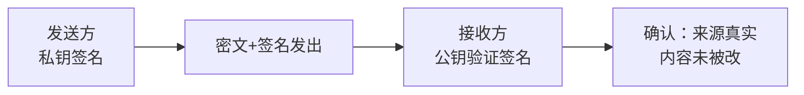

## 考点梳理

### 11.1 安全基础与访问控制

- 安全目标仍是 **CIA**（保密、完整、可用）+ 真实性/可审计（示例口径）；
- **纵深防御**：网络、主机、应用、数据多道防线；
- 访问控制模型：**DAC 自主**（属主自己授权）、**MAC 强制**（系统统一分级）、**RBAC 基于角色**（给角色授权，人挂角色）。

### 11.2 常见攻击与威胁

- **拒绝服务 DoS / 分布式 DDoS**：耗尽资源致服务不可用（破坏可用性）；
- 恶意代码：病毒（传染）、蠕虫（自传播）、木马（伪装远控）、勒索软件；
- **Web 攻击**：SQL 注入、XSS 跨站脚本、CSRF 跨站请求伪造；
- **社会工程/钓鱼**：骗人而非破系统，最难防。

### 11.3 密码学与数字签名（高频）

- **对称加密**（AES/DES）：**一个密钥**加密解密，**快**；问题在密钥分发；
- **非对称加密**（RSA/ECC）：**公钥加密、私钥解密**（反之签名），**慢**但解决分发；
- **哈希摘要**（SHA 系列/MD5）：定长指纹，用于完整性校验；
- **数字签名**：**发送方私钥签名 → 接收方公钥验证**——保证**来源真实 + 不可抵赖 + 内容完整**；
- **数字证书/CA/PKI**：由证书机构 CA 用根证书为公钥"背书"，解决"公钥是谁的"问题。

### 11.4 安全设备与机制

防火墙（包过滤/状态检测/应用代理）、入侵检测 IDS（旁路告警）与入侵防御 IPS（串联阻断）、WAF（Web 应用防火墙）、防病毒、漏洞扫描、安全审计、数据加密与脱敏。

### 11.5 等级保护（等保 2.0）

- 定级对象按受侵害后的**危害程度**定级，一般分 **1–5 级**（1 自主、2 指导、3 监督、4 强制、5 专控——示例口径）；
- 流程：**定级 → 备案 → 安全建设整改 → 等级测评 → 监督检查**。

### 11.6 备份与容灾

- **全量备份**：全拷，恢复快、占空间大、耗时；
- **增量备份**：只备"上次备份后"的变化，省空间快，但恢复要全量 + 依次全部增量；
- **差异备份**：只备"上次全量后"的变化，恢复只要全量 + 最后一次差异；
- 容灾指标：**RPO**（可容忍的数据丢失量/时间）与 **RTO**（可容忍的停机恢复时长）。

## 🧠 记忆工具箱

### 一图速记 · 数字签名怎么"盖章"

锚点：私钥是**私章**（只有我有），公钥是**印鉴备案**（大家可查）——私章盖章，大家验章。

### 口诀速记

- **对称/非对称**：`对称一个钥、又快怕分发；非对称两个钥、安全但慢慢`。
- **签名 vs 加密一句话**：**加密=上锁防偷看（保密）；签名=盖章防抵赖（来源与完整）**。
- **备份三兄弟**：全量=全屋搬家；增量=只搬"昨天以后"新增的；差异=只搬"上次大扫除以后"所有变化的。恢复速度：全量最快、增量最麻烦。
- **等保五级**：`自、指、监、强、专`（自主保护→指导→监督→强制→专控），级别越高管得越严。

### 易混辨析 · 三种备份

| 方式 | 备份范围 | 空间/耗时 | 恢复难度 |
|------|---------|-----------|---------|
| 全量 | 全部数据 | 最大 | 最简单 |
| 增量 | 上次备份后新增 | 最小 | 最麻烦（全量+一串增量） |
| 差异 | 上次**全量**后变化 | 中 | 全量+最后一次差异 |

## 📚 深度精讲（重点精细版）

### 一、安全体系分层（防护要成体系）

物理安全（机房与环境）→ 网络安全（边界、访问控制）→ 主机安全（系统加固、补丁）→ 应用安全（代码与接口）→ 数据安全（加密、脱敏、备份）＋**管理安全**（制度、人员、审计）。
**两项基本原则**：**最小权限**（只给必需权限）、**职责分离**（关键操作不由一人完成）。

### 二、访问控制三模型

| 模型 | 授权主体 | 特点 |
|------|---------|------|
| DAC 自主访问控制 | **资源属主** | 灵活，但权限易扩散 |
| MAC 强制访问控制 | **系统按安全级别**统一规定 | 严格（军用/涉密常用） |
| RBAC 基于角色 | 按**角色**授权，人挂角色 | 企业最常用，易管理 |

### 三、密码技术三件套与数字信封

| 技术 | 密钥 | 速度 | 用途 |
|------|------|------|------|
| 对称加密（AES/DES） | 加解密同一密钥 | **快** | 大数据量加密 |
| 非对称加密（RSA/ECC） | 公钥加密、私钥解密 | 慢 | 密钥交换、签名 |
| 哈希（SHA 系列） | 无密钥（可加盐） | 快 | 完整性校验、口令存储 |

- **数字签名**：发送方**私钥签名** → 接收方**公钥验证**，保证来源真实、内容完整、不可抵赖；
- **数字信封**（应用最广的组合）：**用对称密钥加密数据（快）＋ 用接收方公钥加密该对称密钥（安全）**——同时解决"快"与"密钥分发安全"；
- **PKI/CA**：CA 用自身私钥签发证书为公钥背书；证书链用于验证身份。

### 四、攻击分类与防护

- 被动攻击：窃听、流量分析（**难被发现**，重在预防加密）；主动攻击：篡改、重放、伪装、拒绝服务；
- 恶意代码：病毒（依附传染）、蠕虫（自主传播）、木马（伪装远控）、勒索软件；
- Web 攻击与防护：**SQL 注入**（参数化查询/预编译）、**XSS**（输出编码/内容安全策略）、**CSRF**（Token 校验/校验来源）；
- **社会工程/钓鱼**：骗人不骗系统——靠安全意识培训与流程控制防范。

### 五、等级保护 2.0

- 定级依据：系统遭破坏后对**国家安全、社会秩序与公共利益、公民与法人合法权益**的危害程度；
- 级别：1 自主、2 指导、3 监督、4 强制、5 专控（常见为二级、三级）；
- 流程：**定级 → 备案 → 建设整改 → 等级测评 → 监督检查**；
- 等保 2.0 扩展：云计算、移动互联、物联网、工业控制、大数据等新场景的安全扩展要求。

### 六、备份与容灾

| 方式 | 备份范围 | 恢复方式 |
|------|---------|---------|
| 全量 | 全部数据 | 直接恢复 |
| 增量 | 上次**任意备份**后的变化 | 全量 + 依次全部增量 |
| 差异 | 上次**全量**后的变化 | 全量 + 最后一次差异 |

指标：**RPO（可容忍数据丢失量）**决定备份频率；**RTO（可容忍恢复时长）**决定容灾架构。

### 七、典型例题（带解析）

**例题 1**：需要高效且安全地传输一份大文件，常见做法是？
A. 全程用 RSA 直接加密文件内容
B. 用对称密钥加密文件，再用接收方公钥加密该对称密钥一并发送
C. 只计算文件哈希值后发送
D. 只做数字签名不加密
**答案 B**。解析：这是数字信封思路——对称算法快、非对称算法解决密钥分发；A 慢，C 不保密，D 只保证完整与来源。

**例题 2**：信息系统等级保护的定级主要依据是？
A. 系统投资金额
B. 系统受到破坏后对国家安全、社会秩序与公共利益、公民与法人合法权益的危害程度
C. 系统用户数量
D. 服务器数量与机房面积
**答案 B**。解析：等保定级看"危害客体与危害程度"，与投资额、用户数、设备数量无关。

### 八、命题角度与背诵卡

- 命题角度：CIA 归属判断、对称/非对称特性、数字签名与数字信封、访问控制模型、等保定级与流程、备份方式对比、Web 攻击防护；
- 背诵卡：**加密防偷看、签名防抵赖、信封两把钥**；**DAC 属主定、MAC 系统定、RBAC 角色定**；**等保流程"定备建测定"**；**增量看任意备份、差异看上次全量**。

## ⚠️ 易错提醒

- **加密 ≠ 签名**：加密解决"保密"，签名解决"是谁发的/有没有被改"（防抵赖与完整）。
- 对称加密**快**但密钥分发难；非对称**慢**——别把速度记反。
- 防火墙防外不防内、不是万能；**DDoS 破坏的是可用性**（题目喜欢问动了哪一性）。
- 增量 vs 差异看"基准"：增量基准=上次任意备份；差异基准=上次全量。
