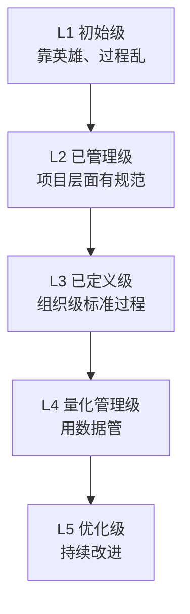

## 考点梳理

### 12.1 组织级项目管理：做对的项目

- **项目组合管理**：站在战略层**选项目**（该做哪些项目、资源怎么分）；
- **项目集管理**：把**相互关联**的项目打包协同管理，获取单干得不到的收益；
- **PMO（项目管理办公室）**三种类型：
  - **支持型**：当顾问，提供模板与方法，控制弱；
  - **控制型**：要求遵循规范，中等控制；
  - **指令型**：直接管理项目，控制最强。

### 12.2 成熟度模型 CMMI

- 五级阶梯：**初始级（1）→ 已管理级（2）→ 已定义级（3）→ 量化管理级（4）→ 优化级（5）**；
- 核心思想：过程能力逐级提升，从"靠英雄"到"靠制度"再到"靠数据、持续优化"。

### 12.3 ITIL 服务管理（示例口径）

- 面向 IT **运维服务**：服务台、事件管理（快速恢复）、问题管理（查根因）、变更管理、配置管理等流程化运维。

### 12.4 信息系统工程监理

- 建设方委托**独立的第三方监理**对承建方进行监督（独立性是生命线）；
- 核心口诀 **"三控、两管、一协调"**：
  - **三控**：质量控制、进度控制、投资（成本）控制；
  - **两管**：合同管理、信息管理；
  - **一协调**：组织协调（各方关系）。
- 监理工作贯穿设计、实施（施工）、验收各阶段。

## 🧠 记忆工具箱

### 一图速记 · CMMI 五级楼梯

### 口诀速记

- **组合 vs 项目集一句话**：组合管**"选不选这个项目"**（战略），项目集管**"几个项目怎么一起干"**（协同）。
- **PMO 从弱到强**：`支（支持：参谋）→ 控（控制：立规矩）→ 指（指令：直接管）`。
- **CMMI 五级串**：`初混 → 已管 → 已定 → 量化 → 优化`（混→管→定→量→优）。
- **监理八字诀**：`三控（质、进、投）两管（合、信）一协调`——锚点：**质量进度投资三个阀门，合同信息两本账，外加和事佬协调**。

### 易混辨析 · 项目/项目集/项目组合

| 层次 | 关注 | 类比 |
|------|------|------|
| 项目 | 交付成果 | 一次具体战役 |
| 项目集 | 相关联项目协同收益 | 一场战役集群 |
| 项目组合 | 选对项目、资源分配 | 总部战略沙盘 |

## ⚠️ 易错提醒

- **PMO 类型看控制力**：支持型不直接管、指令型直接管——题给场景让选类型时先找"管不管项目"。
- CMMI 第 1 级是**初始/混乱**，"已管理"是第 2 级（很多人把 2/3 记反）。
- 监理是**独立第三方**：既不代表建设方包庇，也不替承建方干活；"监理代替验收/监理帮写代码"都是错的。
- "三控"是**质量控制、进度控制、投资控制**——不是"成本+范围+进度"那种项目管理三约束，别套错。
