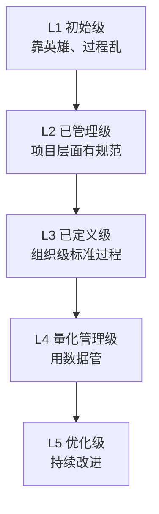

## 考点梳理

### 12.1 组织级项目管理：做对的项目

- **项目组合管理**：站在战略层**选项目**（该做哪些项目、资源怎么分）；
- **项目集管理**：把**相互关联**的项目打包协同管理，获取单干得不到的收益；
- **PMO（项目管理办公室）**三种类型：
  - **支持型**：当顾问，提供模板与方法，控制弱；
  - **控制型**：要求遵循规范，中等控制；
  - **指令型**：直接管理项目，控制最强。

### 12.2 成熟度模型 CMMI

- 五级阶梯：**初始级（1）→ 已管理级（2）→ 已定义级（3）→ 量化管理级（4）→ 优化级（5）**；
- 核心思想：过程能力逐级提升，从"靠英雄"到"靠制度"再到"靠数据、持续优化"。

### 12.3 ITIL 服务管理（示例口径）

- 面向 IT **运维服务**：服务台、事件管理（快速恢复）、问题管理（查根因）、变更管理、配置管理等流程化运维。

### 12.4 信息系统工程监理

- 建设方委托**独立的第三方监理**对承建方进行监督（独立性是生命线）；
- 核心口诀 **"三控、两管、一协调"**：
  - **三控**：质量控制、进度控制、投资（成本）控制；
  - **两管**：合同管理、信息管理；
  - **一协调**：组织协调（各方关系）。
- 监理工作贯穿设计、实施（施工）、验收各阶段。

## 🧠 记忆工具箱

### 一图速记 · CMMI 五级楼梯

### 口诀速记

- **组合 vs 项目集一句话**：组合管**"选不选这个项目"**（战略），项目集管**"几个项目怎么一起干"**（协同）。
- **PMO 从弱到强**：`支（支持：参谋）→ 控（控制：立规矩）→ 指（指令：直接管）`。
- **CMMI 五级串**：`初混 → 已管 → 已定 → 量化 → 优化`（混→管→定→量→优）。
- **监理八字诀**：`三控（质、进、投）两管（合、信）一协调`——锚点：**质量进度投资三个阀门，合同信息两本账，外加和事佬协调**。

### 易混辨析 · 项目/项目集/项目组合

| 层次 | 关注 | 类比 |
|------|------|------|
| 项目 | 交付成果 | 一次具体战役 |
| 项目集 | 相关联项目协同收益 | 一场战役集群 |
| 项目组合 | 选对项目、资源分配 | 总部战略沙盘 |

## 📚 深度精讲（重点精细版）

### 一、三层管理：项目 / 项目集 / 项目组合

| 层次 | 管理对象 | 核心目标 | 关键动作 |
|------|---------|---------|---------|
| 项目 | 单个项目 | 交付成果、达成目标 | 计划、执行、监控、收尾 |
| 项目集 | 相互关联的一组项目 | 获取**协同收益**（1+1＞2） | 收益管理、依赖协调 |
| 项目组合 | 组织内全部项目/项目集 | **战略对齐、资源最优配置** | 识别、选择、优先级排序、平衡、监控 |

**组合管理五步**：识别组件 → 评估与选择 → 确定优先级 → 平衡资源（风险与收益搭配）→ 持续监控与调整（**定期剔除低价值项目**）。

### 二、PMO 三类职能再辨析（易混）

| 类型 | 控制力 | 具体表现 | 一句话 |
|------|-------|---------|--------|
| 支持型 | 弱 | 提供模板、培训、经验库、咨询 | "顾问" |
| 控制型 | 中 | 制定并要求执行方法/流程，检查合规 | "立规矩的人" |
| 指令型 | 强 | 直接管理项目、项目经理向其汇报 | "直接指挥官" |

> 与项目经理的分工：PMO 关注**方法论与组织级治理**；项目经理关注**本项目的目标与交付**。

### 三、CMMI 五级成熟度（记住每级"关键词"）

1. **初始级**：过程混乱，靠个人英雄；
2. **已管理级**：项目层面有计划、有跟踪（**项目管理级**）；
3. **已定义级**：组织级**标准过程**被定义，项目裁剪后使用（**组织标准化**）；
4. **量化管理级**：用**数据与统计**管理过程（量化控制）；
5. **优化级**：**持续改进**、预防缺陷、技术创新。

> 口诀：**混 → 管 → 定 → 量 → 优**。

### 四、IT 服务管理（ITIL 视角）

- 核心理念：IT 从"技术保障"转向"**服务交付**"，用流程化方式管理运维；
- 关键实践：**服务台**（统一入口）、**事件管理**（尽快恢复服务）、**问题管理**（找根因、防复发）、**变更管理**（控风险）、**配置管理**（管资产与关系）；
- 一句话区分：**事件看"快恢复"，问题看"找根因"**。

### 五、信息系统工程监理

- 定位：受建设单位委托，对承建方实施**独立第三方**监督（独立性是生命线）；
- 核心职责：**三控**（质量控制、进度控制、投资控制）＋ **两管**（合同管理、信息管理）＋ **一协调**（组织协调）；
- 覆盖阶段：设计阶段监理、实施阶段监理、验收阶段监理；
- 与项目管理区别：项目管理由承建方/建设方内部实施，监理是**外部独立监督**，不替任何一方干活、不代替验收决策。

### 六、典型例题（带解析）

**例题 1**：某组织的办公室只提供模板、培训与咨询，不直接管理项目。该 PMO 属于？
A. 支持型　B. 控制型　C. 指令型　D. 顾问型
**答案 A**。解析：只提供支撑服务而不介入项目管理的属支持型；控制型要求执行规范，指令型直接管项目。

**例题 2**：CMMI 三级（已定义级）的核心特征是？
A. 过程混乱、靠个人能力　B. 组织已建立标准过程，项目裁剪后使用　C. 全面量化管理　D. 持续优化改进
**答案 B**。解析：二级是项目级管理，三级升到"组织级标准过程"，四级量化，五级优化。

### 七、命题角度与背诵卡

- 命题角度：三层管理辨析、PMO 类型、CMMI 级别特征、ITIL 事件/问题区分、监理"三控两管一协调"、监理独立性与阶段；
- 背诵卡：**组合选项目、项目集要协同、项目交成果**；**PMO：支持/控制/指令**；**CMMI：混管定量优**；**监理：质量进度投资三控 + 合同信息两管 + 一协调**。

## ⚠️ 易错提醒

- **PMO 类型看控制力**：支持型不直接管、指令型直接管——题给场景让选类型时先找"管不管项目"。
- CMMI 第 1 级是**初始/混乱**，"已管理"是第 2 级（很多人把 2/3 记反）。
- 监理是**独立第三方**：既不代表建设方包庇，也不替承建方干活；"监理代替验收/监理帮写代码"都是错的。
- "三控"是**质量控制、进度控制、投资控制**——不是"成本+范围+进度"那种项目管理三约束，别套错。
