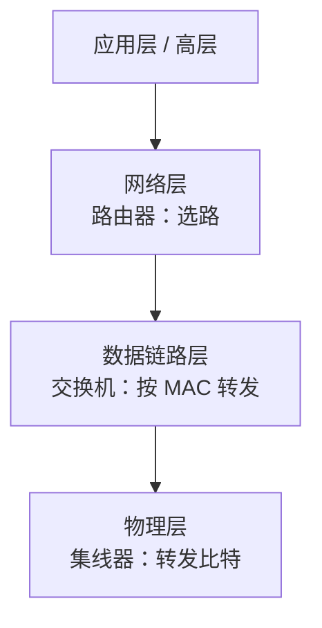

## 考点梳理

### 13.1 OSI 七层与 TCP/IP

**OSI 参考模型（自下而上）**：物理层 → 数据链路层 → 网络层 → 传输层 → 会话层 → 表示层 → 应用层。

- 记忆锚点：**"物数网传会表应"**——把数据比作快递：物理=公路、链路=装箱打包、网络=定路线、传输=运输送达、会话=收发双方通话、表示=翻译格式、应用=快递 App 下单。
- 各层管的事：物理层传比特；链路层做帧与 MAC 寻址；网络层负责**寻址与选路**（IP）；传输层管端到端（TCP/UDP）；应用层管应用协议（HTTP/FTP/SMTP/DNS…）。

**TCP/IP 四层**（自下而上）：网络接口层 → 网际层（IP）→ 传输层（TCP/UDP）→ 应用层，与 OSI 是对应而非相等。

### 13.2 TCP 与 UDP

| 对比 | TCP | UDP |
|------|-----|-----|
| 连接 | 面向连接（三次握手） | 无连接 |
| 可靠性 | 可靠（确认重传） | 尽力而为 |
| 速度/开销 | 慢、开销大 | 快、开销小 |
| 典型应用 | 网页 HTTP、文件 FTP、邮件 SMTP | 视频直播、语音、DNS 查询 |

### 13.3 IP 地址基础

- IPv4 分 A/B/C 等类：A 类首位 0、B 类 10、C 类 110（示例口径）；
- **私有地址**：`10.x`、`172.16~31.x`、`192.168.x`（内网用，公网不路由）；
- IPv6 地址长度 **128 位**，解决地址枯竭；
- 子网掩码用于区分网络号与主机号。

### 13.4 网络设备与层次

| 设备 | 工作层 | 作用 |
|------|--------|------|
| 集线器 Hub | 物理层 | 简单转发、共享带宽（少用） |
| 交换机 Switch | 数据链路层 | 按 MAC 转发，隔离冲突域 |
| 路由器 Router | 网络层 | 按 IP 选路，连接不同网络 |
| 网关 | 高层 | 协议转换、连接异构网络 |
| 防火墙 | 网络层以上 | 访问控制、安全过滤 |

### 13.5 网络集成设计流程

需求调研 → 逻辑网络设计（拓扑/地址规划/安全）→ 物理网络设计（设备选型/布线）→ 实施与测试 → 运行维护。**先规划后实施**，与项目管理"规划先行"一致。

## 🧠 记忆工具箱

### 一图速记 · 设备在"层"上的位置

### 口诀速记

- **设备×层**：`路选网络、交换链路、集线物理`（路由器管网络层选路，交换机管链路层转发，集线器在物理层）。
- **TCP/UDP**：`TCP 打电话（先接通、能确认），UDP 寄平信（不确认、快）`。
- **私有地址**：`10 大网、172 中段、192.168 小网段`——内网三大私网段。
- **OSI 七层**：自下而上 `物、数、网、传、会、表、应`（配合"快递"故事记职责）。

## ⚠️ 易错提醒

- **路由器选路靠 IP（网络层），交换机转发靠 MAC（链路层）**——设备与层次是高频连线题。
- TCP 可靠**慢**，UDP 快**不可靠**：视频直播/语音用 UDP，网页/文件/邮件用 TCP（别记反）。
- IPv6 是 **128 位**，不是 64 位。
- 私有地址只能在**内网**使用，公网路由器不会转发（常考"哪个能当公网 IP"选非）。
