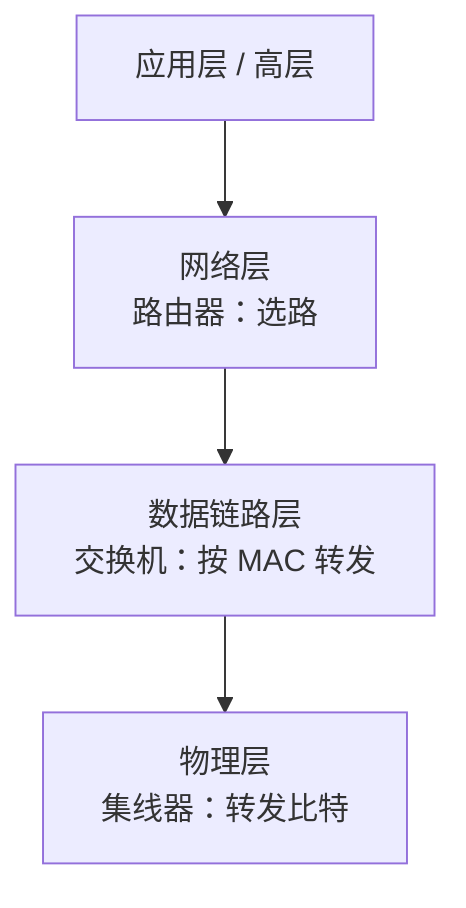

## 考点梳理

### 13.1 OSI 七层与 TCP/IP

**OSI 参考模型（自下而上）**：物理层 → 数据链路层 → 网络层 → 传输层 → 会话层 → 表示层 → 应用层。

- 记忆锚点：**"物数网传会表应"**——把数据比作快递：物理=公路、链路=装箱打包、网络=定路线、传输=运输送达、会话=收发双方通话、表示=翻译格式、应用=快递 App 下单。
- 各层管的事：物理层传比特；链路层做帧与 MAC 寻址；网络层负责**寻址与选路**（IP）；传输层管端到端（TCP/UDP）；应用层管应用协议（HTTP/FTP/SMTP/DNS…）。

**TCP/IP 四层**（自下而上）：网络接口层 → 网际层（IP）→ 传输层（TCP/UDP）→ 应用层，与 OSI 是对应而非相等。

### 13.2 TCP 与 UDP

| 对比 | TCP | UDP |
|------|-----|-----|
| 连接 | 面向连接（三次握手） | 无连接 |
| 可靠性 | 可靠（确认重传） | 尽力而为 |
| 速度/开销 | 慢、开销大 | 快、开销小 |
| 典型应用 | 网页 HTTP、文件 FTP、邮件 SMTP | 视频直播、语音、DNS 查询 |

### 13.3 IP 地址基础

- IPv4 分 A/B/C 等类：A 类首位 0、B 类 10、C 类 110（示例口径）；
- **私有地址**：`10.x`、`172.16~31.x`、`192.168.x`（内网用，公网不路由）；
- IPv6 地址长度 **128 位**，解决地址枯竭；
- 子网掩码用于区分网络号与主机号。

### 13.4 网络设备与层次

| 设备 | 工作层 | 作用 |
|------|--------|------|
| 集线器 Hub | 物理层 | 简单转发、共享带宽（少用） |
| 交换机 Switch | 数据链路层 | 按 MAC 转发，隔离冲突域 |
| 路由器 Router | 网络层 | 按 IP 选路，连接不同网络 |
| 网关 | 高层 | 协议转换、连接异构网络 |
| 防火墙 | 网络层以上 | 访问控制、安全过滤 |

### 13.5 网络集成设计流程

需求调研 → 逻辑网络设计（拓扑/地址规划/安全）→ 物理网络设计（设备选型/布线）→ 实施与测试 → 运行维护。**先规划后实施**，与项目管理"规划先行"一致。

## 🧠 记忆工具箱

### 一图速记 · 设备在"层"上的位置

### 口诀速记

- **设备×层**：`路选网络、交换链路、集线物理`（路由器管网络层选路，交换机管链路层转发，集线器在物理层）。
- **TCP/UDP**：`TCP 打电话（先接通、能确认），UDP 寄平信（不确认、快）`。
- **私有地址**：`10 大网、172 中段、192.168 小网段`——内网三大私网段。
- **OSI 七层**：自下而上 `物、数、网、传、会、表、应`（配合"快递"故事记职责）。

## 📚 深度精讲（重点精细版）

### 一、OSI 七层"职责—协议—设备"总表

| 层（自下而上） | 主要职责 | 典型协议 | 典型设备 |
|---------------|---------|---------|---------|
| 物理层 | 传输比特、定义接口与介质 | — | 中继器、**集线器**、网线/光纤 |
| 数据链路层 | 成帧、**MAC 寻址**、差错检测 | 以太网、PPP | **交换机**、网桥、网卡 |
| 网络层 | **IP 寻址与路由选择** | IP、ICMP、ARP | **路由器**、三层交换机 |
| 传输层 | 端到端可靠/不可靠传输 | **TCP、UDP** | 主机协议栈（非设备） |
| 会话层 | 建立/管理会话 | — | — |
| 表示层 | 数据格式转换、加密压缩 | — | — |
| 应用层 | 面向应用的协议 | **HTTP、FTP、SMTP、DNS** | 网关、代理服务器 |

> 记忆三重奏：**"物数网传会表应"**（自下而上）＋ **"路选网络、交换链路、集线物理"**（设备）＋ **"HTTP 网页、FTP 文件、SMTP 邮件、DNS 解析"**（应用协议）。

### 二、TCP/UDP 与三次握手

- **TCP 面向连接、可靠**（序号确认、超时重传、流量与拥塞控制），典型应用 HTTP/FTP/SMTP；
- **UDP 无连接、快但不可靠**，典型应用视频直播、语音、DNS 查询；
- **三次握手**（建立连接）：SYN → SYN+ACK → ACK；**四次挥手**（断开）：FIN → ACK → FIN → ACK（理解即可，考试以概念为主）。

### 三、IP 地址与子网划分（会算）

- IPv4 分类与私网段：**10./172.16–31./192.168.**；IPv6 为 **128 位**；
- 子网掩码作用：区分网络号与主机号。**C 类 /24 划分两个等长子网 → 掩码 255.255.255.128（/25）**，每个子网 126 个可用主机地址；
- 判断"某 IP 是否与给定网络同网段"：把 IP 与掩码按位与，比较网络号即可。

### 四、网络性能与设备选型

- 指标：带宽（速率上限）、时延（往返 RTT）、吞吐量（实际通过量）、丢包率、抖动（实时业务关键）；
- 选型：接入层用交换机做端口密度与 VLAN 隔离，汇聚/核心层用路由器或三层交换做路由与安全策略；
- **安全设备分工**：防火墙（访问控制）、**IDS 旁路检测告警**、**IPS 串联阻断**、WAF（Web 应用防护）、VPN（加密隧道）。

### 五、网络集成设计流程（与项目管理衔接）

需求调研 → 逻辑设计（拓扑、地址规划、VLAN 与路由、安全域）→ 物理设计（设备选型、布线、机房）→ 实施与测试（连通性、性能、冗余切换）→ 运维与优化。

### 六、典型例题（带解析）

**例题 1**：工作在数据链路层、依据 MAC 地址转发数据帧的设备是？
A. 集线器　B. 交换机　C. 路由器　D. 网关
**答案 B**。解析：交换机工作在链路层按 MAC 转发；集线器在物理层、路由器在网络层、网关在高层做协议转换。

**例题 2**：把 192.168.1.0/24 划分为两个等长子网，子网掩码应为？
A. 255.255.255.0　B. 255.255.255.128　C. 255.255.255.192　D. 255.255.0.0
**答案 B**。解析：划分 2 个子网需借 1 位主机位 → /25，即 255.255.255.128；/26（.192）会得到 4 个子网。

### 七、命题角度与背诵卡

- 命题角度：层次—协议—设备对应、TCP/UDP 应用匹配、私网地址判断、子网掩码与可用主机数、网络设备/安全设备职责、性能指标；
- 背诵卡：**物数网传会表应**；**路选网络、交换链路、集线物理**；**TCP 打电话、UDP 寄平信**；**私网 10 / 172.16-31 / 192.168**；**IDS 旁路告警、IPS 串联阻断**。

## ⚠️ 易错提醒

- **路由器选路靠 IP（网络层），交换机转发靠 MAC（链路层）**——设备与层次是高频连线题。
- TCP 可靠**慢**，UDP 快**不可靠**：视频直播/语音用 UDP，网页/文件/邮件用 TCP（别记反）。
- IPv6 是 **128 位**，不是 64 位。
- 私有地址只能在**内网**使用，公网路由器不会转发（常考"哪个能当公网 IP"选非）。
