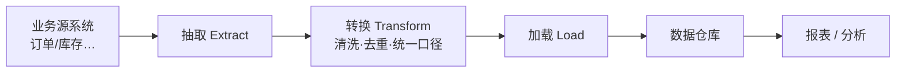

## 考点梳理

### 14.1 关系数据库基础

- **关系模型**：数据组织为**表（关系）**，行=记录、列=字段；
- **主键**：唯一标识一行；**外键**：引用他表主键，建立关联；
- **SQL** 分三类：**DDL**（建表 Create/Alter/Drop）、**DML**（增删改查 Insert/Update/Delete/Select）、**DCL**（授权 Grant/Revoke）；查询常用 Select … Where/Order by/Group by/Join。

### 14.2 事务 ACID

- **原子性（Atomicity）**：事务要么全做要么全不做；
- **一致性（Consistency）**：事务前后数据都满足约束（账目平衡）；
- **隔离性（Isolation）**：并发事务互不干扰；
- **持久性（Durability）**：提交后修改永久保存（落盘）。

锚点：**银行转账**——扣款+入账要么都成功要么都回滚（原子）；钱数守恒（一致）；两人同时转账不串账（隔离）；转完断电也不丢（持久）。

### 14.3 数据库设计步骤

需求分析 → 概念设计（**E-R 图**：实体-联系）→ 逻辑设计（关系模式/规范化）→ 物理设计（存储与索引）。

### 14.4 数据仓库与数据集成

- **数据仓库四大特征**：**面向主题、集成（清洗一致）、时变（随时间变化）、非易失（稳定只读）**——与"实时事务库"相对，专供分析；
- **ETL**：**抽取（Extract）→ 转换（Transform）→ 加载（Load）**，是数据入仓的核心管线；
- 数据集成手段：数据库复制/共享、数据交换平台、ESB/中间件、**主数据管理**（统一各系统共用基础数据，如客户/产品）；
- 与系统集成的关系：数据集成是系统集成的重要层面，先统一"数据口径"再谈应用协同。

## 🧠 记忆工具箱

### 一图速记 · ETL 数据流水线

### 口诀速记

- **ACID**：`原（原子）· 一（一致）· 隔（隔离）· 持（持久）`，配"银行转账"故事一次记住。
- **SQL 三类**：`定结构用 DDL（建表）、改数据用 DML（增删改）、管权限用 DCL`。
- **数据仓库四特征**：`主题、集成、时变、稳定`——**专为分析而建的"历史仓库"**。
- **ETL**：`抽 → 转 → 载`（洗澡水流程：抽水→过滤→灌进池子）。

## ⚠️ 易错提醒

- **主键 vs 外键**：主键标识"本表"每一行，外键引用"他表"主键（连线题高频）。
- 事务的 **ACID** 别少背或记错字：I 是隔离性不是"完整性"。
- 数据仓库是**只读、面向历史分析**的，不是实时 OLTP 事务库——"数据仓库实时更新用于在线交易"是错误说法。
- ETL 顺序固定：先抽取、再转换、最后加载，"转换"夹在中间别排反。
