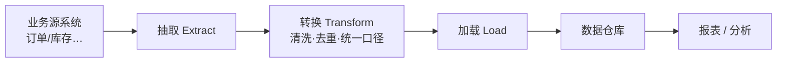

## 考点梳理

### 14.1 关系数据库基础

- **关系模型**：数据组织为**表（关系）**，行=记录、列=字段；
- **主键**：唯一标识一行；**外键**：引用他表主键，建立关联；
- **SQL** 分三类：**DDL**（建表 Create/Alter/Drop）、**DML**（增删改查 Insert/Update/Delete/Select）、**DCL**（授权 Grant/Revoke）；查询常用 Select … Where/Order by/Group by/Join。

### 14.2 事务 ACID

- **原子性（Atomicity）**：事务要么全做要么全不做；
- **一致性（Consistency）**：事务前后数据都满足约束（账目平衡）；
- **隔离性（Isolation）**：并发事务互不干扰；
- **持久性（Durability）**：提交后修改永久保存（落盘）。

锚点：**银行转账**——扣款+入账要么都成功要么都回滚（原子）；钱数守恒（一致）；两人同时转账不串账（隔离）；转完断电也不丢（持久）。

### 14.3 数据库设计步骤

需求分析 → 概念设计（**E-R 图**：实体-联系）→ 逻辑设计（关系模式/规范化）→ 物理设计（存储与索引）。

### 14.4 数据仓库与数据集成

- **数据仓库四大特征**：**面向主题、集成（清洗一致）、时变（随时间变化）、非易失（稳定只读）**——与"实时事务库"相对，专供分析；
- **ETL**：**抽取（Extract）→ 转换（Transform）→ 加载（Load）**，是数据入仓的核心管线；
- 数据集成手段：数据库复制/共享、数据交换平台、ESB/中间件、**主数据管理**（统一各系统共用基础数据，如客户/产品）；
- 与系统集成的关系：数据集成是系统集成的重要层面，先统一"数据口径"再谈应用协同。

## 🧠 记忆工具箱

### 一图速记 · ETL 数据流水线

### 口诀速记

- **ACID**：`原（原子）· 一（一致）· 隔（隔离）· 持（持久）`，配"银行转账"故事一次记住。
- **SQL 三类**：`定结构用 DDL（建表）、改数据用 DML（增删改）、管权限用 DCL`。
- **数据仓库四特征**：`主题、集成、时变、稳定`——**专为分析而建的"历史仓库"**。
- **ETL**：`抽 → 转 → 载`（洗澡水流程：抽水→过滤→灌进池子）。

## 📚 深度精讲（重点精细版）

### 一、数据库三级模式与两级映射

| 层次 | 描述什么 | 对应概念 |
|------|---------|---------|
| 外模式（用户模式） | 单个用户/应用看到的数据视图 | 视图、权限 |
| **模式（概念模式）** | **全体数据的逻辑结构** | 表结构定义 |
| 内模式（存储模式） | 数据在物理介质上的存储方式 | 索引、文件组织 |

两级映射保证**逻辑独立性**（改表结构不影响应用）与**物理独立性**（改存储不影响逻辑结构）。

### 二、关系模型与完整性约束（必考三分法）

- 术语：关系＝表、元组＝行、属性＝列、域＝列的取值范围；**主键**唯一标识元组、**外键**引用他表主键；
- 三类完整性：
  | 约束 | 作用 |
  |------|------|
  | 实体完整性 | **主键非空且唯一** |
  | 参照完整性 | **外键必须匹配被引用表的主键或为空**（不能引用不存在的记录） |
  | 用户定义完整性 | 业务规则（如"年龄 0–150"、"库存不为负"） |

### 三、SQL 分类与常用语句

| 类别 | 语句 | 用途 |
|------|------|------|
| DDL | CREATE / ALTER / DROP | 定义与修改表结构 |
| DML | SELECT / INSERT / UPDATE / DELETE | 增删改查数据 |
| DCL | GRANT / REVOKE | 授权与回收权限 |
| TCL | COMMIT / ROLLBACK | 事务提交与回滚 |

连接类型：内连接（只取匹配行）、左外连接（保留左表全部）、右外连接（保留右表全部）。

### 四、范式与事务并发

- **1NF**：属性不可再分；**2NF**：非主属性完全依赖主键（消除部分依赖）；**3NF**：消除传递依赖。工程上"**一般满足 3NF 即可**"，过度规范化会影响查询性能；
- 事务并发三类问题：
  | 问题 | 表现 |
  |------|------|
  | **脏读** | 读到别的事务**未提交**的数据 |
  | 不可重复读 | 同一事务内两次读同一数据结果不同（别人改了并提交） |
  | 幻读 | 同一查询条件两次读到不同**行数**（别人插入了新行） |
- 隔离级别越高越安全但并发性能越低（示例口径：读未提交＜读已提交＜可重复读＜串行化）。

### 五、数据仓库、ETL 与数据集成

| 对比 | 事务型数据库（OLTP） | 数据仓库（OLAP） |
|------|-------------------|-----------------|
| 面向 | 日常业务操作 | 分析与决策 |
| 数据 | 当前、明细、频繁更新 | 历史、集成、**非易失** |
| 特征 | 高并发短事务 | 大批量复杂查询 |

- **ETL**：抽取 → 转换（清洗、去重、统一口径）→ 加载；**数据集市**＝面向某部门的小型数据仓库；
- 数据集成方式：数据库共享/复制、数据交换平台、ETL 工具、ESB/消息中间件、**主数据管理（MDM）**统一客户/产品等基础数据。

### 六、典型例题（带解析）

**例题 1**：订单表中的"客户号"字段引用了客户表的主键。该约束属于？
A. 实体完整性　B. 参照完整性　C. 用户定义完整性　D. 域完整性
**答案 B**。解析：外键引用被引用表主键的约束就是参照完整性；主键非空唯一是实体完整性。

**例题 2**：一个事务读到了另一个事务尚未提交的数据，这种现象称为？
A. 脏读　B. 不可重复读　C. 幻读　D. 死锁
**答案 A**。解析："读到未提交数据"＝脏读；同一事务内两次读结果不同＝不可重复读；两次查询行数变化＝幻读；死锁是互相等待资源。

### 七、命题角度与背诵卡

- 命题角度：三级模式归属、三类完整性判断、SQL 语句分类、范式级别、并发问题辨识、数据仓库特征、ETL 顺序、数据集成方式；
- 背诵卡：**外模式看局部、模式看全局、内模式看存储**；**主键保实体、外键保参照、业务规则=用户定义**；**脏读未提交、不可重复读被改、幻读多出行**；**数仓：面向主题、集成、时变、非易失**。

## ⚠️ 易错提醒

- **主键 vs 外键**：主键标识"本表"每一行，外键引用"他表"主键（连线题高频）。
- 事务的 **ACID** 别少背或记错字：I 是隔离性不是"完整性"。
- 数据仓库是**只读、面向历史分析**的，不是实时 OLTP 事务库——"数据仓库实时更新用于在线交易"是错误说法。
- ETL 顺序固定：先抽取、再转换、最后加载，"转换"夹在中间别排反。
