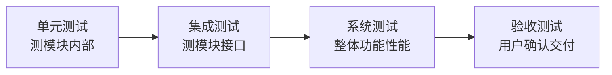

## 考点梳理

### 15.1 软件生命周期模型

- **瀑布模型**：需求→设计→编码→测试→运维，**阶段顺序、文档驱动**；怕变更，返工代价大；
- **原型模型**：先做可运行原型快速获取反馈，适合需求不明；
- **增量/迭代**：分批交付可用功能；
- **螺旋模型**：**风险驱动**，每圈做"计划→风险分析→开发→评审"，适合大型高风险项目；
- **敏捷开发**：小步快跑、短迭代（Scrum 的冲刺 Sprint）、持续交付、拥抱变更。

### 15.2 测试层次与类型

- **测试层次（从小到大）**：单元测试（模块内）→ 集成测试（模块间接口）→ 系统测试（整体功能/性能）→ 验收测试（用户确认）；
- **按方法分**：
  - **白盒测试**：看代码内部结构，测**路径与分支**（语句覆盖、分支覆盖、路径覆盖）；
  - **黑盒测试**：不看内部，只按需求测输入输出（等价类划分、边界值分析、错误推测）；
- **静态测试**（评审、走查，不运行）vs **动态测试**（运行程序）；
- 缺陷管理：发现→登记→分派→修复→回归验证→关闭。

### 15.3 与项目管理的关系

需求变更要过变更控制；测试计划与进度/质量相关联；缺陷密度是质量度量之一；开发与测试任务都要进 WBS。

## 🧠 记忆工具箱

### 一图速记 · 测试从里到外四层次

### 口诀速记

- **生命周期模型一句话**：`瀑布怕改、原型快反馈、螺旋管风险、敏捷跑得快`。
- **白盒/黑盒**：`白盒翻代码（查路径分支）、黑盒点按钮（只看输入输出）`。
- **测试顺序**：`单→集→系→验`，从里到外层层验。
- **黑盒三件套**：等价类、边界值、错误推测——**边界值最爱考**（如"1–100 的合法输入"测 0、1、100、101）。

### 易混辨析 · 主要模型特点

| 模型 | 关键词 | 适用 |
|------|--------|------|
| 瀑布 | 顺序、文档、怕变更 | 需求稳定的传统项目 |
| 原型 | 快速原型、反馈 | 需求不清 |
| 螺旋 | 风险驱动、迭代循环 | 大型高风险 |
| 敏捷 | 短迭代、拥抱变更 | 需求易变、快速交付 |

## 📚 深度精讲（重点精细版）

### 一、生命周期模型对比（选型题必会）

| 模型 | 核心特征 | 适用场景 | 主要风险 |
|------|---------|---------|---------|
| 瀑布 | 阶段顺序、文档驱动 | 需求明确、合同严格 | 变更代价大 |
| 原型 | 快速可运行原型、用户反馈 | **需求不明确** | 原型被误当成品 |
| 增量 | 分批交付可用功能 | 希望早交付、可分期 | 集成与架构约束 |
| 迭代 | 反复精化同一系统 | 需求演化、风险高 | 管理复杂 |
| 螺旋 | **风险驱动**，每轮含风险分析 | 大型高风险项目 | 成本高、需专家 |
| 敏捷 | 短迭代、拥抱变更、自组织团队 | 需求多变、快速交付 | 文档与合同适配难 |
| DevOps | 开发运维一体化、持续集成/交付 | 互联网产品快速发布 | 文化转型难 |

### 二、需求工程与 UML 视图

- 需求过程：**获取 → 分析 → 规格说明（SRS）→ 验证**；需求变更须走变更控制并更新需求基线；
- 结构化方法：自顶向下、以**数据流图 DFD** 与数据字典为核心；
- 面向对象方法：以**对象/类**为核心，四大特征＝**封装、继承、多态、抽象**；
- UML 常用图：**用例图**（谁做什么，需求阶段）、**类图**（静态结构）、**时序图**（对象交互顺序）、**活动图**（流程与并发）。

### 三、测试：V 模型（对应关系必背）

| 开发阶段 | 对应测试级别 |
|---------|-------------|
| 需求分析 | **验收测试** |
| 概要/系统设计 | **系统测试** |
| 详细设计 | **集成测试** |
| 编码 | **单元测试** |

> 记忆锚：**左侧开发、右侧测试，越靠上越"整体"**。

### 四、白盒覆盖强度与黑盒方法

- 白盒覆盖强度（由弱到强）：**语句覆盖 ＜ 判定（分支）覆盖 ＜ 条件覆盖 ＜ 判定/条件覆盖 ＜ 路径覆盖**；
- 黑盒方法：**等价类划分**（有效/无效类各取代表）、**边界值分析**（取边界及边界±1）、因果图（输入组合）、错误推测（凭经验）；
- 用例设计步骤：明确输入域 → 划分等价类 → 取边界值 → 组合成用例 → 评审。
- 补充概念：**冒烟测试**（版本基本可用性快速验证，先于详细测试）≠ **回归测试**（确认修改没有破坏原有功能）。

### 五、维护类型（四分类高频）

| 类型 | 目的 | 例子 |
|------|------|------|
| 改正性维护 | 修缺陷 | 修复计算错误 |
| **适应性维护** | 适应**环境变化** | 操作系统/数据库升级、法规变化 |
| 改善性维护 | 增强功能或性能 | 新增报表、优化响应速度 |
| 预防性维护 | 防患未然 | 重构、补充文档、提升可维护性 |

### 六、典型例题（带解析）

**例题 1**：在 V 模型中，与"需求分析"阶段相对应的测试级别是？
A. 单元测试　B. 集成测试　C. 系统测试　D. 验收测试
**答案 D**。解析：需求对应验收测试；设计对应系统测试；详细设计对应集成测试；编码对应单元测试。

**例题 2**：为适应数据库版本升级而对软件进行的修改，属于哪种维护？
A. 改正性　B. 适应性　C. 改善性　D. 预防性
**答案 B**。解析："为适应外部环境（数据库/OS/法规）变化"是适应性维护；修 bug 是改正性、加功能是改善性、重构防患是预防性。

### 七、命题角度与背诵卡

- 命题角度：模型与场景匹配、需求过程顺序、UML 图用途、V 模型对应、白盒覆盖强度排序、黑盒方法与用例设计、维护类型；
- 背诵卡：**瀑布怕改、原型快反馈、螺旋管风险、敏捷跑得快**；**左侧开发右侧测：需求—验收、设计—系统、详设—集成、编码—单元**；**语句＜判定＜条件＜路径**；**改正、适应、改善、预防**。

## ⚠️ 易错提醒

- **白盒测"实现路径"，黑盒测"需求功能"**——题干说"查看内部代码/路径覆盖"是白盒；说"输入输出/边界值"是黑盒。
- **集成测试 ≠ 系统测试**：集成测"模块间接口协作"，系统测"整个系统的功能与性能"。
- 瀑布模型**不允许"边做边改"**，变更代价大——考"最适合需求明确的场景"。
- 缺陷"回归测试"是为了确认**修复没有引入新问题**，不是简单重复执行。
