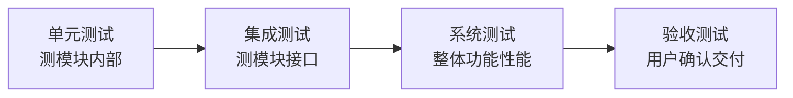

## 考点梳理

### 15.1 软件生命周期模型

- **瀑布模型**：需求→设计→编码→测试→运维，**阶段顺序、文档驱动**；怕变更，返工代价大；
- **原型模型**：先做可运行原型快速获取反馈，适合需求不明；
- **增量/迭代**：分批交付可用功能；
- **螺旋模型**：**风险驱动**，每圈做"计划→风险分析→开发→评审"，适合大型高风险项目；
- **敏捷开发**：小步快跑、短迭代（Scrum 的冲刺 Sprint）、持续交付、拥抱变更。

### 15.2 测试层次与类型

- **测试层次（从小到大）**：单元测试（模块内）→ 集成测试（模块间接口）→ 系统测试（整体功能/性能）→ 验收测试（用户确认）；
- **按方法分**：
  - **白盒测试**：看代码内部结构，测**路径与分支**（语句覆盖、分支覆盖、路径覆盖）；
  - **黑盒测试**：不看内部，只按需求测输入输出（等价类划分、边界值分析、错误推测）；
- **静态测试**（评审、走查，不运行）vs **动态测试**（运行程序）；
- 缺陷管理：发现→登记→分派→修复→回归验证→关闭。

### 15.3 与项目管理的关系

需求变更要过变更控制；测试计划与进度/质量相关联；缺陷密度是质量度量之一；开发与测试任务都要进 WBS。

## 🧠 记忆工具箱

### 一图速记 · 测试从里到外四层次

### 口诀速记

- **生命周期模型一句话**：`瀑布怕改、原型快反馈、螺旋管风险、敏捷跑得快`。
- **白盒/黑盒**：`白盒翻代码（查路径分支）、黑盒点按钮（只看输入输出）`。
- **测试顺序**：`单→集→系→验`，从里到外层层验。
- **黑盒三件套**：等价类、边界值、错误推测——**边界值最爱考**（如"1–100 的合法输入"测 0、1、100、101）。

### 易混辨析 · 主要模型特点

| 模型 | 关键词 | 适用 |
|------|--------|------|
| 瀑布 | 顺序、文档、怕变更 | 需求稳定的传统项目 |
| 原型 | 快速原型、反馈 | 需求不清 |
| 螺旋 | 风险驱动、迭代循环 | 大型高风险 |
| 敏捷 | 短迭代、拥抱变更 | 需求易变、快速交付 |

## ⚠️ 易错提醒

- **白盒测"实现路径"，黑盒测"需求功能"**——题干说"查看内部代码/路径覆盖"是白盒；说"输入输出/边界值"是黑盒。
- **集成测试 ≠ 系统测试**：集成测"模块间接口协作"，系统测"整个系统的功能与性能"。
- 瀑布模型**不允许"边做边改"**，变更代价大——考"最适合需求明确的场景"。
- 缺陷"回归测试"是为了确认**修复没有引入新问题**，不是简单重复执行。
