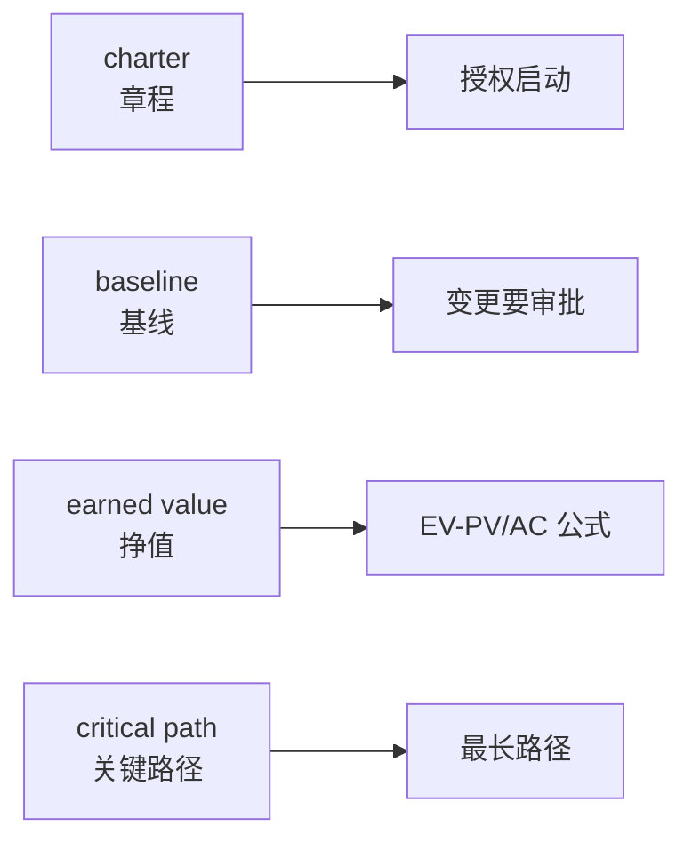

## 考点梳理

### 13.1 英文题怎么考（示例口径）

- 综合知识卷通常含若干道**专业英语题**：给英文题干/选项，考项目管理术语含义、过程定义或简单情景判断；
- 题干多为"which of the following statements is **correct / incorrect / NOT** ..."——注意 NOT 陷阱；
- 词汇以**项目管理通用术语**为主，不考生僻技术词。

### 13.2 高频术语速记表（背诵用）

| 英文 | 中文 | 考点联想 |
|------|------|---------|
| project charter | 项目章程 | 发起人签发、授权启动 |
| scope / WBS | 范围 / 工作分解结构 | 100% 规则 |
| critical path | 关键路径 | 最长路径、决定工期 |
| milestone | 里程碑 | 阶段标志点 |
| earned value (EV) | 挣值 | EV-PV 管进度、EV-AC 管成本 |
| SPI / CPI | 进度/成本绩效指数 | >1 为好 |
| stakeholder | 干系人 | 识别+参与管理 |
| risk register | 风险登记册 | 已识别风险记录 |
| procurement | 采购 | 自制-外购、合同类型 |
| contract | 合同 | FFP/CPFF/工料 |
| baseline | 基线 | 冻结版本、变更要审批 |
| change control board (CCB) | 变更控制委员会 | 变更审批 |
| configuration management | 配置管理 | 三库、配置审计 |
| quality assurance / control | 质量保证 / 质量控制 | 过程 vs 结果 |
| milestone / deliverable | 里程碑 / 可交付成果 | 输出物 |
| RFP / RFQ | 建议征询 / 报价征询 | 采购文件 |
| statement of work (SOW) | 工作说明书 | 采购范围描述 |
| workaround | 权变措施 | 应急处理 |
| contingency reserve | 应急储备 | 已知-未知风险 |
| management reserve | 管理储备 | 未知-未知风险 |

### 13.3 答题策略

1. 先**翻译题干关键词**映射到中文考点（scope→范围、schedule→进度……）；
2. 遇到 **NOT / except / incorrect** 先圈出来，选"不"的那项；
3. 两个选项都像对的：选与**教材标准表述**最一致的，排除绝对化（always/never）与口语化说法；
4. 术语不会就**猜词根**：control=控制、assurance=保证、procurement=采购、implementation=实施。

## 🧠 记忆工具箱

### 一图速记 · 见英文关键词 → 想中文考点

做题时在草稿上把英文词"翻译成中文考点"，基本就赢了一半。

### 口诀速记

- **必背三句英文套路**：
  - 见到 **authorize / approve → charter（授权=章程）**；
  - 见到 **freeze → baseline（冻结=基线）**；
  - 见到 **compare actual with plan → earned value（对账=挣值）**。
- **字母对**：QA=过程保证、QC=结果检验；PM=项目经理、CCB=变更委员会。

## ⚠️ 易错提醒

- **NOT 题先画圈**：题目问"下列**不正确**的是"，答案反而是最像正确的那句的反面——看漏 NOT 是最大失分点。
- 不要逐字翻译长题干：先抓主语和动作（谁、做什么、管什么），术语题考的是"名词对应"，不是语法。
- 专业英语题做错先回看对应中文章节：英语是壳、考点是里子，**考点还是项目管理知识本身**。
