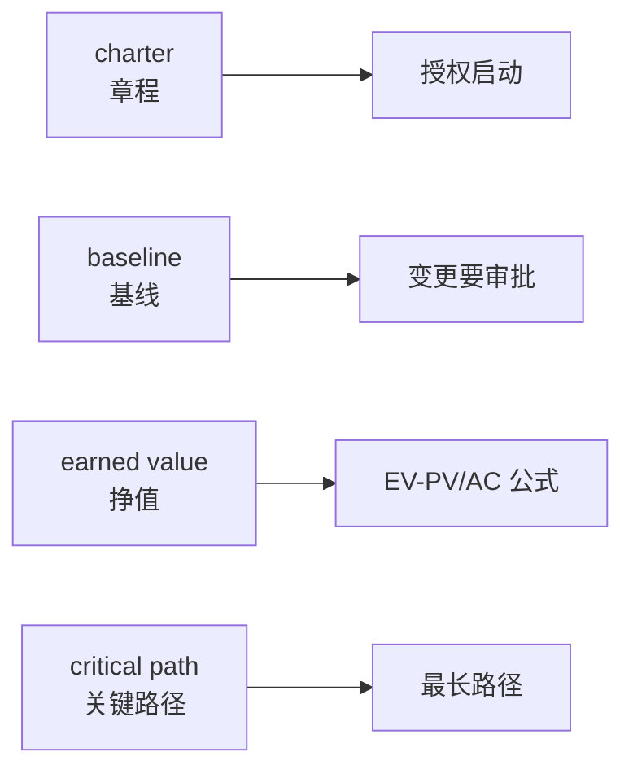

## 考点梳理

### 13.1 英文题怎么考（示例口径）

- 综合知识卷通常含若干道**专业英语题**：给英文题干/选项，考项目管理术语含义、过程定义或简单情景判断；
- 题干多为"which of the following statements is **correct / incorrect / NOT** ..."——注意 NOT 陷阱；
- 词汇以**项目管理通用术语**为主，不考生僻技术词。

### 13.2 高频术语速记表（背诵用）

| 英文 | 中文 | 考点联想 |
|------|------|---------|
| project charter | 项目章程 | 发起人签发、授权启动 |
| scope / WBS | 范围 / 工作分解结构 | 100% 规则 |
| critical path | 关键路径 | 最长路径、决定工期 |
| milestone | 里程碑 | 阶段标志点 |
| earned value (EV) | 挣值 | EV-PV 管进度、EV-AC 管成本 |
| SPI / CPI | 进度/成本绩效指数 | >1 为好 |
| stakeholder | 干系人 | 识别+参与管理 |
| risk register | 风险登记册 | 已识别风险记录 |
| procurement | 采购 | 自制-外购、合同类型 |
| contract | 合同 | FFP/CPFF/工料 |
| baseline | 基线 | 冻结版本、变更要审批 |
| change control board (CCB) | 变更控制委员会 | 变更审批 |
| configuration management | 配置管理 | 三库、配置审计 |
| quality assurance / control | 质量保证 / 质量控制 | 过程 vs 结果 |
| milestone / deliverable | 里程碑 / 可交付成果 | 输出物 |
| RFP / RFQ | 建议征询 / 报价征询 | 采购文件 |
| statement of work (SOW) | 工作说明书 | 采购范围描述 |
| workaround | 权变措施 | 应急处理 |
| contingency reserve | 应急储备 | 已知-未知风险 |
| management reserve | 管理储备 | 未知-未知风险 |

### 13.3 答题策略

1. 先**翻译题干关键词**映射到中文考点（scope→范围、schedule→进度……）；
2. 遇到 **NOT / except / incorrect** 先圈出来，选"不"的那项；
3. 两个选项都像对的：选与**教材标准表述**最一致的，排除绝对化（always/never）与口语化说法；
4. 术语不会就**猜词根**：control=控制、assurance=保证、procurement=采购、implementation=实施。

## 🧠 记忆工具箱

### 一图速记 · 见英文关键词 → 想中文考点

做题时在草稿上把英文词"翻译成中文考点"，基本就赢了一半。

### 口诀速记

- **必背三句英文套路**：
  - 见到 **authorize / approve → charter（授权=章程）**；
  - 见到 **freeze → baseline（冻结=基线）**；
  - 见到 **compare actual with plan → earned value（对账=挣值）**。
- **字母对**：QA=过程保证、QC=结果检验；PM=项目经理、CCB=变更委员会。

## 📚 深度精讲（重点精细版）

### 一、答题四步法（英语题也能"套路化"）

1. **抓主语与动作**：Who does what（谁、做什么、管什么）；
2. **术语映射**：把英文关键词译成中文考点（charter→章程、baseline→基线、earned value→挣值）；
3. **比对选项**：优先选与**教材标准定义**一致的表述；
4. **排除陷阱**：圈出 **NOT / EXCEPT / INCORRECT**，排除含 always/never/only 等绝对化词且与常识冲突的选项。

### 二、高频术语扩展表（第二组 20 词）

| 英文 | 中文 | 考点联想 |
|------|------|---------|
| scope baseline | 范围基准 | 范围说明书+WBS+WBS 词典 |
| change request | 变更请求 | 走 CCB |
| lessons learned | 经验教训 | 收尾必产出、知识管理 |
| stakeholder engagement | 干系人参与 | 参与度矩阵 |
| work performance data | 工作绩效数据 | 原始数据→信息→报告 |
| requirements traceability matrix | 需求跟踪矩阵 | 需求—设计—测试可追溯 |
| quality audit | 质量审计 | 过程合规（QA） |
| inspection | 检查 | 结果验证（QC） |
| resource leveling | 资源平衡 | 改变工期以平衡资源 |
| fast tracking | 快速跟进 | 并行、增返工风险 |
| crashing | 赶工 | 加资源、增成本 |
| contingency reserve | 应急储备 | 已知-未知 |
| management reserve | 管理储备 | 未知-未知 |
| procurement audit | 采购审计 | 采购收尾 |
| source selection | 供方选择 | 评标/建议书评价 |
| cost baseline | 成本基准 | 含应急储备 |
| control account | 控制账户 | WBS 与成本结合点 |
| milestone | 里程碑 | 零历时标志 |
| variance analysis | 偏差分析 | 挣值分析核心 |
| workaround | 权变措施 | 未识别风险的应急处理 |

### 三、词根词缀速记（猜词不求人）

- 前缀：**pro-**（向前，process）、**re-**（再，review/revise）、**inter-**（之间，interface/integration）、**sub-**（下，subcontract）；
- 后缀：**-tion/-sion**（名词，implementation）、**-ity**（性质，quality/priority）、**-able**（可…的，measurable）、**-ment**（名词，management）；
- 否定：**un- / in- / im- / dis-**（incomplete、ineffective、discontinue）。

### 四、常见题型与陷阱

| 题型 | 特征 | 应对 |
|------|------|------|
| 术语定义题 | "The term X means…" | 直接比对中文考点定义 |
| 情景判断题 | 给一句项目情景 | 抓动词判断所属过程/领域 |
| 选非题（NOT） | "Which is NOT…" | 先划 NOT，三项正确一项错误 |
| 数字/公式题 | 给的百分比与工期 | 套 EVM/渠道公式再比对 |

### 五、典型例题（带解析）

**例题 1**：Which document formally authorizes the existence of a project and provides the project manager with the authority to apply organizational resources?
A. Project charter　B. Scope statement　C. Work breakdown structure　D. Business case
**答案 A**。解析：关键词 "formally authorizes + gives authority to PM" 是项目章程的定义；范围说明书描述范围、WBS 分解成果、商业论证论证价值（在章程之前）。

**例题 2**：Which of the following is NOT one of the ten knowledge areas of project management?
A. Procurement management　B. Risk management　C. Lessons learned management　D. Quality management
**答案 C**。解析：十大知识领域不含"经验教训管理"（经验教训是各过程与收尾的产物）。

### 六、命题角度与背诵卡

- 命题角度：术语英文—中文匹配、NOT 选非、情景过程归属、英文版 EVM/渠道计算；
- 背诵卡：**授权=charter、冻结=baseline、对账=earned value、过程审计=quality audit**；**NOT 先画圈**；**绝对化词多为错项**。

## ⚠️ 易错提醒

- **NOT 题先画圈**：题目问"下列**不正确**的是"，答案反而是最像正确的那句的反面——看漏 NOT 是最大失分点。
- 不要逐字翻译长题干：先抓主语和动作（谁、做什么、管什么），术语题考的是"名词对应"，不是语法。
- 专业英语题做错先回看对应中文章节：英语是壳、考点是里子，**考点还是项目管理知识本身**。
