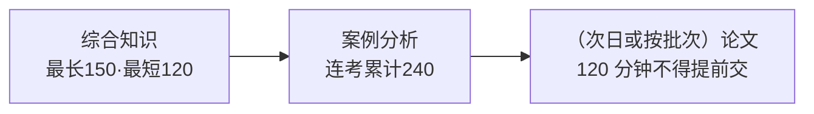

## 考点梳理

### 1.1 机考规则（2026 官方口径）

- 高级三科均**计算机化考试**：**综合知识与案例分析连考共 240 分钟**；
  - 综合知识最长作答 150 分钟、**最短 120 分钟**（到了最短时长才可交卷进入/离开）；
  - 交卷后若继续做案例分析，考试结束前 **60 分钟**可交卷离场；
- **论文科目单独 120 分钟，不得提前交卷**——打字慢的考生务必提前练。

### 1.2 合格与时间节奏

- 各科满分 75、合格 **45 分**（60%）；成绩考后 45 日内查询；
- 一年两次（约 5 月、11 月），高项人多**分批**，按准考证批次参加。

### 1.3 复习优先级（经验策略）

1. **论文**最早启动（最难量变，需 3–5 篇打磨）；
2. **案例计算**（网络图、挣值）确定性高，优先拿分；
3. **综合知识**靠精讲刷题积累——先用本站中级精讲覆盖公共考点。

## 🧠 记忆工具箱

### 一图速记 · 一场考试的时间轴

### 口诀速记

- **三科节奏**：`上午选择题＋案例连着考，论文单独两小时别想早退`；
- **合格线**：75 分卷考 **45**（满分的 60%）——与系统集成一致，不用单独背。

## ⚠️ 易错提醒

- 论文**不能提前交卷**，与案例连考的"结束前 60 分钟可交"规则不同；
- 综合知识交卷进入案例后不可回改第一科（示例经验），答题顺序要稳。
