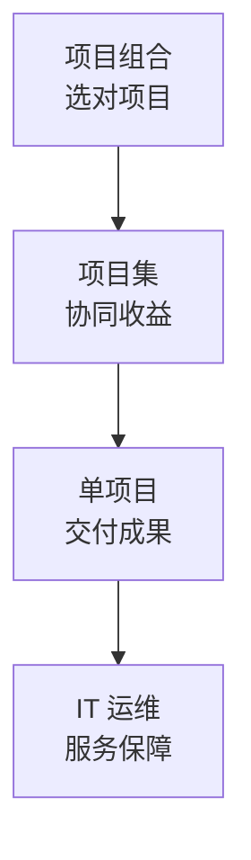

## 考点梳理

### 2.1 复用层（本站中级精讲已覆盖，直接去练）

项目管理**十大知识领域**、五大过程组、挣值、配置、采购合同、信息安全、新一代信息技术等——使用本站《软考·系统集成》16 章 + 题库即可。

### 2.2 高项增侧重（本专题要点）

| 领域 | 高项要点 |
|------|---------|
| 企业信息化与战略 | 信息化规划、业务流程重组、企业架构的粗识（示例口径） |
| 项目集/项目组合 | 项目集=协同管理一群相关项目；项目组合=按战略选项目配资源 |
| 组织级/PMO | 支持/控制/指令三类 PMO；成熟度模型（CMMI 五级） |
| IT 服务管理 | 服务台、事件/问题管理、ITIL 流程化运维思想 |
| 新技术与安全 | 云/大数据/AI 考查更深、更贴近"数字中国"语境（示例口径） |

### 2.3 学习方法

先做一套近年真题（正版出版物）**自测差距**，把错题归到"复用层"（去中级刷）或"增侧重"（本清单逐个补）。

## 🧠 记忆工具箱

### 口诀速记

- 高级三件套：`项目集协同、组合选项目、PMO 分三类`；
- IT 服务一句话：`服务台接单、事件快恢复、问题找根因`。

### 一图速记 · 战略层到执行层

## ⚠️ 易错提醒

- 高项≠内容全不同：**公共考点占大头**，跳过中级直接裸考高项是常见误区；
- 项目组合管"选不选"，项目集管"怎么一起干"——别把两层混淆。
