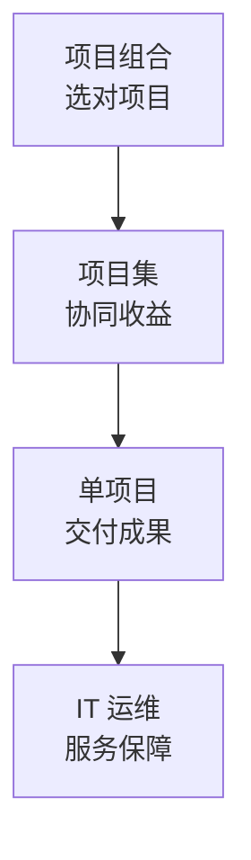

## 考点梳理

### 2.1 复用层（本站中级精讲已覆盖，直接去练）

项目管理**十大知识领域**、五大过程组、挣值、配置、采购合同、信息安全、新一代信息技术等——使用本站《软考·系统集成》16 章 + 题库即可。

### 2.2 高项增侧重（本专题要点）

| 领域 | 高项要点 |
|------|---------|
| 企业信息化与战略 | 信息化规划、业务流程重组、企业架构的粗识（示例口径） |
| 项目集/项目组合 | 项目集=协同管理一群相关项目；项目组合=按战略选项目配资源 |
| 组织级/PMO | 支持/控制/指令三类 PMO；成熟度模型（CMMI 五级） |
| IT 服务管理 | 服务台、事件/问题管理、ITIL 流程化运维思想 |
| 新技术与安全 | 云/大数据/AI 考查更深、更贴近"数字中国"语境（示例口径） |

### 2.3 学习方法

先做一套近年真题（正版出版物）**自测差距**，把错题归到"复用层"（去中级刷）或"增侧重"（本清单逐个补）。

## 🧠 记忆工具箱

### 口诀速记

- 高级三件套：`项目集协同、组合选项目、PMO 分三类`；
- IT 服务一句话：`服务台接单、事件快恢复、问题找根因`。

### 一图速记 · 战略层到执行层



## 📚 深度精讲（重点精细版）

### 一、高项 vs 中级：差异定位表

| 维度 | 中级（系统集成） | 高级（高项） |
|------|----------------|-------------|
| 科目 | 综合知识 + 案例分析 | 综合知识 + 案例分析 + **论文** |
| 综合知识深度 | 概念与基础计算 | 概念更深、**管理情境题更多** |
| 新增侧重 | — | 企业信息化战略、BPR、项目集/组合、组织级项目管理、IT 治理与 IT 服务管理、新技术与安全合规 |
| 案例难度 | 单项目情境 | **多项目/战略情境**、要求决策与排序 |
| 论文 | 无 | **120 分钟写作**，必须准备 |

### 二、高项增侧重清单（逐个补）

1. **企业信息化与战略**：信息化规划、**BPR 业务流程重组**（对流程进行根本性再思考与彻底重新设计）、企业架构（含 TOGAF 思路：业务—数据—应用—技术架构分层）；
2. **项目集管理**：以**收益**为导向协同管理关联项目（区别于项目"交付成果"）；
3. **项目组合管理**：战略对齐、选择与优先级、资源平衡、定期剔除低价值项目；
4. **组织级项目管理（OPM）与治理**：PMO 三类（支持/控制/指令）、成熟度模型（CMMI 五级：混—管—定—量—优）；
5. **IT 治理与 IT 服务管理**：ITIL 核心实践（服务台、**事件管理=快恢复**、**问题管理=找根因**、变更与配置管理）、ISO 20000（IT 服务管理体系，示例口径）；
6. **新技术与合规**：云/大数据/AI/区块链深化；等级保护 2.0、数据安全与个人信息保护合规要求（示例口径）。

### 三、复习路径（三步走）

```text
① 中级基本功：项目管理十大领域 + 计算（本站软考·系统集成精讲与题库）
   ↓
② 高项增侧重：本清单 1–6 项，逐个过一遍并做笔记
   ↓
③ 真题验证：近 3 年真题自测，把错题归到"基本功"或"增侧重"分别补
```

### 四、典型例题（带解析）

**例题 1**：企业为提升竞争力，对现有业务流程进行根本性的再思考与彻底重新设计。这属于？
A. 业务流程重组（BPR）　B. 业务流程自动化　C. 组织结构调整　D. 信息系统运维
**答案 A**。解析：关键词"根本性再思考 + 彻底重新设计"是 BPR 的定义；流程自动化只是局部优化。

**例题 2**：在 ITIL 实践中，负责"尽快恢复服务、降低对业务影响"的是？
A. 事件管理　B. 问题管理　C. 变更管理　D. 配置管理
**答案 A**。解析：事件管理以恢复服务为目标；问题管理追查根本原因、防止复发；变更管理控制变更风险；配置管理维护配置项信息。

### 五、命题角度与背诵卡

- 命题角度：BPR 定义、项目集与组合辨析、OPM/PMO、ITIL 事件与问题区分、IT 治理与合规；
- 背诵卡：**高项=中级基本功＋增侧重＋论文**；**BPR：根本性再思考、彻底重设计**；**事件快恢复、问题找根因**；**项目集看收益、组合看战略**。

## ⚠️ 易错提醒

- 高项≠内容全不同：**公共考点占大头**，跳过中级直接裸考高项是常见误区；
- 项目组合管"选不选"，项目集管"怎么一起干"——别把两层混淆。
